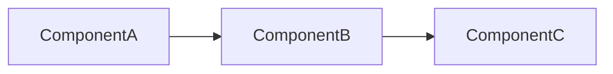
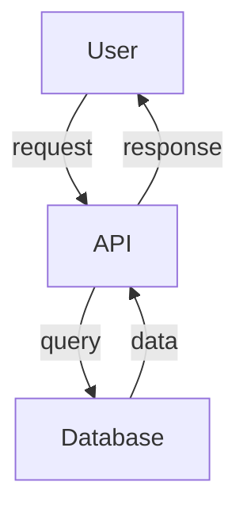

# analyze-architecture

Analyze the repository architecture and generate comprehensive documentation.

## Instructions

You are an expert software architect analyzing this codebase. Generate the following outputs:

### 1. architecture.md

Create a comprehensive architecture document that includes:

- **Executive Summary**: 2-3 paragraph overview of the system
- **System Architecture**: High-level architectural pattern (MVC, microservices, monolith, etc.)
- **Core Components**: List each major component with:
  - Purpose and responsibilities
  - Key interfaces/APIs
  - Dependencies
- **Data Flow**: How data moves through the system
- **Technology Stack**: Languages, frameworks, libraries, tools
- **Design Patterns**: Notable patterns used (Factory, Observer, etc.)

### 2. components.mermaid

Generate a Mermaid flowchart showing component relationships:

Keep it readable - maximum 15 nodes. Use appropriate shapes:
- `[Name]` for services
- `(Name)` for modules
- `[[Name]]` for packages/libraries
- `[(Database)]` for data stores

### 3. dataflow.mermaid

Generate a Mermaid diagram showing data flow:

Include edge labels describing what flows between components.

### 4. tech-stack.txt

List all technologies detected:

- Programming languages and versions
- Frameworks (e.g., React, Django, Express)
- Build tools (e.g., webpack, pip, npm)
- Testing frameworks
- CI/CD tools if visible
- Infrastructure/deployment tools

## Output Format

Generate each file with clear section headers. Use markdown formatting for documentation files. Ensure Mermaid diagrams are valid and renderable.

## Focus Areas

1. Start with package.json, pyproject.toml, or similar manifest files
2. Look for entry points (main.py, index.js, app.py, etc.)
3. Examine directory structure for architectural clues
4. Check for API routes, models, controllers
5. Look for configuration files that reveal infrastructure

Be accurate and factual. If something is unclear, note it as "uncertain" rather than guessing.
