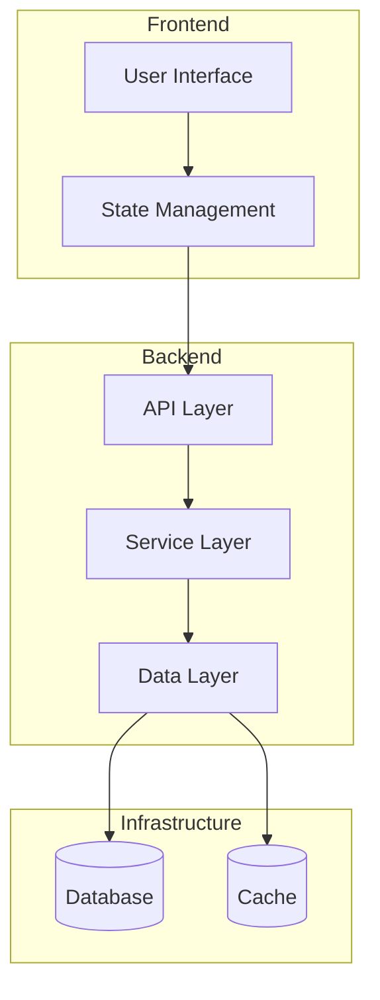
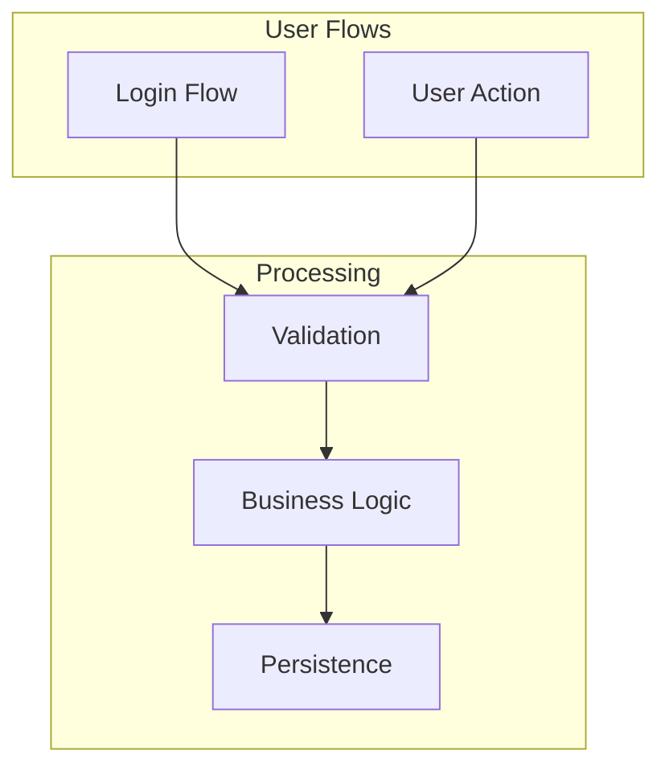
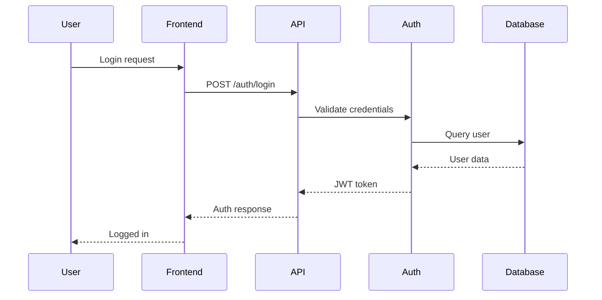
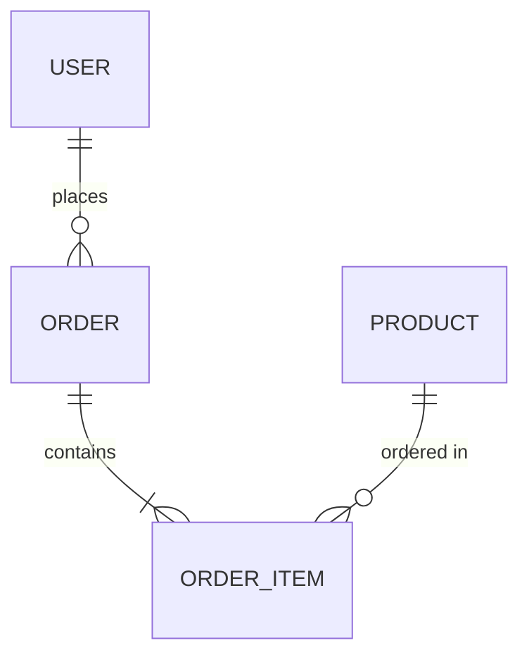
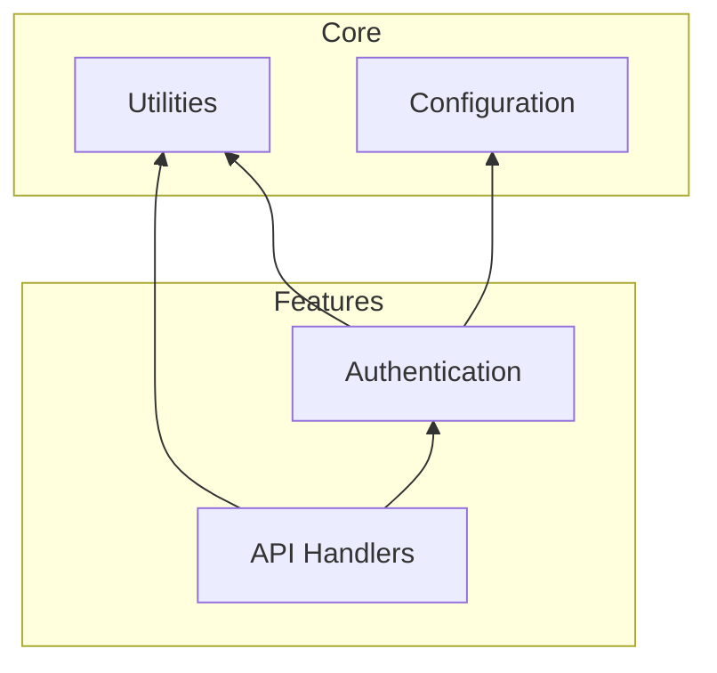

# deep-scan

Perform a comprehensive deep analysis of the repository architecture, patterns, and implementation details.

## Instructions

You are an expert software architect performing an exhaustive analysis of this codebase. Generate detailed documentation covering all aspects of the system.

### 1. architecture.md

Create an extremely detailed architecture document:

#### Executive Summary
- What the system does
- Who it's for
- Key capabilities

#### System Architecture
- Architectural pattern (with justification)
- System boundaries
- External integrations
- Deployment model (if discernible)

#### Core Components (for each major component)
- Name and purpose
- Responsibilities (bulleted list)
- Public interfaces/APIs
- Internal structure
- Dependencies (internal and external)
- Configuration requirements
- Error handling approach

#### Data Architecture
- Data models and entities
- Data stores (databases, caches, etc.)
- Data flow and transformations
- Data validation points

#### API Design
- API style (REST, GraphQL, gRPC, etc.)
- Authentication/authorization patterns
- Request/response formats
- Error handling

#### Security Considerations
- Authentication mechanisms
- Authorization patterns
- Input validation
- Secrets management

### 2. components.mermaid

Detailed component diagram:



### 3. dataflow.mermaid

Comprehensive data flow diagram showing all major flows:



### 4. sequence-auth.mermaid (if applicable)

Authentication/authorization sequence:



### 5. er-diagram.mermaid (if applicable)

Entity relationship diagram for data models:



### 6. dependency-graph.mermaid

Module/package dependency graph:



### 7. tech-stack.txt

Exhaustive technology inventory:

```
# Programming Languages
- Python 3.11
- TypeScript 5.x

# Frameworks
- FastAPI 0.100+
- React 18

# Libraries
- Pydantic (validation)
- SQLAlchemy (ORM)
...

# Build Tools
- pip / poetry
- npm / pnpm

# Testing
- pytest
- Jest

# CI/CD
- GitHub Actions

# Infrastructure
- Docker
- PostgreSQL
```

### 8. patterns.md

Document all identified patterns:

```markdown
# Identified Patterns

## Architectural Patterns
- **Pattern Name**: Description and where it's used

## Design Patterns
- **Factory**: Used in X for creating Y instances
- **Strategy**: Used for Z behavior variations

## Code Patterns
- Error handling conventions
- Logging patterns
- Configuration management

## Anti-Patterns (if found)
- Description and location
- Potential improvements
```

## Analysis Strategy

1. **Manifest files**: package.json, pyproject.toml, requirements.txt, go.mod, Cargo.toml
2. **Configuration**: .env.example, config/, settings files
3. **Entry points**: main files, __main__.py, index files
4. **Core business logic**: services/, handlers/, controllers/
5. **Data layer**: models/, schemas/, migrations/
6. **API definitions**: routes/, endpoints/, resolvers/
7. **Tests**: Understand behavior from test cases
8. **Documentation**: Existing docs, README, comments

Take your time to be thorough and accurate. This analysis will be used for developer onboarding.
