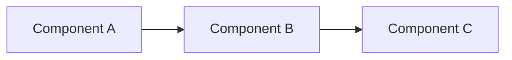

# quick-scan

Perform a quick scan of the repository to generate a high-level overview.

## Instructions

Generate a brief but useful overview of this repository. This is meant to be fast - focus on the most important information.

### Output: quick-overview.md

```markdown
# Repository Overview

## Summary
[1-2 sentences describing what this repository is]

## Primary Language
[Main programming language]

## Key Technologies
- [Technology 1]
- [Technology 2]
- [Technology 3]

## Main Entry Points
- `path/to/main/file`
- `path/to/another/entry`

## Directory Structure
[Brief description of top-level directories]

## Quick Architecture Notes
[2-3 bullet points about the architecture]
```

### Output: quick-diagram.mermaid

Generate a simple component diagram with 5-7 nodes maximum:



## Strategy

1. Check manifest files first (package.json, pyproject.toml, requirements.txt, go.mod)
2. Look at top-level directory names
3. Find the main entry point
4. Identify 3-5 key technologies

Spend no more than 2 minutes on this analysis. Prioritize speed over completeness.
