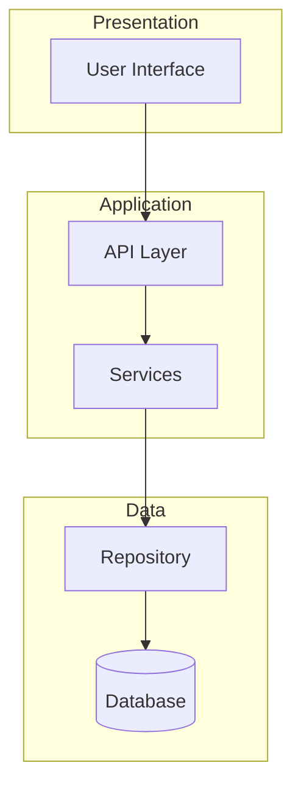
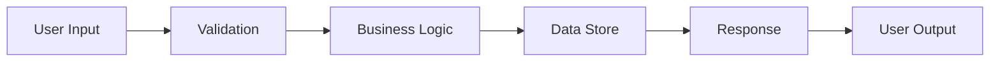

# standard-scan

Perform a standard analysis of the repository - balanced between speed and detail.

## Instructions

Generate well-structured documentation that covers the key aspects of this codebase.

### 1. architecture.md

Create a comprehensive architecture document:

```markdown
# Architecture Overview

## Summary
[2-3 paragraphs describing the system]

## Architecture Pattern
[e.g., MVC, Microservices, Monolith, Layered]

## Core Components

### Component 1: [Name]
- **Purpose**: What it does
- **Responsibilities**: 
  - Responsibility 1
  - Responsibility 2
- **Dependencies**: What it depends on
- **Key Files**: Main files for this component

[Repeat for each major component]

## Technology Stack

### Languages
- [Language and version]

### Frameworks
- [Framework name and purpose]

### Libraries
- [Notable libraries]

### Build/Dev Tools
- [Tools used]

## Data Flow
[Describe how data flows through the system]

## Key Design Decisions
- [Decision 1 and reasoning]
- [Decision 2 and reasoning]
```

### 2. components.mermaid

Component relationship diagram:



### 3. dataflow.mermaid

Data flow diagram:



### 4. tech-stack.txt

Technology inventory:

```
# Languages
- Language: version

# Frameworks
- Framework: purpose

# Key Libraries
- Library: purpose

# Development Tools
- Tool: purpose

# Testing
- Testing framework

# Infrastructure (if visible)
- Infrastructure tools
```

## Analysis Approach

1. Start with manifest/dependency files
2. Examine directory structure
3. Find entry points and main modules
4. Identify the layering/separation of concerns
5. Note external integrations
6. Document the technology choices

Be accurate. Note uncertainties explicitly. Aim for documentation that would help a new developer understand the codebase within 30 minutes of reading.
