# Multi-Repository Documentation Improvement Plan

## Current State Analysis

### What Works Well ✅
- Successfully detects 50+ inter-service interactions
- Generates individual service documentation
- Creates basic service mesh diagram
- Maps dependencies between services

### Major Gaps 🔴

1. **Minimal Diagrams**: Only 2 mermaid files in `/diagrams`, not embedded in docs
2. **Text-Heavy**: Most docs are just lists of text, no visual representation
3. **Poor System Organization**: `/system` only has 4 basic markdown files
4. **Missing Component View**: Services aren't treated as components in a larger system
5. **No API Flow Diagrams**: Just lists of endpoints, no visual API interaction flows
6. **No Data Flow Diagrams**: Missing visual representation of data movement
7. **Empty Folders**: Some folders like `/api`, `/dataflow` exist but are empty or minimal

## Proposed Improvement Plan

### New Directory Structure

```
docs/
├── index.md                                    # Entry point with system overview
│
├── system/                                     # SYSTEM-LEVEL DOCUMENTATION
│   ├── overview.md                            # System architecture overview + diagram
│   ├── components/                            # System component view
│   │   ├── overview.md                        # All services as components + architecture diagram
│   │   ├── component-relationships.md         # Component interaction diagram
│   │   └── deployment-view.md                 # How components are deployed (if detectable)
│   │
│   ├── dataflow/                              # Data flow analysis
│   │   ├── overview.md                        # High-level data flows + diagram
│   │   ├── user-journey.md                    # End-to-end user flows (e.g., checkout flow)
│   │   ├── request-response.md                # Request/response patterns + sequence diagrams
│   │   └── data-entities.md                   # Data models and how they flow between services
│   │
│   ├── api/                                   # API-level documentation
│   │   ├── overview.md                        # All APIs overview + API topology diagram
│   │   ├── rest-endpoints.md                  # REST API catalog with grouping
│   │   ├── api-flows.md                       # Common API interaction patterns + sequence diagrams
│   │   ├── authentication.md                  # Auth flows (if detected)
│   │   └── error-handling.md                  # Error propagation patterns
│   │
│   ├── dependencies/                          # Dependency analysis
│   │   ├── overview.md                        # Dependency summary + graph
│   │   ├── service-graph.md                   # Visual dependency graph + layers
│   │   ├── shared-libraries.md                # Common packages + version matrix
│   │   └── external-services.md               # External dependencies (DBs, caches, etc.)
│   │
│   ├── communication/                         # Communication patterns
│   │   ├── overview.md                        # All communication patterns
│   │   ├── synchronous.md                     # HTTP/REST/gRPC + call graphs
│   │   ├── asynchronous.md                    # Events, queues, pub/sub + flow diagrams
│   │   └── protocols.md                       # Protocol usage breakdown
│   │
│   └── diagrams/                              # System-level diagrams (referenced by docs above)
│       ├── architecture.mermaid               # C4 architecture diagram
│       ├── component-diagram.mermaid          # Component relationships
│       ├── sequence-diagrams/                 # Sequence diagrams for key flows
│       │   ├── user-registration.mermaid
│       │   ├── checkout-flow.mermaid
│       │   └── payment-processing.mermaid
│       ├── dependency-graph.mermaid           # Service dependency graph
│       ├── api-topology.mermaid               # API interaction topology
│       └── data-flow.mermaid                  # Data flow diagram
│
└── services/                                   # INDIVIDUAL SERVICE DOCS (existing)
    ├── front-end/
    ├── user/
    ├── catalogue/
    └── ...
```

### Key Improvements

#### 1. **Rich Diagram Integration** 📊

**Every markdown file should embed diagrams**, not just link to them:

```markdown
# Component Relationships

## Architecture Overview

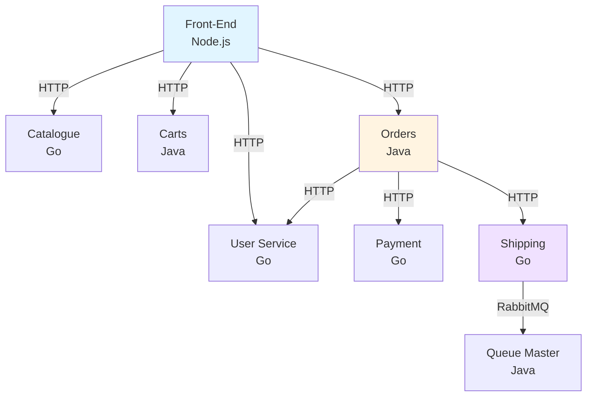

## Component Details
...
```

#### 2. **System Components View** 🏗️

Treat each service as a **component** in the system:

**File: `system/components/overview.md`**
```markdown
# System Components

## Component Architecture

```mermaid
C4Context
    title System Context - Sock Shop

    Person(customer, "Customer", "User of the e-commerce platform")

    System_Boundary(sockshop, "Sock Shop System") {
        Container(frontend, "Front-End", "Node.js", "Web UI")
        Container(user, "User Service", "Go", "User management")
        Container(catalogue, "Catalogue", "Go", "Product catalog")
        Container(cart, "Cart Service", "Java", "Shopping cart")
        Container(orders, "Orders", "Java", "Order processing")
        Container(payment, "Payment", "Go", "Payment processing")
        Container(shipping, "Shipping", "Go", "Shipping management")
        Container(queue, "Queue Master", "Java", "Task queue")
    }

    System_Ext(zipkin, "Zipkin", "Distributed tracing")
    System_Ext(docker, "Docker Daemon", "Container runtime")

    Rel(customer, frontend, "Uses")
    Rel(frontend, user, "API calls")
    Rel(frontend, catalogue, "API calls")
    Rel(frontend, cart, "API calls")
    Rel(frontend, orders, "API calls")
    ...
```

## Components by Layer

### Presentation Layer
- **front-end** - Web UI serving customer requests

### Business Logic Layer
- **user** - Customer, address, and card management
- **catalogue** - Product catalog and inventory
- **cart** - Shopping cart operations
- **orders** - Order orchestration and fulfillment

### Integration Layer
- **payment** - External payment gateway integration
- **shipping** - Shipping provider integration
- **queue-master** - Asynchronous task processing

## Component Interactions Matrix

| Component | Depends On | Used By | Type |
|-----------|------------|---------|------|
| front-end | user, catalogue, cart, orders | - | Gateway |
| user | zipkin | front-end, orders | Service |
| catalogue | zipkin | front-end | Service |
| cart | zipkin | front-end, orders | Service |
| orders | user, cart, payment, shipping | front-end | Orchestrator |
| payment | zipkin | orders | Service |
| shipping | queue-master, zipkin | orders | Service |
| queue-master | docker | shipping | Worker |
```

#### 3. **API Flow Diagrams** 🔄

**File: `system/api/api-flows.md`**
```markdown
# API Interaction Flows

## User Registration Flow

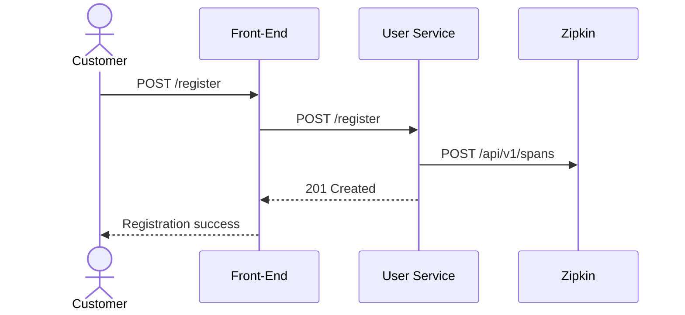

## Checkout Flow

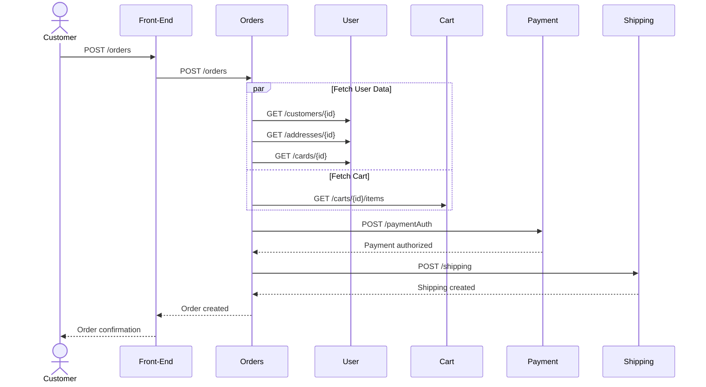

## API Call Patterns

### Gateway Pattern (Front-End)
Front-end acts as API gateway, routing requests to backend services.

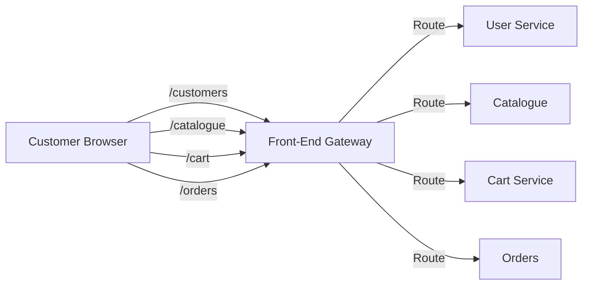

### Orchestration Pattern (Orders)
Orders service orchestrates multiple services for order processing.

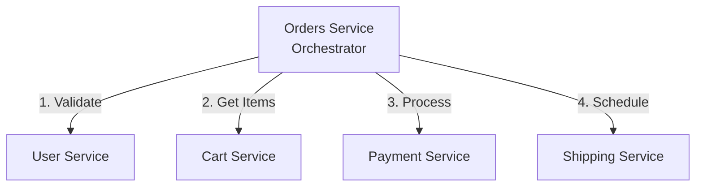
```

#### 4. **Data Flow Diagrams** 💾

**File: `system/dataflow/user-journey.md`**
```markdown
# End-to-End User Journeys

## Complete Purchase Journey

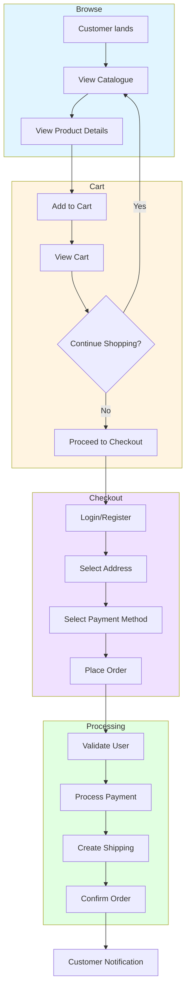

## Data Flow: Order Creation

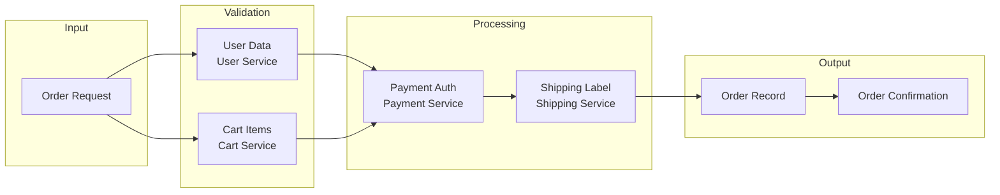
```

#### 5. **Dependency Graph** 🕸️

**File: `system/dependencies/service-graph.md`**
```markdown
# Service Dependency Graph

## Layered Architecture

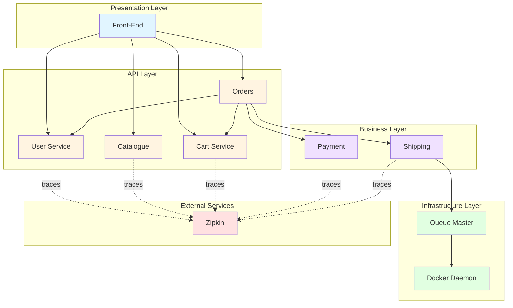

## Dependency Analysis

### Upstream Dependencies (What depends on this service)

| Service | Depended On By | Count |
|---------|----------------|-------|
| user | front-end, orders | 2 |
| catalogue | front-end | 1 |
| cart | front-end, orders | 2 |
| payment | orders | 1 |
| shipping | orders | 1 |
| queue-master | shipping | 1 |

### Downstream Dependencies (What this service depends on)

| Service | Depends On | Count |
|---------|------------|-------|
| front-end | user, catalogue, cart, orders | 4 |
| orders | user, cart, payment, shipping | 4 |
| shipping | queue-master | 1 |
| queue-master | docker | 1 |
| ALL | zipkin | 6 |
```

#### 6. **Communication Patterns** 📡

**File: `system/communication/overview.md`**
```markdown
# Communication Patterns

## Overview

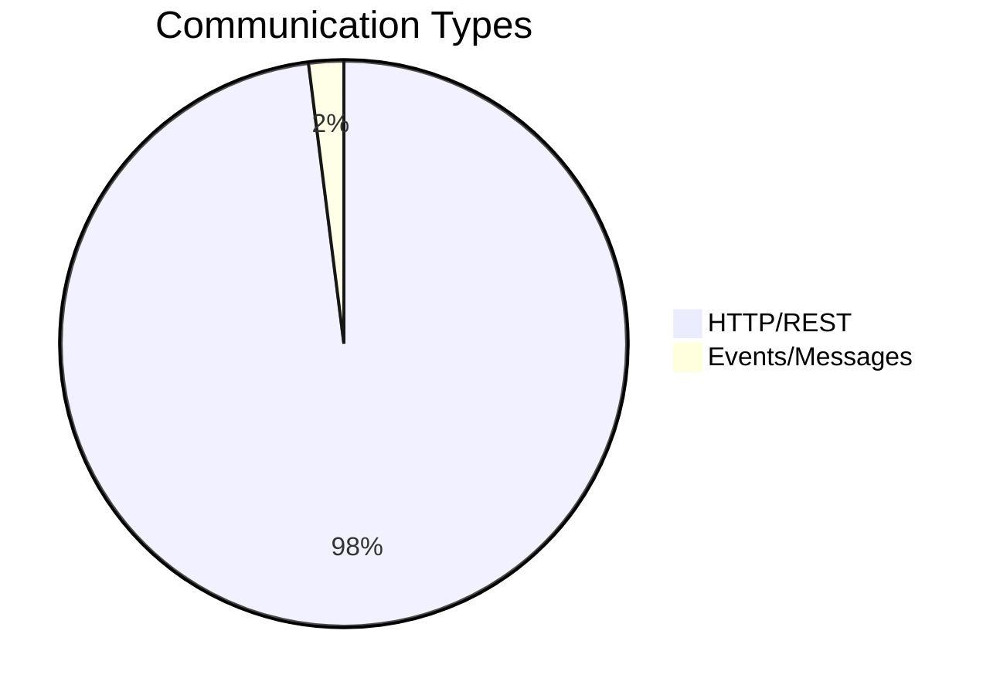

## Synchronous Communication (HTTP/REST)

### API Gateway Pattern
Front-end routes all customer requests to backend services.

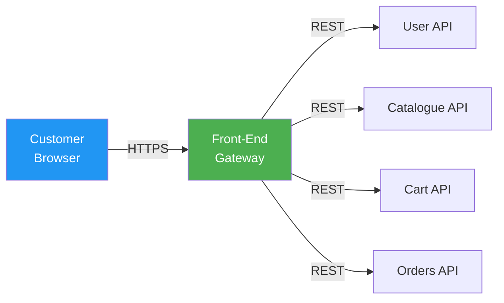

### Service Orchestration Pattern
Orders service orchestrates multiple backend services.

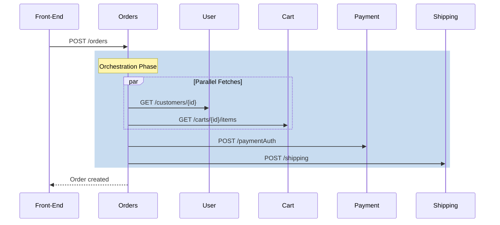

## Asynchronous Communication (Events)

### Event-Driven Pattern
Shipping service publishes events to queue-master via RabbitMQ.

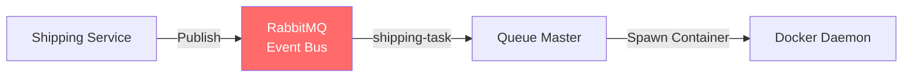

## Communication Statistics

| Pattern | Count | Percentage |
|---------|-------|------------|
| HTTP/REST (Sync) | 49 | 98% |
| Events (Async) | 1 | 2% |
| **Total** | **50** | **100%** |
```

### Implementation Strategy

#### Phase 1: Enhanced System Organization
1. ✅ Create new folder structure under `/system`
2. ✅ Move and reorganize existing content
3. ✅ Remove empty folders

#### Phase 2: Diagram Generation
1. ✅ Generate component architecture diagrams (C4, layered architecture)
2. ✅ Create sequence diagrams for key user flows (registration, checkout, etc.)
3. ✅ Build dependency graph with layers
4. ✅ Create API topology diagrams

#### Phase 3: Content Enhancement
1. ✅ Embed all diagrams directly in markdown files
2. ✅ Add visual representations for every interaction
3. ✅ Create data flow diagrams showing how data moves
4. ✅ Build API interaction flow diagrams

#### Phase 4: Integration
1. ✅ Update `index.md` to reflect new structure
2. ✅ Add cross-references between system and service docs
3. ✅ Ensure no empty folders
4. ✅ Test all diagram rendering

## Diagram Types to Generate

### Must-Have Diagrams
1. **C4 Context Diagram** - System in its environment
2. **Component Architecture** - All services as components
3. **Layered Architecture** - Services organized by layers
4. **Service Dependency Graph** - Who depends on whom
5. **API Topology** - API interaction patterns
6. **Sequence Diagrams** - Key user flows (3-5 flows)
7. **Data Flow Diagram** - How data moves through system
8. **Communication Patterns** - Sync vs async breakdown

### Nice-to-Have Diagrams
1. **Deployment View** - How services are deployed
2. **Error Propagation** - How errors flow through system
3. **Authentication Flow** - Auth patterns (if detected)
4. **Data Entity Relationships** - Shared data models

## Success Criteria

- ✅ Every markdown file has at least one embedded diagram
- ✅ `/system` folder has rich subfolders (components, dataflow, api, dependencies, communication)
- ✅ No empty folders in documentation
- ✅ Clear visual hierarchy: index → system (with diagrams) → individual services
- ✅ Diagrams are embedded in markdown, not just linked
- ✅ Services are treated as components in a larger system architecture
- ✅ At least 10+ different diagram types generated

## Example Output

When user opens `docs/index.md`:
1. See system overview with architecture diagram
2. Click into `/system/components/overview.md` → See all services as components with C4 diagram
3. Click into `/system/api/api-flows.md` → See sequence diagrams for checkout flow
4. Click into `/system/dependencies/service-graph.md` → See layered dependency graph
5. Click into individual service → See detailed service-level docs

**Result:** Rich, visual, hierarchical documentation that treats multi-repo as a cohesive system!
