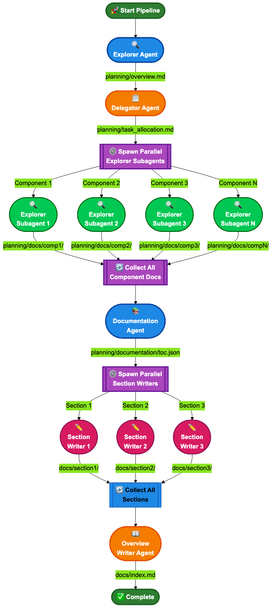
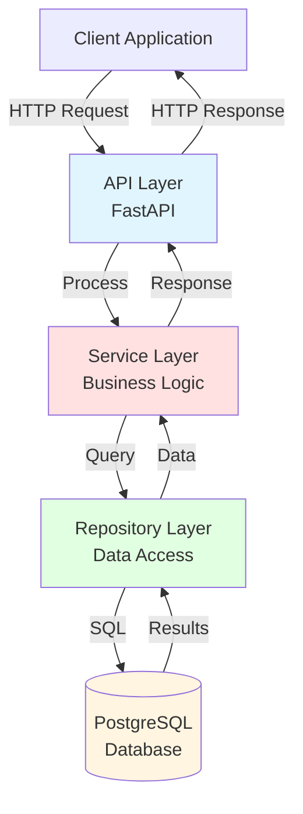

# Multi-Agent Documentation System - Orchestration Guide

## Overview

This document describes how agents are deployed, how they communicate with each other, and the complete workflow of the multi-agent documentation system.

## Agent Architecture



*The diagram above shows the complete flow of the multi-agent documentation pipeline, including parallel subagent spawning and file-based communication.*

## Agent Deployment Model

### Sequential Main Agents

The pipeline executes six main agents in **strict sequence**:

1. **Explorer Agent** - Initial repository analysis
2. **Delegator Agent** - Task allocation and subagent spawning
3. **Component Explorer Subagents** (spawned by Delegator) - Parallel component analysis
4. **Documentation Agent** - TOC creation and section planning
5. **Section Writer Subagents** (spawned by Documentation Agent) - Parallel section generation
6. **Overview Writer Agent** - Final index creation

### Subagent Spawning

Two agents spawn **parallel subagents** using the Task tool:

#### Delegator Agent Spawning
```python
# Delegator spawns 3-10 parallel Explorer subagents
for component in allocated_components:
    spawn_subagent(
        subagent_type="Explore",
        prompt=f"Explore {component.name} in {component.paths}",
        output_path=f"planning/docs/{component.id}/"
    )
```

#### Documentation Agent Spawning
```python
# Documentation agent spawns parallel Section Writer subagents
for section in toc.sections:
    spawn_subagent(
        subagent_type="section_writer",
        prompt=f"Generate {section.title} section",
        output_path=f"docs/{section.name}/"
    )
```

### Deployment Lifecycle

```
Pipeline Initialization
  ├─> Create directory structure
  ├─> Initialize OpenCode wrapper
  └─> Load all agent configs and skills

Step 1: Explorer Agent
  ├─> Execute with EXPLORATION agent type
  ├─> Analyze repository structure
  └─> Write planning/overview.md

Step 2: Delegator Agent
  ├─> Execute with DELEGATOR agent type
  ├─> Read planning/overview.md
  ├─> Write planning/task_allocation.md
  └─> Spawn N Explorer subagents (parallel)

Step 3: Component Exploration (Subagents)
  ├─> Wait for all subagents to complete
  └─> Each writes to planning/docs/{component_id}/

Step 4: Documentation Agent
  ├─> Execute with DOCUMENTATION agent type
  ├─> Read all files in planning/docs/*/
  └─> Write planning/documentation/toc.json

Step 5: Section Writing (Subagents)
  ├─> Wait for all subagents to complete
  └─> Each writes to docs/{section_name}/

Step 6: Overview Writer Agent
  ├─> Execute with OVERVIEW_WRITER agent type
  ├─> Read all docs/*/index.md files
  └─> Write docs/index.md

Pipeline Complete
  └─> Return results with output paths
```

## Communication Protocol

### File-Based Communication

Agents communicate **exclusively through files** in a structured directory hierarchy. No in-memory state is shared between agents.

### Directory Structure

```
{working_dir}/
├── planning/                           # Intermediate planning artifacts
│   ├── overview.md                     # Explorer → Delegator
│   ├── task_allocation.md              # Delegator → Explorer Subagents
│   ├── docs/                           # Component documentation
│   │   ├── core_api/                   # Explorer Subagent 1 output
│   │   │   ├── overview.md
│   │   │   ├── api.md
│   │   │   └── architecture.md
│   │   ├── database/                   # Explorer Subagent 2 output
│   │   │   ├── overview.md
│   │   │   ├── schema.md
│   │   │   └── migrations.md
│   │   └── auth_service/               # Explorer Subagent 3 output
│   │       ├── overview.md
│   │       └── flow.md
│   └── documentation/                  # Documentation metadata
│       └── toc.json                    # Documentation Agent → Section Writers
│
├── docs/                               # Final documentation output
│   ├── index.md                        # Overview Writer output (MAIN ENTRY)
│   ├── assets/                         # Shared assets directory for all diagrams
│   │   ├── architecture_overview.mmd
│   │   ├── architecture_overview.png
│   │   ├── system_flow.mmd
│   │   ├── system_flow.png
│   │   └── component_diagram.mmd
│   ├── architecture/                   # Section Writer 1 output
│   │   ├── index.md
│   │   └── detailed_architecture.md
│   ├── api_reference/                  # Section Writer 2 output
│   │   ├── index.md
│   │   ├── endpoints.md
│   │   └── authentication.md
│   └── components/                     # Section Writer 3 output
│       ├── index.md
│       ├── core_api.md
│       └── database.md
```

## Agent Input/Output Specifications

### 1. Explorer Agent

**Type**: `AgentType.EXPLORATION`
**Skills**: `analyze_components`, `discover_architecture`, `dependency_analysis`

**Input**:
- Repository source code (entire working directory)
- No file dependencies

**Processing**:
1. Scan repository structure
2. Identify major directories and components
3. Detect architectural patterns
4. Analyze technology stack

**Output**:
- **File**: `planning/overview.md`
- **Format**: Markdown with sections:
  - Repository description
  - Technology stack
  - Directory structure
  - Major components identified
  - Architectural patterns

**Example Output**:
```markdown
# Repository Overview

## Description
A RESTful API service for user management with PostgreSQL backend.

## Technology Stack
- Language: Python 3.10
- Framework: FastAPI
- Database: PostgreSQL + SQLAlchemy
- Auth: JWT tokens

## Directory Structure
- `src/api/` - REST API endpoints
- `src/database/` - Database models and migrations
- `src/auth/` - Authentication service
- `tests/` - Test suite

## Components
1. **Core API** - REST endpoints and routing
2. **Database Layer** - ORM models and schema
3. **Auth Service** - JWT authentication
```

---

### 2. Delegator Agent

**Type**: `AgentType.DELEGATOR`
**Skills**: `allocate_exploration_tasks`

**Input**:
- **File**: `planning/overview.md` (from Explorer)

**Processing**:
1. Read repository overview
2. Identify 3-10 major components based on:
   - Directory structure
   - Code volume
   - Architectural boundaries
3. Prioritize by dependency centrality
4. Create task allocation plan
5. Spawn parallel Explorer subagents

**Output**:
- **File**: `planning/task_allocation.md`
- **Format**: Markdown with YAML frontmatter
- **Side Effect**: Spawns N Explorer subagents (N = 3-10)

**Example Output**:
```yaml
---
total_tasks: 3
parallel_execution: true
max_parallel: 10
---

# Task Allocation Plan

## Task 1: Explore Core API Layer
- **Component**: Core API
- **Paths**: `src/api/`, `src/routes/`
- **Priority**: High
- **Focus**: REST endpoints, request/response handling, middleware
- **Output**: `planning/docs/core_api/`
- **Description**: Analyze the REST API layer including all endpoints, routing logic, and request processing

## Task 2: Explore Database Layer
- **Component**: Database Layer
- **Paths**: `src/database/`, `src/models/`
- **Priority**: High
- **Focus**: ORM models, schema design, migrations
- **Output**: `planning/docs/database/`
- **Description**: Document database schema, model definitions, and migration strategy

## Task 3: Explore Auth Service
- **Component**: Auth Service
- **Paths**: `src/auth/`
- **Priority**: Medium
- **Focus**: Authentication flow, JWT handling, permissions
- **Output**: `planning/docs/auth_service/`
- **Description**: Document authentication mechanisms and authorization logic
```

**Subagent Spawning**:
```
Delegator spawns 3 parallel Explorer subagents:
  → Explorer Subagent 1: Analyze Core API (outputs to planning/docs/core_api/)
  → Explorer Subagent 2: Analyze Database Layer (outputs to planning/docs/database/)
  → Explorer Subagent 3: Analyze Auth Service (outputs to planning/docs/auth_service/)
```

---

### 3. Explorer Subagents (Component Explorers)

**Type**: `subagent_type="Explore"` (spawned by Delegator)
**Count**: 3-10 parallel instances
**Skills**: Same as Explorer Agent

**Input**:
- Task-specific prompt from Delegator
- Component paths to analyze
- Focus areas

**Processing**:
1. Explore assigned component directories
2. Analyze code structure and APIs
3. Map dependencies
4. Document architecture

**Output**:
- **Directory**: `planning/docs/{component_id}/`
- **Files**: Multiple markdown files documenting the component
  - `overview.md` - Component overview
  - `api.md` - API documentation (if applicable)
  - `architecture.md` - Architecture details
  - `dependencies.md` - Dependency mapping

**Example Output** (for `planning/docs/core_api/`):

`overview.md`:
```markdown
# Core API Component

## Purpose
Provides RESTful API endpoints for client applications.

## Key Files
- `src/api/main.py` - FastAPI application
- `src/api/routes/` - Endpoint definitions
- `src/api/middleware/` - Request/response middleware

## Technologies
- FastAPI 0.100.0
- Pydantic for validation
- Uvicorn ASGI server
```

`api.md`:
```markdown
# API Endpoints

## User Management
- `GET /users` - List all users
- `POST /users` - Create user
- `GET /users/{id}` - Get user by ID
- `PUT /users/{id}` - Update user
- `DELETE /users/{id}` - Delete user

## Authentication
- `POST /auth/login` - User login
- `POST /auth/refresh` - Refresh token
```

---

### 4. Documentation Agent

**Type**: `AgentType.DOCUMENTATION`
**Skills**: `generate_documentation`, `document_api`, `create_table_of_contents`

**Input**:
- **Directory**: `planning/docs/*/` (all component documentation from subagents)

**Processing**:
1. Read all component documentation files
2. Extract topics and themes
3. Group components into logical sections
4. Create section hierarchy
5. Generate TOC with metadata
6. Spawn parallel Section Writer subagents

**Output**:
- **File**: `planning/documentation/toc.json`
- **Format**: JSON with section metadata
- **Side Effect**: Spawns N Section Writer subagents

**Example Output**:
```json
{
  "repository": "User Management API",
  "sections": [
    {
      "name": "architecture",
      "title": "Architecture Overview",
      "description": "Core architectural patterns and system design",
      "priority": 1,
      "components": ["core_api", "database", "auth_service"],
      "files": [
        "planning/docs/core_api/architecture.md",
        "planning/docs/database/schema.md",
        "planning/docs/auth_service/flow.md"
      ]
    },
    {
      "name": "api_reference",
      "title": "API Reference",
      "description": "Complete API endpoint documentation",
      "priority": 2,
      "components": ["core_api", "auth_service"],
      "files": [
        "planning/docs/core_api/api.md",
        "planning/docs/auth_service/api.md"
      ]
    },
    {
      "name": "components",
      "title": "Component Documentation",
      "description": "Detailed documentation for each component",
      "priority": 3,
      "components": ["core_api", "database", "auth_service"],
      "files": [
        "planning/docs/core_api/overview.md",
        "planning/docs/database/overview.md",
        "planning/docs/auth_service/overview.md"
      ]
    }
  ],
  "metadata": {
    "total_sections": 3,
    "total_components": 3,
    "generated_at": "2026-01-23T10:30:00Z"
  }
}
```

**Subagent Spawning**:
```
Documentation Agent spawns 3 parallel Section Writer subagents:
  → Section Writer 1: Generate architecture/ section
  → Section Writer 2: Generate api_reference/ section
  → Section Writer 3: Generate components/ section
```

---

### 5. Section Writer Subagents

**Type**: `AgentType.SECTION_WRITER` (spawned by Documentation Agent)
**Count**: One per section (typically 3-8 parallel instances)
**Skills**: `generate_section_with_diagrams`, `create_mermaid_diagrams`

**Input**:
- Section metadata from `planning/documentation/toc.json`
- Component documentation files listed in section

**Processing**:
1. Read assigned component documentation files
2. Generate section index with overview
3. Create mermaid diagrams (architecture, flows, etc.)
4. Compile diagrams to PNG using `mmdc` (if available)
5. Organize content with navigation

**Output**:
- **Directory**: `docs/{section_name}/`
- **Assets**: `docs/assets/` - Shared directory for all diagrams
- **Files**:
  - `index.md` - Section main page
  - `docs/assets/*.mmd` - Mermaid diagram source files
  - `docs/assets/*.png` - Compiled diagram images (if mmdc available)
  - Additional content files as needed

**Example Output** (for `docs/architecture/`):

`index.md`:
```markdown
# Architecture Overview

This section describes the core architectural patterns and design decisions for the User Management API.

## System Architecture

The system follows a three-tier architecture with clear separation of concerns:


### Components

- **API Layer** - FastAPI application handling HTTP requests
- **Service Layer** - Business logic and data processing
- **Data Layer** - PostgreSQL database with SQLAlchemy ORM

## Design Patterns

- **Repository Pattern** - Database access abstraction
- **Dependency Injection** - FastAPI's dependency system
- **JWT Authentication** - Stateless token-based auth

## Data Flow


1. Client sends HTTP request
2. Middleware validates JWT token
3. Route handler processes request
4. Service layer applies business logic
5. Repository accesses database
6. Response returned to client

## Related Sections

- [API Reference](../api_reference/index.md) - Detailed endpoint documentation
- [Components](../components/index.md) - Individual component docs
```

`docs/assets/system_architecture.mmd`:


**Diagram Compilation**:
```bash
# If mmdc is available
# Create assets directory first
mkdir -p docs/assets

# Compile diagrams to shared assets directory
mmdc -i docs/assets/system_architecture.mmd -o docs/assets/system_architecture.png -t dark -b transparent

# Result: docs/assets/system_architecture.png created
```

---

### 6. Overview Writer Agent

**Type**: `AgentType.OVERVIEW_WRITER`
**Skills**: `generate_overview_index`

**Input**:
- **Files**: `docs/*/index.md` (all section index files from Section Writers)
- **File**: `planning/documentation/toc.json` (section metadata)
- **File**: `planning/overview.md` (repository overview)

**Processing**:
1. Read all section index files
2. Extract titles, descriptions, key topics
3. Create hierarchical navigation structure
4. Generate quick start guide
5. Add repository overview summary

**Output**:
- **File**: `docs/index.md` (MAIN DOCUMENTATION ENTRY POINT)
- **Format**: Markdown with comprehensive navigation

**Example Output**:
```markdown
# User Management API Documentation

## Overview

The User Management API is a RESTful service built with FastAPI that provides user account management, authentication, and authorization capabilities. The system uses PostgreSQL for data persistence and JWT tokens for stateless authentication.

**Key Features:**
- User CRUD operations with role-based access control
- JWT-based authentication with refresh tokens
- PostgreSQL database with SQLAlchemy ORM
- Comprehensive API documentation with OpenAPI/Swagger

**Tech Stack:** Python 3.10, FastAPI, PostgreSQL, SQLAlchemy, JWT

## Quick Start

New to this project? Start here:

1. [Architecture Overview](architecture/index.md) - Understand the system design and patterns
2. [API Reference](api_reference/index.md) - Explore available endpoints and authentication
3. [Components](components/index.md) - Learn about individual system components

## Documentation Structure

### Core Documentation

#### [Architecture](architecture/index.md)
Core architectural patterns, design decisions, and system structure including three-tier architecture and design patterns.

#### [API Reference](api_reference/index.md)
Complete API documentation including all endpoints, request/response formats, authentication flows, and error handling.

#### [Components](components/index.md)
Detailed documentation for all major components including API layer, database layer, and authentication service.

## Development

For development setup, testing, and contribution guidelines, see:

- Setup: `README.md` in the repository root
- Testing: Run `pytest` in the project directory
- Contributing: See `CONTRIBUTING.md`

## Support

- **Issues**: [GitHub Issues](https://github.com/org/user-api/issues)
- **Discussions**: [GitHub Discussions](https://github.com/org/user-api/discussions)
- **API Documentation**: [Swagger UI](http://localhost:8000/docs)

---

*Documentation generated on 2026-01-23*
```

---

## Complete Example Output Structure

### Full Directory Tree After Pipeline Execution

```
my_repository/
│
├── planning/                                    # Intermediate artifacts (can be cleaned up)
│   ├── overview.md                              # ← Explorer Agent output
│   ├── task_allocation.md                       # ← Delegator Agent output
│   │
│   ├── docs/                                    # ← Explorer Subagent outputs
│   │   ├── core_api/
│   │   │   ├── overview.md
│   │   │   ├── api.md
│   │   │   ├── architecture.md
│   │   │   └── dependencies.md
│   │   │
│   │   ├── database/
│   │   │   ├── overview.md
│   │   │   ├── schema.md
│   │   │   ├── migrations.md
│   │   │   └── models.md
│   │   │
│   │   ├── auth_service/
│   │   │   ├── overview.md
│   │   │   ├── flow.md
│   │   │   └── jwt.md
│   │   │
│   │   └── background_tasks/
│   │       ├── overview.md
│   │       └── workers.md
│   │
│   └── documentation/
│       └── toc.json                             # ← Documentation Agent output
│
├── docs/                                        # ← FINAL DOCUMENTATION (main output)
│   ├── index.md                                 # ← Overview Writer output (MAIN ENTRY)
│   │
│   ├── assets/                                  # ← Shared assets for all diagrams
│   │   ├── system_architecture.mmd              # Section Writer 1 diagram source
│   │   ├── system_architecture.png              # Compiled PNG
│   │   ├── request_flow.mmd                     # Section Writer 1 diagram source
│   │   ├── request_flow.png                     # Compiled PNG
│   │   ├── auth_flow.mmd                        # Section Writer 2 diagram source
│   │   ├── auth_flow.png                        # Compiled PNG
│   │   ├── component_diagram.mmd                # Section Writer 3 diagram source
│   │   └── component_diagram.png                # Compiled PNG
│   │
│   ├── architecture/                            # ← Section Writer 1 output
│   │   ├── index.md
│   │   └── design_patterns.md
│   │
│   ├── api_reference/                           # ← Section Writer 2 output
│   │   ├── index.md
│   │   ├── endpoints.md
│   │   ├── authentication.md
│   │   └── error_handling.md
│   │
│   ├── components/                              # ← Section Writer 3 output
│   │   ├── index.md
│   │   ├── core_api.md
│   │   ├── database.md
│   │   └── auth_service.md
│   │
│   └── development/                             # ← Section Writer 4 output (optional)
│       ├── index.md
│       ├── setup.md
│       ├── testing.md
│       └── deployment.md
│
├── .opencode/                                   # OpenCode configuration
│   ├── agents/
│   │   ├── exploration.md
│   │   ├── delegator.md
│   │   ├── documentation.md
│   │   ├── section_writer.md
│   │   └── overview_writer.md
│   └── skills/
│       ├── analyze_components/
│       ├── allocate_exploration_tasks/
│       ├── create_table_of_contents/
│       └── ...
│
└── src/                                         # Original source code (unchanged)
    └── ...
```

### Key Output Files

| File Path | Producer | Consumer | Purpose |
|-----------|----------|----------|---------|
| `planning/overview.md` | Explorer Agent | Delegator Agent | Repository structure overview |
| `planning/task_allocation.md` | Delegator Agent | (Human review) | Task allocation plan |
| `planning/docs/{component}/` | Explorer Subagents | Documentation Agent | Component documentation |
| `planning/documentation/toc.json` | Documentation Agent | Section Writers | Section metadata and mapping |
| `docs/{section}/index.md` | Section Writers | Overview Writer | Section documentation |
| `docs/index.md` | Overview Writer | **END USER** | Main documentation entry point |

---

## Synchronization and Execution Order

### Step-by-Step Execution Timeline

```
T0: Pipeline Start
  └─> Create directory structure
  └─> Initialize OpenCode wrapper

T1: Explorer Agent (Sequential)
  └─> Analyze repository
  └─> Write planning/overview.md
  └─> [BLOCKING: Wait for completion]

T2: Delegator Agent (Sequential)
  └─> Read planning/overview.md
  └─> Analyze components
  └─> Write planning/task_allocation.md
  └─> Spawn N Explorer subagents

T3: Explorer Subagents (Parallel)
  ├─> Subagent 1: Explore Component A → planning/docs/component_a/
  ├─> Subagent 2: Explore Component B → planning/docs/component_b/
  ├─> Subagent 3: Explore Component C → planning/docs/component_c/
  └─> ...
  └─> [BLOCKING: Wait for ALL subagents to complete]

T4: Documentation Agent (Sequential)
  └─> Read all planning/docs/*/
  └─> Group into sections
  └─> Write planning/documentation/toc.json
  └─> Spawn M Section Writer subagents

T5: Section Writer Subagents (Parallel)
  ├─> Subagent 1: Generate Section 1 → docs/section_1/
  ├─> Subagent 2: Generate Section 2 → docs/section_2/
  ├─> Subagent 3: Generate Section 3 → docs/section_3/
  └─> ...
  └─> [BLOCKING: Wait for ALL subagents to complete]

T6: Overview Writer Agent (Sequential)
  └─> Read all docs/*/index.md
  └─> Read planning/documentation/toc.json
  └─> Write docs/index.md

T7: Pipeline Complete
  └─> Return results with output paths
```

### Blocking Points

The pipeline has **two critical synchronization points** where all parallel subagents must complete:

1. **After Component Exploration (T3)**: Wait for all Explorer subagents before Documentation Agent starts
2. **After Section Writing (T5)**: Wait for all Section Writer subagents before Overview Writer starts

---

## Error Handling and Recovery

### Critical Failures (Abort Pipeline)

These failures will **stop the pipeline**:

- **Explorer Agent failure**: No overview.md → Cannot allocate tasks
- **Delegator Agent failure**: No task allocation → Cannot explore components
- **Documentation Agent failure**: No TOC → Cannot organize sections
- **Overview Writer failure**: No main index → Incomplete documentation

### Non-Critical Failures (Continue Pipeline)

These failures will **log warnings but continue**:

- **Single Explorer Subagent failure**: Skip that component, continue with others
- **Single Section Writer failure**: Skip that section, continue with others
- **mmdc not available**: Keep .mmd files, skip PNG compilation
- **Diagram compilation failure**: Keep .mmd source, log warning

### Recovery Strategies

```python
# Component exploration: Continue with successful components
try:
    spawn_all_component_explorers()
except SubagentError as e:
    log_warning(f"Component {e.component} failed: {e}")
    continue_with_successful_components()

# Section writing: Continue with successful sections
try:
    spawn_all_section_writers()
except SubagentError as e:
    log_warning(f"Section {e.section} failed: {e}")
    continue_with_successful_sections()

# Diagram compilation: Graceful degradation
try:
    compile_mermaid_diagrams()
except MermaidError:
    log_warning("mmdc not available - keeping .mmd source files")
    continue_without_png_diagrams()
```

---

## Performance Characteristics

### Parallelization

- **Component Exploration**: 3-10 parallel subagents (configurable)
- **Section Writing**: 3-8 parallel subagents (based on TOC)
- **Total Parallelism**: Up to 18 concurrent agents at peak

### Expected Timeline

For a **medium-sized repository** (~10K-50K lines of code):

| Phase | Estimated Duration | Parallelization |
|-------|-------------------|-----------------|
| Explorer Agent | 2-5 minutes | Sequential |
| Delegator Agent | 1-2 minutes | Sequential |
| Component Exploration | 5-10 minutes | 3-10 parallel |
| Documentation Agent | 1-3 minutes | Sequential |
| Section Writing | 5-10 minutes | 3-8 parallel |
| Overview Writer | 1-2 minutes | Sequential |
| **Total Pipeline** | **15-30 minutes** | Mixed |

### Scalability

- **Small repos** (<5K LOC): ~10-15 minutes
- **Medium repos** (10K-50K LOC): ~15-30 minutes
- **Large repos** (50K-200K LOC): ~30-60 minutes
- **Very large repos** (>200K LOC): ~60-120 minutes

---

## Monitoring and Observability

### Pipeline Logging

```python
# Enable verbose logging
pipeline = DocumentationPipeline(repo_path, verbose=True)

# Logs output:
# 2026-01-23 10:00:00 - INFO - Pipeline initialized for: /path/to/repo
# 2026-01-23 10:00:05 - INFO - Step 1: Creating repository overview...
# 2026-01-23 10:03:12 - INFO - Step 2: Allocating component exploration tasks...
# 2026-01-23 10:04:30 - INFO - Step 3: Component exploration (parallel subagents)...
# 2026-01-23 10:04:31 - INFO -   → Subagents spawned by delegator agent
# 2026-01-23 10:14:45 - INFO - Step 4: Creating table of contents...
# 2026-01-23 10:16:20 - INFO - Step 5: Generating documentation sections...
# 2026-01-23 10:16:21 - INFO -   → Section writers spawned by documentation agent
# 2026-01-23 10:26:10 - INFO - Step 6: Generating main documentation index...
# 2026-01-23 10:27:30 - INFO - Pipeline completed successfully!
```

### Progress Tracking

```python
result = pipeline.run()

# Inspect results
print(f"Success: {result['success']}")
print(f"Steps completed: {list(result['steps'].keys())}")
print(f"Output paths:")
for name, path in result['output_paths'].items():
    print(f"  {name}: {path}")

# Check for errors
if result['errors']:
    print(f"Errors encountered:")
    for error in result['errors']:
        print(f"  - {error}")
```

---

## Summary

This orchestration guide provides the complete specification for deploying and coordinating the multi-agent documentation system. Key takeaways:

1. **6 main agents** execute in strict sequence with 2 parallel subagent spawning points
2. **File-based communication** through structured directories ensures clear agent boundaries
3. **Blocking synchronization** at component exploration and section writing ensures data consistency
4. **Graceful error handling** allows pipeline to continue despite non-critical failures
5. **Final output** is a comprehensive documentation site rooted at `docs/index.md`

For implementation details, see:
- `src-v3/core/documentation_pipeline.py` - Pipeline implementation
- `MULTI_AGENT_DOCUMENTATION.md` - Usage guide and examples
- Individual agent configs in `src-v3/core/agents/config/`
