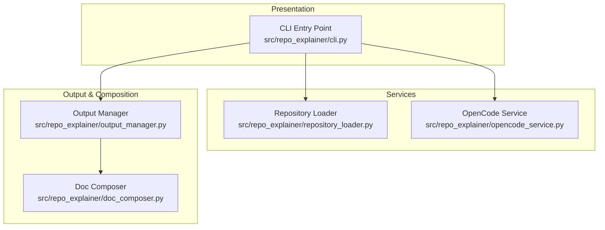
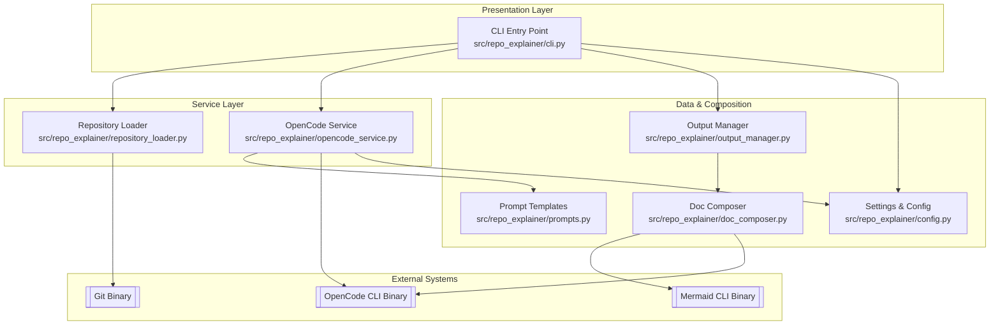

# Components Overview

This repository contains **5 component(s)**. Click on any component below for detailed documentation.

## Components

### [CLI Entry Point](cli.md)

**Type**: `module`  
**Location**: `src/repo_explainer/cli.py`  

Main entry point for the application, handling user commands and CLI formatting.

### [Repository Loader](repository-loader.md)

**Type**: `module`  
**Location**: `src/repo_explainer/repository_loader.py`  

Responsible for loading local repositories or cloning remote ones.

### [OpenCode Integration Service](opencode-service.md)

**Type**: `module`  
**Location**: `src/repo_explainer/opencode_service.py`  

Manages communication with the OpenCode CLI, handles streaming output, and parses JSON events.

### [Document Composer](doc-composer.md)

**Type**: `module`  
**Location**: `src/repo_explainer/doc_composer.py`  

Composes coherent documentation from raw analysis artifacts, handles diagram rendering and subpage generation.

### [Output Manager](output-manager.md)

**Type**: `module`  
**Location**: `src/repo_explainer/output_manager.py`  

Handles writing analysis results to the filesystem and organizing generated documentation.

---

## Architecture Overview

## Architecture Overview

# Architecture Overview: repo-explainer

## Executive Summary
`repo-explainer` is an AI-powered documentation generator designed to analyze software repositories and produce structured, navigable, and visually rich documentation. It leverages the OpenCode CLI as its analysis engine, providing deep insights into project structure, component relationships, and data flows.

The system is designed to handle both local paths and remote Git URLs, orchestrating the analysis process from initial cloning to the final assembly of a coherent documentation set, including rendered Mermaid diagrams and cross-referenced component details.

## High-Level Architecture
The project follows a **Layered Architecture** pattern, separating concerns between CLI interaction, service orchestration, and output management.

- **Presentation Layer**: Typer-based CLI for user interaction.
- **Service Layer**: Orchestrates repository loading and AI-powered analysis via OpenCode.
- **Composition Layer**: Post-processes analysis data into structured markdown and visual diagrams.

## System Components

### Component: CLI Entry Point
- **ID**: `cli`
- **Type**: `module`
- **Location**: `src/repo_explainer/cli.py`
- **Lines**: `1-321`
- **Purpose**: Main entry point for the application, handling user commands and CLI formatting.
- **Responsibilities**:
  - Parse CLI arguments and options using Typer.
  - Coordinate the high-level analysis workflow.
  - Provide progress feedback and rich terminal output.
- **Key Functions**:
  - `analyze` (`src/repo_explainer/cli.py:44-284`) - Main command for repository analysis and doc generation.
  - `main` (`src/repo_explainer/cli.py:33-40`) - Typer callback for version and global options.
- **Dependencies**:
  - Internal: `repository-loader`, `opencode-service`, `output-manager`, `config`
  - External: `typer`, `rich`
- **Interfaces**: Typer CLI Command Line Interface.

### Component: Repository Loader
- **ID**: `repository-loader`
- **Type**: `module`
- **Location**: `src/repo_explainer/repository_loader.py`
- **Lines**: `1-215`
- **Purpose**: Handles the resolution of local paths and cloning of remote Git repositories.
- **Responsibilities**:
  - Detect if an input is a Git URL or a local path.
  - Clone remote repositories to a temporary directory.
  - Manage cleanup of temporary repository clones.
- **Key Functions**:
  - `load` (`src/repo_explainer/repository_loader.py:163-189`) - Loads a repository from path or URL.
  - `clone_repository` (`src/repo_explainer/repository_loader.py:120-162`) - Clones a Git repository to `tmp`.
  - `is_git_url` (`src/repo_explainer/repository_loader.py:28-54`) - Detects Git URL patterns.
- **Dependencies**:
  - External: `GitPython`

### Component: OpenCode Integration Service
- **ID**: `opencode-service`
- **Type**: `module`
- **Location**: `src/repo_explainer/opencode_service.py`
- **Lines**: `1-242`
- **Purpose**: Interfaces with the OpenCode CLI to execute AI-powered analysis tasks.
- **Responsibilities**:
  - Construct and execute `opencode run` commands.
  - Stream and parse newline-delimited JSON events from OpenCode.
  - Provide high-level methods for specific analysis types (architecture, patterns, dependencies).
- **Key Functions**:
  - `run_command` (`src/repo_explainer/opencode_service.py:56-148`) - Executes the OpenCode CLI and streams output.
  - `analyze_architecture` (`src/repo_explainer/opencode_service.py:150-167`) - Runs the deep-dive architectural analysis.
  - `quick_scan` (`src/repo_explainer/opencode_service.py:169-187`) - Performs a lightweight repository scan.
- **Dependencies**:
  - Internal: `config`, `prompts`

### Component: Document Composer
- **ID**: `doc-composer`
- **Type**: `module`
- **Location**: `src/repo_explainer/doc_composer.py`
- **Lines**: `1-1191`
- **Purpose**: Assembles the final, navigable documentation set from raw analysis artifacts.
- **Responsibilities**:
  - Render Mermaid diagrams to SVG using `mermaid-cli`.
  - Generate a coherent `index.md` with navigation links.
  - Create detailed per-component and per-API documentation pages.
  - Attempt auto-fixes for Mermaid syntax errors via AI.
- **Key Functions**:
  - `compose` (`src/repo_explainer/doc_composer.py:32-101`) - Main orchestration for document assembly.
  - `_render_diagrams` (`src/repo_explainer/doc_composer.py:103-194`) - Converts `.mermaid` files to SVG.
  - `_generate_index` (`src/repo_explainer/doc_composer.py:453-575`) - Creates the landing page documentation.
- **Dependencies**:
  - External: `mermaid-cli` (mmdc)

### Component: Output Manager
- **ID**: `output-manager`
- **Type**: `module`
- **Location**: `src/repo_explainer/output_manager.py`
- **Lines**: `1-268`
- **Purpose**: Manages file system operations for saving analysis results and logs.
- **Responsibilities**:
  - Ensure the output directory structure is created.
  - Copy raw artifacts generated by OpenCode.
  - Save execution logs and metadata.
- **Key Functions**:
  - `write_analysis_result` (`src/repo_explainer/output_manager.py:51-127`) - Saves all analysis outputs and invokes composer.
  - `ensure_directories` (`src/repo_explainer/output_manager.py:37-50`) - Sets up the organized output structure.
- **Dependencies**:
  - Internal: `doc-composer`

### Component: Config Manager
- **ID**: `config`
- **Type**: `module`
- **Location**: `src/repo_explainer/config.py`
- **Lines**: `1-57`
- **Purpose**: Manages global settings and environment variables.
- **Responsibilities**:
  - Load configuration from environment variables (prefix `REPO_EXPLAINER_`).
  - Provide a centralized `Settings` object using Pydantic.
- **Key Functions**:
  - `get_settings` (`src/repo_explainer/config.py:45-50`) - Returns the global settings singleton.
- **Dependencies**:
  - External: `pydantic`, `pydantic-settings`

## Data Flow
[See `dataflow.mermaid` for detailed sequence]

1. **Input**: User provides a repository path or URL to the `cli`.
2. **Loading**: `RepositoryLoader` clones (if remote) or resolves (if local) the target repository path.
3. **Analysis**: `OpenCodeService` executes the OpenCode CLI with a specific analysis prompt (e.g., Architecture Deep Dive).
4. **Processing**: `OpenCodeService` streams JSON events from the CLI; `OutputManager` captures the raw output and generated artifacts.
5. **Composition**: `DocComposer` renders diagrams, parses structured component data, and generates a navigable set of Markdown pages.
6. **Output**: The user receives a structured `docs/` directory with `index.md` as the entry point.

## Entry Points
- **Primary**: `src/repo_explainer/cli.py` - Typer CLI application entry point.

## External Integrations
- **OpenCode CLI**: External binary used for AI-powered repository analysis.
- **Mermaid CLI (mmdc)**: Optional binary used for rendering diagrams to SVG.
- **Git**: Used via `GitPython` for cloning repositories.

## Component Diagram

View Mermaid Source

