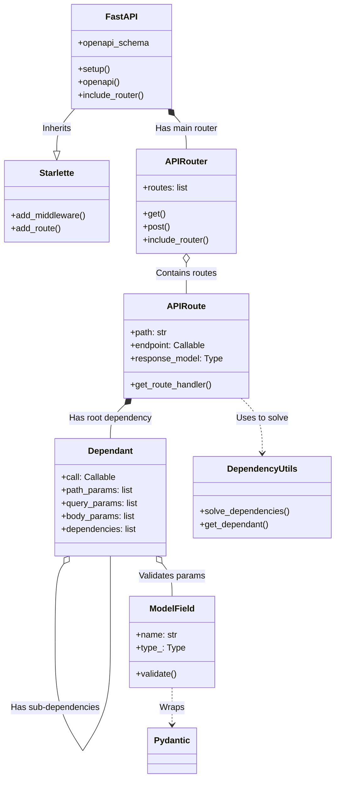

# Architecture Overview

## repo-explainer-yhqjidle

This repository is a large-sized project primarily written in python.

## System Architecture

### Components



## Key Components

### tests
- **Type**: tests
- **Path**: `tests`
- **Files**: 20 source files

### docs
- **Type**: module
- **Path**: `docs`
- **Files**: 2 source files

### fastapi
- **Type**: service
- **Path**: `fastapi`
- **Files**: 20 source files

### scripts
- **Type**: module
- **Path**: `scripts`
- **Files**: 20 source files

### docs_src
- **Type**: module
- **Path**: `docs_src`
- **Files**: 20 source files

## Data Flow

```mermaid
graph TD
    Client[Client Request] --> ASGI[ASGI Server (Uvicorn)]
    ASGI --> Middleware[Middleware Stack]
    Middleware --> Router{URL Routing}
    
    Router -->|Match| RouteHandler[Get Request Handler]
    
    subgraph Request Processing
        RouteHandler --> DependencySolver[Solve Dependencies]
        DependencySolver -->|Recurse| SubDeps[Resolve Sub-Dependencies]
        DependencySolver --> Validation[Validate Input Data]
        Validation -- Invalid --> Error[Raise RequestValidationError]
        Validation -- Valid --> Endpoint[Execute User Path Operation]
    end
    
    Endpoint --> Result[Raw Result]
    Result --> Serialization[Serialize & Validate Response]
    Serialization --> Response[Construct Response Object]
    
    Error --> ExceptionHandler[Exception Handler]
    ExceptionHandler --> Response
    
    Response --> Middleware
    Middleware --> ASGI
    ASGI --> Client

```

