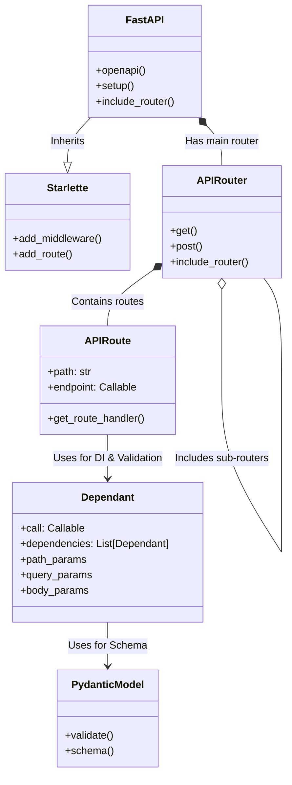
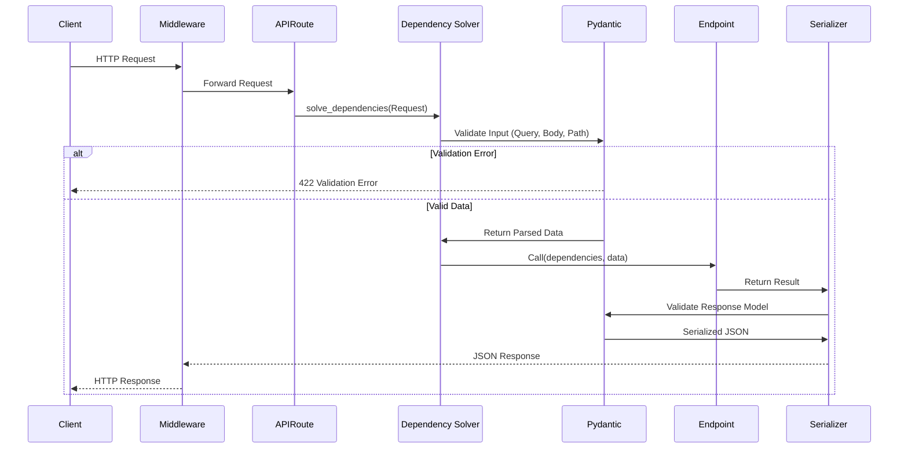

# Architecture Overview

## repo-explainer-dehe4qu3

This repository is a large-sized project primarily written in python.

## System Architecture

### Components

## Key Components

### tests
- **Type**: tests
- **Path**: `tests`
- **Files**: 20 source files

### docs
- **Type**: module
- **Path**: `docs`
- **Files**: 2 source files

### fastapi
- **Type**: service
- **Path**: `fastapi`
- **Files**: 20 source files

### scripts
- **Type**: module
- **Path**: `scripts`
- **Files**: 20 source files

### docs_src
- **Type**: module
- **Path**: `docs_src`
- **Files**: 20 source files

## Data Flow

