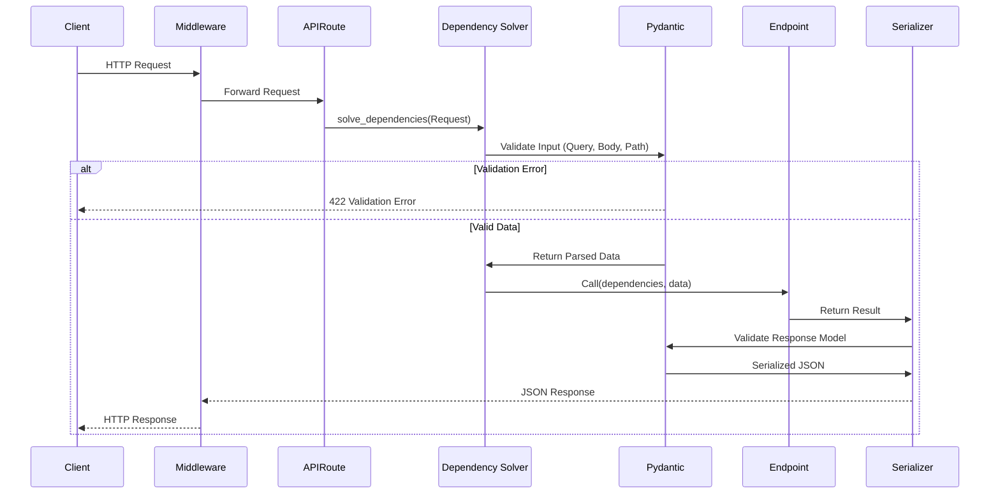
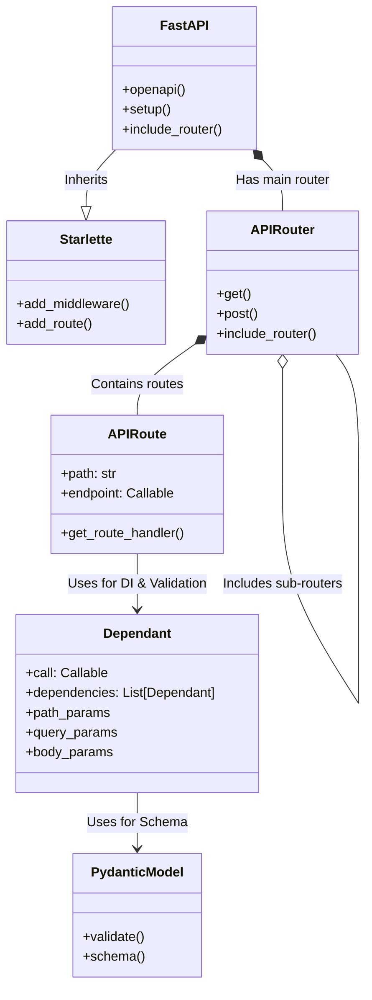

# repo-explainer-dehe4qu3 - Repository Documentation

> Auto-generated documentation by repo-explainer

## Overview

| Property | Value |
|----------|-------|
| **Primary Language** | python |
| **All Languages** | python, javascript |
| **Size** | large (1,255 files) |
| **Total Lines** | 107,163 |
| **Last Analyzed** | 2026-01-17 11:50:24 |
| **Git Remote** | git@github.com:fastapi/fastapi.git |
| **Branch** | master |
| **Commit** | 0c7f2b66 |

## Table of Contents

### Architecture
- [Architecture Overview](architecture/overview.md)
- [System Architecture](architecture/system-architecture.md)

### Components
- [tests](components/tests/overview.md)
- [docs](components/docs/overview.md)
- [fastapi](components/fastapi/overview.md)
- [scripts](components/scripts/overview.md)
- [docs_src](components/docs_src/overview.md)

### Diagrams
- [Dataflow](architecture/diagrams/dataflow.png)
- [Components](architecture/diagrams/components.png)

## Visual Overview

### Dataflow

### Components

### Additional
- [Dependencies](dependencies/internal.md)
- [Patterns](patterns/identified-patterns.md)

---

*Generated by [repo-explainer](https://github.com/your-org/repo-explainer)*
