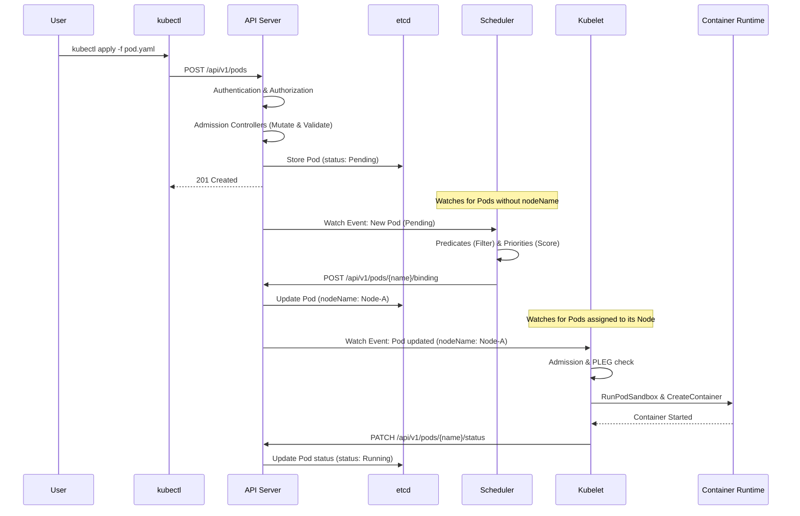

# Data Flow

This page visualizes how data flows through the system.

## Data Flow Diagram

View Mermaid Source

```mermaid
sequenceDiagram
    participant User
    participant kubectl
    participant API as API Server
    participant etcd
    participant Scheduler
    participant Kubelet
    participant Runtime as Container Runtime
    
    User->>kubectl: kubectl apply -f pod.yaml
    kubectl->>API: POST /api/v1/pods
    API->>API: Authentication & Authorization
    API->>API: Admission Controllers (Mutate & Validate)
    API->>etcd: Store Pod (status: Pending)
    API-->>kubectl: 201 Created
    
    Note over Scheduler: Watches for Pods without nodeName
    API->>Scheduler: Watch Event: New Pod (Pending)
    Scheduler->>Scheduler: Predicates (Filter) & Priorities (Score)
    Scheduler->>API: POST /api/v1/pods/{name}/binding
    API->>etcd: Update Pod (nodeName: Node-A)
    
    Note over Kubelet: Watches for Pods assigned to its Node
    API->>Kubelet: Watch Event: Pod updated (nodeName: Node-A)
    Kubelet->>Kubelet: Admission & PLEG check
    Kubelet->>Runtime: RunPodSandbox & CreateContainer
    Runtime-->>Kubelet: Container Started
    Kubelet->>API: PATCH /api/v1/pods/{name}/status
    API->>etcd: Update Pod status (status: Running)

```

