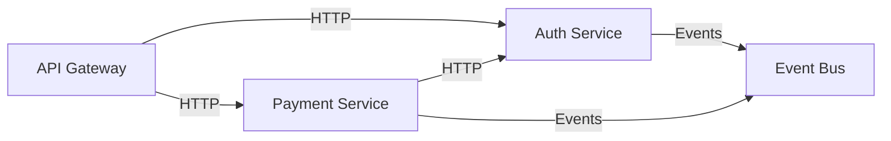

# Multi-Repository Analysis Plan

## Overview

Extend repo-explainer to support **multi-repository analysis** for microservices architectures. Generate system-wide documentation showing how services interact, cross-service data flows, and aggregate architecture views.

## User Experience

### CLI Interface

```bash
# Analyze multiple repositories
repo-analyze -f https://github.com/user/auth-service \
             -f https://github.com/user/api-gateway \
             -f https://github.com/user/payment-service \
             --verbose

# Mix local and remote repositories
repo-analyze -f ./local-repo \
             -f https://github.com/user/shared-lib \
             -f git@github.com:user/worker-service.git

# Specify custom output directory
repo-analyze -f repo1 -f repo2 -f repo3 \
             --output ./system-docs

# Quick vs deep analysis (applies to all repos)
repo-analyze -f repo1 -f repo2 --depth deep
```

### Expected Workflow

1. **Parse Arguments**: Collect all repository paths/URLs from `-f` flags
2. **Clone/Load Repos**: Download or resolve all repositories
3. **Individual Analysis**: Run standard analysis on each repo (parallel execution)
4. **Cross-Repo Detection**: Identify inter-service dependencies and communication patterns
5. **Aggregate Documentation**: Generate system-wide views + per-repo documentation
6. **Render Diagrams**: Create multi-repo architecture, service mesh, and data flow diagrams

## Output Structure

```
docs/
├── index.md                          # 🎯 System overview entry point
├── system/
│   ├── overview.md                   # Multi-repo architecture summary
│   ├── service-mesh.md               # How services communicate
│   ├── dataflow.md                   # Cross-service data flows
│   ├── tech-stack.md                 # Aggregated technology inventory
│   └── deployment.md                 # Deployment architecture (if detectable)
├── diagrams/
│   ├── system-architecture.svg       # All services + interactions
│   ├── service-mesh.svg              # Service communication graph
│   ├── dataflow-cross-service.svg    # Multi-repo data flows
│   └── dependency-graph.svg          # Inter-service dependencies
├── services/
│   ├── auth-service/
│   │   ├── overview.md               # Service-specific overview
│   │   ├── components/               # (existing single-repo structure)
│   │   ├── dependencies/
│   │   ├── api/
│   │   └── diagrams/
│   ├── api-gateway/
│   │   └── ... (same structure)
│   └── payment-service/
│       └── ... (same structure)
├── dependencies/
│   ├── overview.md                   # System-wide dependency summary
│   ├── inter-service.md              # Service-to-service dependencies
│   ├── external.md                   # All external packages (aggregated)
│   └── shared-libraries.md           # Common dependencies across services
├── apis/
│   ├── overview.md                   # All API endpoints across services
│   ├── rest-contracts.md             # REST API contracts
│   ├── grpc-contracts.md             # gRPC services (if detected)
│   └── events.md                     # Event-driven communication (if detected)
└── src/
    ├── raw/
    │   ├── auth-service/             # Individual repo artifacts
    │   ├── api-gateway/
    │   ├── payment-service/
    │   ├── system-architecture.mermaid
    │   └── service-mesh.mermaid
    └── logs/
        ├── analysis_auth-service_*.txt
        ├── analysis_api-gateway_*.txt
        ├── metadata_system_*.json
        └── cross-repo-analysis_*.json
```

### Key Documentation Files

#### `docs/index.md` (System Entry Point)

```markdown
# System Documentation

**Analysis Date:** 2026-01-17
**Services Analyzed:** 3

## Services

- [Auth Service](services/auth-service/overview.md) - Authentication and authorization
- [API Gateway](services/api-gateway/overview.md) - Request routing and composition
- [Payment Service](services/payment-service/overview.md) - Payment processing

## System Views

- [System Architecture](system/overview.md) - Complete system architecture
- [Service Mesh](system/service-mesh.md) - Inter-service communication
- [Data Flows](system/dataflow.md) - Cross-service data flows
- [Technology Stack](system/tech-stack.md) - Aggregated tech inventory

## API Contracts

- [REST APIs](apis/rest-contracts.md) - All REST endpoints
- [Events](apis/events.md) - Event-driven communication

## Dependencies

- [Inter-Service Dependencies](dependencies/inter-service.md)
- [Shared Libraries](dependencies/shared-libraries.md)
- [External Packages](dependencies/external.md)
```

#### `docs/system/service-mesh.md`

Shows how services communicate:

```markdown
# Service Mesh

## Communication Patterns

### Synchronous (REST/HTTP)
- **API Gateway → Auth Service**: `POST /api/v1/auth/verify`
- **API Gateway → Payment Service**: `GET /api/v1/payments/{id}`
- **Payment Service → Auth Service**: `GET /api/internal/users/{id}`

### Asynchronous (Events)
- **Payment Service → Event Bus**: `payment.completed` event
- **Auth Service → Event Bus**: `user.created` event

## Service Dependencies



## Detected Communication Mechanisms

- **HTTP/REST**: 15 endpoints across services
- **gRPC**: Not detected
- **Message Queue**: RabbitMQ (detected in payment-service)
- **Event Bus**: Custom event bus (shared across services)
```

#### `docs/dependencies/inter-service.md`

```markdown
# Inter-Service Dependencies

## Direct Dependencies

### Auth Service
**Depends on:** None (leaf service)
**Used by:**
- API Gateway (REST client)
- Payment Service (REST client)

### API Gateway
**Depends on:**
- Auth Service (authentication)
- Payment Service (payment endpoints)

**Used by:**
- External clients

### Payment Service
**Depends on:**
- Auth Service (user verification)
- Event Bus (event publishing)

**Used by:**
- API Gateway (payment orchestration)
```

## Architecture Design

### Component Architecture

```
┌─────────────────────────────────────────────────────┐
│                 CLI (cli.py)                        │
│  - Parse multiple -f flags                          │
│  - Orchestrate multi-repo workflow                  │
└─────────────┬───────────────────────────────────────┘
              │
              ▼
┌─────────────────────────────────────────────────────┐
│        Multi-Repo Orchestrator (NEW)                │
│  - Coordinate analysis across repos                 │
│  - Manage parallel execution                        │
│  - Aggregate results                                │
└────┬────────────────────────────────────────────────┘
     │
     ├──► Repository Loader (MODIFIED)
     │    - Load multiple repos
     │    - Track repo metadata (name, URL, path)
     │
     ├──► Individual Analysis (EXISTING)
     │    - Run standard analysis per repo
     │    - Use OpenCode service as-is
     │
     ├──► Cross-Repo Analyzer (NEW)
     │    - Detect inter-service communication
     │    - Map API calls and event flows
     │    - Identify shared dependencies
     │
     ├──► Aggregator (NEW)
     │    - Combine tech stacks
     │    - Build service dependency graph
     │    - Create system-wide views
     │
     └──► Multi-Repo Doc Composer (NEW)
          - Generate system/ documentation
          - Generate service mesh diagrams
          - Aggregate API documentation
          - Create cross-service data flows
```

### Key Design Decisions

1. **Parallel Execution**: Analyze individual repos in parallel for performance
2. **Two-Phase Analysis**:
   - **Phase 1**: Individual repo analysis (existing pipeline)
   - **Phase 2**: Cross-repo analysis and aggregation (new logic)
3. **Reuse Existing Components**: Leverage current OpenCode prompts for single-repo analysis
4. **New Prompts for Cross-Repo**: Create specialized prompts for detecting inter-service patterns

## Implementation Changes

### 1. CLI Changes (`src/repo_explainer/cli.py`)

**Current:**
```python
@app.command()
def analyze(
    repo_path_or_url: str,
    depth: str = "standard",
    output: Optional[Path] = None,
    force_clone: bool = False,
    verbose: bool = False,
) -> None:
    # Single repo analysis
```

**New:**
```python
@app.command()
def analyze(
    repo_path_or_url: Optional[str] = typer.Argument(None),  # Optional for backward compat
    repos: Optional[List[str]] = typer.Option(None, "-f", "--file"),  # New multi-repo flag
    depth: str = "standard",
    output: Optional[Path] = None,
    force_clone: bool = False,
    verbose: bool = False,
) -> None:
    """
    Analyze one or more repositories.

    Examples:
        # Single repo (backward compatible)
        repo-analyze ./my-repo

        # Multiple repos
        repo-analyze -f repo1 -f repo2 -f repo3
    """

    # Determine if single or multi-repo mode
    if repos:
        # Multi-repo mode
        from .multi_repo_orchestrator import MultiRepoOrchestrator
        orchestrator = MultiRepoOrchestrator(
            repos=repos,
            depth=depth,
            output_dir=output or Path("docs"),
            force_clone=force_clone,
            verbose=verbose,
        )
        orchestrator.run()
    else:
        # Single repo mode (existing logic)
        # ... existing implementation
```

### 2. New Component: Multi-Repo Orchestrator

**File:** `src/repo_explainer/multi_repo_orchestrator.py`

```python
"""Multi-repository analysis orchestrator."""

from concurrent.futures import ThreadPoolExecutor, as_completed
from pathlib import Path
from typing import List

from rich.console import Console
from rich.progress import Progress

from .config import Config
from .cross_repo_analyzer import CrossRepoAnalyzer
from .multi_repo_doc_composer import MultiRepoDocComposer
from .opencode_service import OpenCodeService
from .output_manager import OutputManager
from .repository_loader import RepositoryLoader, RepoMetadata

console = Console()


class MultiRepoOrchestrator:
    """Orchestrates multi-repository analysis workflow."""

    def __init__(
        self,
        repos: List[str],
        depth: str,
        output_dir: Path,
        force_clone: bool = False,
        verbose: bool = False,
    ):
        self.repos = repos
        self.depth = depth
        self.output_dir = output_dir
        self.force_clone = force_clone
        self.verbose = verbose
        self.config = Config()

    def run(self) -> None:
        """Execute multi-repo analysis workflow."""
        console.print(f"\n[bold cyan]Multi-Repository Analysis[/bold cyan]")
        console.print(f"Repositories: {len(self.repos)}")
        console.print(f"Analysis depth: {self.depth}\n")

        # Phase 1: Load all repositories
        console.print("[bold]Phase 1: Loading repositories...[/bold]")
        repo_metadata = self._load_repositories()

        # Phase 2: Analyze each repository individually (parallel)
        console.print(f"\n[bold]Phase 2: Analyzing {len(repo_metadata)} repositories...[/bold]")
        analysis_results = self._analyze_repositories(repo_metadata)

        # Phase 3: Cross-repo analysis
        console.print(f"\n[bold]Phase 3: Cross-repository analysis...[/bold]")
        cross_repo_data = self._analyze_cross_repo(repo_metadata, analysis_results)

        # Phase 4: Generate aggregated documentation
        console.print(f"\n[bold]Phase 4: Generating system documentation...[/bold]")
        self._generate_documentation(repo_metadata, analysis_results, cross_repo_data)

        console.print(f"\n[bold green]✓ Multi-repo analysis complete![/bold green]")
        console.print(f"Documentation: {self.output_dir.absolute()}\n")

    def _load_repositories(self) -> List[RepoMetadata]:
        """Load all repositories (clone if needed)."""
        loader = RepositoryLoader(
            clone_dir=Path("./tmp"),
            force_clone=self.force_clone,
        )

        metadata = []
        for repo_url in self.repos:
            meta = loader.load_repository(repo_url)
            metadata.append(meta)
            console.print(f"  ✓ Loaded: {meta.name}")

        return metadata

    def _analyze_repositories(self, repo_metadata: List[RepoMetadata]) -> dict:
        """Analyze repositories in parallel."""
        results = {}

        with ThreadPoolExecutor(max_workers=3) as executor:
            futures = {
                executor.submit(self._analyze_single_repo, meta): meta
                for meta in repo_metadata
            }

            with Progress() as progress:
                task = progress.add_task(
                    "[cyan]Analyzing repositories...",
                    total=len(futures)
                )

                for future in as_completed(futures):
                    meta = futures[future]
                    try:
                        result = future.result()
                        results[meta.name] = result
                        console.print(f"  ✓ Analyzed: {meta.name}")
                    except Exception as e:
                        console.print(f"  ✗ Failed: {meta.name} ({e})")
                        results[meta.name] = None

                    progress.update(task, advance=1)

        return results

    def _analyze_single_repo(self, meta: RepoMetadata) -> dict:
        """Run standard analysis on a single repository."""
        service = OpenCodeService(
            repo_path=meta.path,
            opencode_binary=self.config.opencode_binary,
        )

        # Run architecture analysis
        result = service.analyze_architecture()

        # Save individual repo output
        output_manager = OutputManager(
            output_dir=self.output_dir / "services" / meta.name
        )
        output_files = output_manager.write_analysis_result(
            result=result,
            repo_path=meta.path,
            depth=self.depth,
        )

        return {
            "metadata": meta,
            "result": result,
            "output_files": output_files,
        }

    def _analyze_cross_repo(
        self,
        repo_metadata: List[RepoMetadata],
        analysis_results: dict,
    ) -> dict:
        """Detect cross-repository patterns and dependencies."""
        analyzer = CrossRepoAnalyzer(
            repo_metadata=repo_metadata,
            analysis_results=analysis_results,
            opencode_binary=self.config.opencode_binary,
        )

        return analyzer.analyze()

    def _generate_documentation(
        self,
        repo_metadata: List[RepoMetadata],
        analysis_results: dict,
        cross_repo_data: dict,
    ) -> None:
        """Generate multi-repo documentation."""
        composer = MultiRepoDocComposer(
            output_dir=self.output_dir,
            repo_metadata=repo_metadata,
            analysis_results=analysis_results,
            cross_repo_data=cross_repo_data,
        )

        composer.compose()
```

### 3. New Component: Cross-Repo Analyzer

**File:** `src/repo_explainer/cross_repo_analyzer.py`

```python
"""Detects cross-repository patterns and dependencies."""

import json
import re
from pathlib import Path
from typing import Any, List

from rich.console import Console

from .opencode_service import OpenCodeService
from .repository_loader import RepoMetadata

console = Console()


class CrossRepoAnalyzer:
    """Analyzes interactions and dependencies across multiple repositories."""

    def __init__(
        self,
        repo_metadata: List[RepoMetadata],
        analysis_results: dict,
        opencode_binary: str,
    ):
        self.repo_metadata = repo_metadata
        self.analysis_results = analysis_results
        self.opencode_binary = opencode_binary

    def analyze(self) -> dict:
        """
        Perform cross-repository analysis.

        Returns:
            Dictionary with:
            - service_mesh: Inter-service communication patterns
            - api_contracts: Detected API endpoints and consumers
            - event_flows: Event-driven communication
            - shared_dependencies: Common external packages
            - service_graph: Service dependency graph
        """
        console.print("[dim]  Detecting inter-service communication...[/dim]")
        service_mesh = self._detect_service_mesh()

        console.print("[dim]  Mapping API contracts...[/dim]")
        api_contracts = self._detect_api_contracts()

        console.print("[dim]  Analyzing event flows...[/dim]")
        event_flows = self._detect_event_flows()

        console.print("[dim]  Identifying shared dependencies...[/dim]")
        shared_deps = self._detect_shared_dependencies()

        console.print("[dim]  Building service dependency graph...[/dim]")
        service_graph = self._build_service_graph(service_mesh, event_flows)

        return {
            "service_mesh": service_mesh,
            "api_contracts": api_contracts,
            "event_flows": event_flows,
            "shared_dependencies": shared_deps,
            "service_graph": service_graph,
        }

    def _detect_service_mesh(self) -> dict:
        """
        Detect how services communicate with each other.

        Strategy:
        1. Search for HTTP client usage (requests, httpx, fetch, axios)
        2. Search for gRPC client/server definitions
        3. Look for service discovery patterns (Consul, Eureka, K8s services)
        4. Extract base URLs and endpoint patterns
        """
        # Use OpenCode to analyze each repo for outbound calls
        service_mesh = {
            "http_calls": [],
            "grpc_calls": [],
            "service_discovery": [],
        }

        for meta in self.repo_metadata:
            prompt = self._get_service_mesh_prompt(meta.name)
            service = OpenCodeService(
                repo_path=meta.path,
                opencode_binary=self.opencode_binary,
            )
            result = service.run_command(prompt)

            if result.success:
                # Parse OpenCode output for detected patterns
                mesh_data = self._parse_service_mesh_output(result.output)
                service_mesh["http_calls"].extend(mesh_data.get("http_calls", []))
                service_mesh["grpc_calls"].extend(mesh_data.get("grpc_calls", []))

        return service_mesh

    def _detect_api_contracts(self) -> dict:
        """
        Map all API endpoints and their consumers.

        Strategy:
        1. Extract API routes from each service (Flask, Express, FastAPI, etc.)
        2. Match outbound HTTP calls to these routes
        3. Build producer-consumer relationships
        """
        # Aggregate all API endpoints from individual analyses
        api_contracts = {
            "endpoints": [],
            "consumers": {},
        }

        for meta in self.repo_metadata:
            result = self.analysis_results.get(meta.name)
            if not result:
                continue

            # Load components.json for this service
            components_file = result["output_files"].get("components_json")
            if components_file and components_file.exists():
                data = json.loads(components_file.read_text())

                # Extract API endpoints
                for component in data.get("components", []):
                    for interface in component.get("interfaces", []):
                        if interface.get("type") in ["REST", "HTTP", "API"]:
                            api_contracts["endpoints"].append({
                                "service": meta.name,
                                "endpoint": interface.get("name"),
                                "method": interface.get("method"),
                                "path": interface.get("path"),
                            })

        return api_contracts

    def _detect_event_flows(self) -> dict:
        """
        Detect event-driven communication patterns.

        Strategy:
        1. Search for event publishing (EventEmitter, Kafka, RabbitMQ, Redis pub/sub)
        2. Search for event subscriptions/listeners
        3. Map event types to publishers and subscribers
        """
        event_flows = {
            "publishers": {},
            "subscribers": {},
            "events": [],
        }

        for meta in self.repo_metadata:
            prompt = self._get_event_detection_prompt(meta.name)
            service = OpenCodeService(
                repo_path=meta.path,
                opencode_binary=self.opencode_binary,
            )
            result = service.run_command(prompt)

            if result.success:
                events = self._parse_event_output(result.output)
                event_flows["publishers"][meta.name] = events.get("published", [])
                event_flows["subscribers"][meta.name] = events.get("subscribed", [])

        return event_flows

    def _detect_shared_dependencies(self) -> dict:
        """
        Find external packages used across multiple services.

        Returns:
            Dictionary mapping package names to list of services using them
        """
        shared_deps = {}

        for meta in self.repo_metadata:
            result = self.analysis_results.get(meta.name)
            if not result:
                continue

            # Load dependencies from individual analysis
            deps_file = result["output_files"].get("dependencies_external")
            if deps_file and deps_file.exists():
                content = deps_file.read_text()

                # Parse package names (simplified - would need proper parsing)
                packages = re.findall(r'`([a-zA-Z0-9_-]+)`', content)

                for package in packages:
                    if package not in shared_deps:
                        shared_deps[package] = []
                    shared_deps[package].append(meta.name)

        # Filter to only packages used by 2+ services
        return {
            pkg: services
            for pkg, services in shared_deps.items()
            if len(services) >= 2
        }

    def _build_service_graph(self, service_mesh: dict, event_flows: dict) -> dict:
        """
        Build directed graph of service dependencies.

        Returns:
            Dictionary with:
            - nodes: List of services
            - edges: List of (source, target, type) tuples
        """
        nodes = [meta.name for meta in self.repo_metadata]
        edges = []

        # Add edges from HTTP calls
        for call in service_mesh.get("http_calls", []):
            edges.append({
                "source": call.get("caller"),
                "target": call.get("callee"),
                "type": "http",
                "details": call.get("endpoint"),
            })

        # Add edges from event flows
        for publisher, events in event_flows.get("publishers", {}).items():
            for event in events:
                for subscriber in event_flows.get("subscribers", {}).values():
                    if event in subscriber:
                        edges.append({
                            "source": publisher,
                            "target": subscriber,
                            "type": "event",
                            "details": event,
                        })

        return {"nodes": nodes, "edges": edges}

    def _get_service_mesh_prompt(self, service_name: str) -> str:
        """Generate prompt for detecting service mesh patterns."""
        return f"""Analyze the {service_name} repository to detect outbound service calls.

Search for:
1. **HTTP/REST calls** - requests, httpx, axios, fetch usage
2. **gRPC calls** - gRPC client definitions
3. **Service URLs** - Base URLs or service names being called

For each detected call, provide:
- Target service name (if detectable from URL/config)
- HTTP method and endpoint pattern
- File location (file_path:line_number)

Output format (JSON):
{{
  "http_calls": [
    {{
      "caller": "{service_name}",
      "callee": "target-service",
      "method": "POST",
      "endpoint": "/api/v1/resource",
      "file_path": "src/client.py",
      "line_number": 42
    }}
  ]
}}

Write the result to `service-mesh-{service_name}.json`.
"""

    def _get_event_detection_prompt(self, service_name: str) -> str:
        """Generate prompt for detecting event patterns."""
        return f"""Analyze the {service_name} repository to detect event-driven communication.

Search for:
1. **Event publishing** - Kafka producers, RabbitMQ publish, Redis pub/sub, EventEmitter.emit
2. **Event subscription** - Kafka consumers, RabbitMQ subscribe, EventEmitter.on

For each event, provide:
- Event name/topic
- Whether published or subscribed
- File location (file_path:line_number)

Output format (JSON):
{{
  "published": ["user.created", "payment.completed"],
  "subscribed": ["order.placed", "user.updated"]
}}

Write the result to `events-{service_name}.json`.
"""

    def _parse_service_mesh_output(self, output: str) -> dict:
        """Parse OpenCode output for service mesh data."""
        # Implementation would parse the JSON output from OpenCode
        # Placeholder for now
        return {"http_calls": []}

    def _parse_event_output(self, output: str) -> dict:
        """Parse OpenCode output for event data."""
        # Implementation would parse the JSON output from OpenCode
        # Placeholder for now
        return {"published": [], "subscribed": []}
```

### 4. New Component: Multi-Repo Doc Composer

**File:** `src/repo_explainer/multi_repo_doc_composer.py`

```python
"""Composes multi-repository system documentation."""

import json
from pathlib import Path
from typing import Any, List

from rich.console import Console

from .repository_loader import RepoMetadata

console = Console()


class MultiRepoDocComposer:
    """Generates system-wide documentation from multi-repo analysis."""

    def __init__(
        self,
        output_dir: Path,
        repo_metadata: List[RepoMetadata],
        analysis_results: dict,
        cross_repo_data: dict,
    ):
        self.output_dir = output_dir
        self.repo_metadata = repo_metadata
        self.analysis_results = analysis_results
        self.cross_repo_data = cross_repo_data

    def compose(self) -> dict[str, Path]:
        """Generate all system-level documentation."""
        composed_files = {}

        # Create directory structure
        (self.output_dir / "system").mkdir(exist_ok=True)
        (self.output_dir / "diagrams").mkdir(exist_ok=True)
        (self.output_dir / "dependencies").mkdir(exist_ok=True)
        (self.output_dir / "apis").mkdir(exist_ok=True)

        # Generate system overview
        console.print("[dim]  Writing system overview...[/dim]")
        composed_files["system_overview"] = self._generate_system_overview()

        # Generate service mesh documentation
        console.print("[dim]  Writing service mesh documentation...[/dim]")
        composed_files["service_mesh"] = self._generate_service_mesh()

        # Generate cross-service data flows
        console.print("[dim]  Writing data flow documentation...[/dim]")
        composed_files["dataflow"] = self._generate_dataflow()

        # Generate aggregated tech stack
        console.print("[dim]  Writing tech stack summary...[/dim]")
        composed_files["tech_stack"] = self._generate_tech_stack()

        # Generate dependency documentation
        console.print("[dim]  Writing dependency documentation...[/dim]")
        composed_files.update(self._generate_dependencies())

        # Generate API contracts
        console.print("[dim]  Writing API contracts...[/dim]")
        composed_files.update(self._generate_api_contracts())

        # Generate system diagrams
        console.print("[dim]  Rendering system diagrams...[/dim]")
        composed_files.update(self._generate_diagrams())

        # Generate main index
        console.print("[dim]  Writing index.md...[/dim]")
        composed_files["index"] = self._generate_index()

        return composed_files

    def _generate_system_overview(self) -> Path:
        """Generate system/overview.md."""
        content = f"""# System Architecture Overview

**Total Services:** {len(self.repo_metadata)}
**Analysis Date:** {self._get_timestamp()}

## Services

"""
        for meta in self.repo_metadata:
            content += f"### {meta.name}\n\n"
            content += f"- **Repository:** `{meta.url or meta.path}`\n"
            content += f"- **Documentation:** [View Details](../services/{meta.name}/overview.md)\n\n"

        # Add architecture summary
        service_graph = self.cross_repo_data.get("service_graph", {})
        edges = service_graph.get("edges", [])

        content += f"\n## Communication Patterns\n\n"
        content += f"- **Total Interactions:** {len(edges)}\n"

        http_count = len([e for e in edges if e.get("type") == "http"])
        event_count = len([e for e in edges if e.get("type") == "event"])

        content += f"- **HTTP/REST calls:** {http_count}\n"
        content += f"- **Event-driven:** {event_count}\n\n"

        content += "## Diagrams\n\n"
        content += "- [System Architecture](../diagrams/system-architecture.svg)\n"
        content += "- [Service Mesh](../diagrams/service-mesh.svg)\n"
        content += "- [Data Flow](../diagrams/dataflow-cross-service.svg)\n\n"

        file_path = self.output_dir / "system" / "overview.md"
        file_path.write_text(content)
        return file_path

    def _generate_service_mesh(self) -> Path:
        """Generate system/service-mesh.md."""
        mesh_data = self.cross_repo_data.get("service_mesh", {})

        content = "# Service Mesh\n\n"
        content += "## Communication Patterns\n\n"

        # HTTP calls
        http_calls = mesh_data.get("http_calls", [])
        if http_calls:
            content += "### Synchronous (REST/HTTP)\n\n"
            for call in http_calls:
                caller = call.get("caller", "unknown")
                callee = call.get("callee", "unknown")
                endpoint = call.get("endpoint", "")
                content += f"- **{caller} → {callee}**: `{endpoint}`\n"
            content += "\n"

        # Event flows
        event_flows = self.cross_repo_data.get("event_flows", {})
        publishers = event_flows.get("publishers", {})
        if publishers:
            content += "### Asynchronous (Events)\n\n"
            for service, events in publishers.items():
                for event in events:
                    content += f"- **{service} → Event Bus**: `{event}` event\n"
            content += "\n"

        # Service dependency diagram
        content += "## Service Dependencies\n\n"
        content += "```mermaid\n"
        content += self._generate_service_graph_mermaid()
        content += "```\n\n"

        file_path = self.output_dir / "system" / "service-mesh.md"
        file_path.write_text(content)
        return file_path

    def _generate_dataflow(self) -> Path:
        """Generate system/dataflow.md."""
        # Placeholder - would generate cross-service data flow documentation
        content = "# Cross-Service Data Flows\n\n"
        content += "*To be implemented based on detected API calls and event flows*\n"

        file_path = self.output_dir / "system" / "dataflow.md"
        file_path.write_text(content)
        return file_path

    def _generate_tech_stack(self) -> Path:
        """Aggregate tech stacks from all services."""
        content = "# System Technology Stack\n\n"

        languages = set()
        frameworks = set()

        for meta in self.repo_metadata:
            result = self.analysis_results.get(meta.name)
            if not result:
                continue

            # Parse tech stack from individual service
            tech_file = result["output_files"].get("tech_stack")
            if tech_file and tech_file.exists():
                tech_content = tech_file.read_text()
                # Simple parsing - would need enhancement
                if "Python" in tech_content:
                    languages.add("Python")
                if "JavaScript" in tech_content:
                    languages.add("JavaScript")

        content += "## Languages\n\n"
        for lang in sorted(languages):
            content += f"- {lang}\n"
        content += "\n"

        content += "## By Service\n\n"
        for meta in self.repo_metadata:
            content += f"### {meta.name}\n\n"
            content += f"See [detailed tech stack](../services/{meta.name}/tech-stack/overview.md)\n\n"

        file_path = self.output_dir / "system" / "tech-stack.md"
        file_path.write_text(content)
        return file_path

    def _generate_dependencies(self) -> dict[str, Path]:
        """Generate dependency documentation."""
        files = {}

        # Inter-service dependencies
        content = "# Inter-Service Dependencies\n\n"
        service_graph = self.cross_repo_data.get("service_graph", {})

        for meta in self.repo_metadata:
            content += f"## {meta.name}\n\n"

            # Find dependencies
            deps = [
                edge["target"]
                for edge in service_graph.get("edges", [])
                if edge["source"] == meta.name
            ]

            # Find dependents
            dependents = [
                edge["source"]
                for edge in service_graph.get("edges", [])
                if edge["target"] == meta.name
            ]

            content += f"**Depends on:** {', '.join(deps) or 'None'}\n\n"
            content += f"**Used by:** {', '.join(dependents) or 'None'}\n\n"

        inter_service_file = self.output_dir / "dependencies" / "inter-service.md"
        inter_service_file.write_text(content)
        files["inter_service_deps"] = inter_service_file

        # Shared libraries
        shared_deps = self.cross_repo_data.get("shared_dependencies", {})
        content = "# Shared Libraries\n\n"
        content += "External packages used by multiple services:\n\n"

        for package, services in sorted(shared_deps.items()):
            content += f"## `{package}`\n\n"
            content += f"**Used by:** {', '.join(services)}\n\n"

        shared_file = self.output_dir / "dependencies" / "shared-libraries.md"
        shared_file.write_text(content)
        files["shared_libraries"] = shared_file

        return files

    def _generate_api_contracts(self) -> dict[str, Path]:
        """Generate API contract documentation."""
        files = {}

        api_contracts = self.cross_repo_data.get("api_contracts", {})
        endpoints = api_contracts.get("endpoints", [])

        content = "# REST API Contracts\n\n"
        content += f"**Total Endpoints:** {len(endpoints)}\n\n"

        # Group by service
        by_service = {}
        for endpoint in endpoints:
            service = endpoint.get("service", "unknown")
            if service not in by_service:
                by_service[service] = []
            by_service[service].append(endpoint)

        for service, service_endpoints in sorted(by_service.items()):
            content += f"## {service}\n\n"
            for ep in service_endpoints:
                method = ep.get("method", "GET")
                path = ep.get("path", "/")
                content += f"- `{method} {path}`\n"
            content += "\n"

        rest_file = self.output_dir / "apis" / "rest-contracts.md"
        rest_file.write_text(content)
        files["rest_contracts"] = rest_file

        return files

    def _generate_diagrams(self) -> dict[str, Path]:
        """Generate and render system-level diagrams."""
        files = {}

        # System architecture diagram
        mermaid_content = self._generate_system_architecture_mermaid()
        mermaid_file = self.output_dir / "src" / "raw" / "system-architecture.mermaid"
        mermaid_file.write_text(mermaid_content)

        # Would render to SVG using mmdc
        # svg_file = self.output_dir / "diagrams" / "system-architecture.svg"
        # files["system_architecture"] = svg_file

        return files

    def _generate_index(self) -> Path:
        """Generate main index.md."""
        content = "# System Documentation\n\n"
        content += f"**Analysis Date:** {self._get_timestamp()}\n"
        content += f"**Services Analyzed:** {len(self.repo_metadata)}\n\n"

        content += "## Services\n\n"
        for meta in self.repo_metadata:
            content += f"- [{meta.name}](services/{meta.name}/overview.md)\n"
        content += "\n"

        content += "## System Views\n\n"
        content += "- [System Architecture](system/overview.md)\n"
        content += "- [Service Mesh](system/service-mesh.md)\n"
        content += "- [Data Flows](system/dataflow.md)\n"
        content += "- [Technology Stack](system/tech-stack.md)\n\n"

        content += "## Dependencies\n\n"
        content += "- [Inter-Service Dependencies](dependencies/inter-service.md)\n"
        content += "- [Shared Libraries](dependencies/shared-libraries.md)\n\n"

        content += "## API Contracts\n\n"
        content += "- [REST APIs](apis/rest-contracts.md)\n\n"

        file_path = self.output_dir / "index.md"
        file_path.write_text(content)
        return file_path

    def _generate_service_graph_mermaid(self) -> str:
        """Generate Mermaid diagram for service dependencies."""
        service_graph = self.cross_repo_data.get("service_graph", {})
        edges = service_graph.get("edges", [])

        mermaid = "graph LR\n"

        # Add nodes with IDs
        node_ids = {}
        for i, meta in enumerate(self.repo_metadata):
            node_id = f"S{i}"
            node_ids[meta.name] = node_id
            mermaid += f"    {node_id}[{meta.name}]\n"

        # Add edges
        for edge in edges:
            source = node_ids.get(edge["source"])
            target = node_ids.get(edge["target"])
            edge_type = edge.get("type", "")

            if source and target:
                label = f"|{edge_type}|" if edge_type else ""
                mermaid += f"    {source} -->{label} {target}\n"

        return mermaid

    def _generate_system_architecture_mermaid(self) -> str:
        """Generate comprehensive system architecture diagram."""
        # Placeholder - would generate detailed architecture diagram
        return "graph TD\n    A[System] --> B[Services]\n"

    def _get_timestamp(self) -> str:
        """Get current timestamp string."""
        from datetime import datetime
        return datetime.now().strftime("%Y-%m-%d")
```

### 5. Modify Repository Loader

**File:** `src/repo_explainer/repository_loader.py`

Add support for repository metadata:

```python
from dataclasses import dataclass

@dataclass
class RepoMetadata:
    """Metadata about a loaded repository."""
    name: str           # Repository name (e.g., "auth-service")
    path: Path          # Local path to repository
    url: str | None     # Git URL if remote, None if local
    is_remote: bool     # Whether cloned from remote
```

Update `load_repository()` to return `RepoMetadata` instead of just `Path`.

## New OpenCode Prompts

### Service Mesh Detection

**File:** `prompts/templates/service_mesh_detection.md`

```markdown
# Service Mesh Detection

Analyze this repository to detect **outbound service calls** (how this service communicates with other services).

## Search Strategy

1. **HTTP/REST Clients**
   - Python: `requests`, `httpx`, `aiohttp`, `urllib`
   - JavaScript: `axios`, `fetch`, `node-fetch`, `got`
   - Go: `net/http`, third-party HTTP clients
   - Java: `RestTemplate`, `HttpClient`, `OkHttp`

2. **gRPC Clients**
   - Look for `.proto` files
   - Search for gRPC stub usage
   - Identify service definitions

3. **Service URLs**
   - Check environment variables, config files
   - Look for hardcoded URLs
   - Find service discovery usage (Consul, Eureka, Kubernetes services)

## Output Format

Create `service-mesh.json`:

```json
{
  "service_name": "current-service",
  "http_calls": [
    {
      "target_service": "auth-service",
      "method": "POST",
      "endpoint": "/api/v1/auth/verify",
      "file_path": "src/middleware/auth.py",
      "line_number": 42,
      "base_url_source": "env:AUTH_SERVICE_URL"
    }
  ],
  "grpc_calls": [
    {
      "target_service": "payment-service",
      "rpc_method": "ProcessPayment",
      "proto_file": "proto/payment.proto",
      "file_path": "src/services/payment_client.py",
      "line_number": 15
    }
  ]
}
```

## Instructions

1. Search the codebase for HTTP client usage
2. For each detected call:
   - Extract the target URL or service name
   - Identify the HTTP method and endpoint pattern
   - Record the file location
   - Find where the base URL is configured
3. Write findings to `service-mesh.json`
```

### Event Flow Detection

**File:** `prompts/templates/event_flow_detection.md`

```markdown
# Event Flow Detection

Analyze this repository to detect **event-driven communication** patterns.

## Search Strategy

1. **Message Queue Publishers**
   - Kafka: `KafkaProducer`, `producer.send()`
   - RabbitMQ: `channel.basic_publish()`, `amqp` library
   - Redis: `redis.publish()`, pub/sub patterns
   - AWS SQS/SNS: `boto3` SNS/SQS clients

2. **Message Queue Subscribers**
   - Kafka: `KafkaConsumer`, `@kafka.consumer` decorators
   - RabbitMQ: `channel.basic_consume()`, `@consumer` decorators
   - Redis: `redis.subscribe()`, listener patterns

3. **Event Emitters**
   - Node.js: `EventEmitter`, `.emit()`, `.on()`
   - Python: Custom event systems, signals

## Output Format

Create `events.json`:

```json
{
  "service_name": "current-service",
  "published_events": [
    {
      "event_name": "payment.completed",
      "mechanism": "kafka",
      "topic": "payments",
      "file_path": "src/events/payment_events.py",
      "line_number": 78
    }
  ],
  "subscribed_events": [
    {
      "event_name": "order.placed",
      "mechanism": "kafka",
      "topic": "orders",
      "file_path": "src/handlers/order_handler.py",
      "line_number": 23
    }
  ]
}
```

## Instructions

1. Search for event publishing code
2. Search for event subscription/listener code
3. Extract event names, topics, and mechanisms
4. Record file locations
5. Write findings to `events.json`
```

## Challenges and Considerations

### 1. Cross-Repo Dependency Detection

**Challenge**: How do we know that `auth-service` calls `/api/v1/users` on `user-service`?

**Solution Approaches**:
- **Static Analysis**: Search for HTTP calls to known service URLs
- **Config Parsing**: Extract service URLs from environment variables, config files
- **Service Discovery**: Detect Kubernetes service names, Consul registrations
- **Prompt Engineering**: Ask OpenCode to map outbound calls to target services

**Limitations**:
- Dynamic URLs constructed at runtime may be missed
- Service names may not match repository names
- Indirect communication (through API gateway) harder to detect

### 2. Event Flow Mapping

**Challenge**: Connecting event publishers to subscribers across repos.

**Solution**:
- Search for event publishing code (Kafka, RabbitMQ, etc.)
- Search for event subscription code
- Match event names/topics across services
- Build event dependency graph

**Limitations**:
- Event names may not be standardized
- Dead letter queues and error handling complicate flows
- Dynamic topic names harder to track

### 3. Performance with Many Repos

**Challenge**: Analyzing 10+ repos could be slow.

**Solutions**:
- **Parallel Execution**: Analyze repos concurrently (ThreadPoolExecutor)
- **Incremental Analysis**: Cache results, only re-analyze changed repos
- **Quick Mode**: Use lightweight analysis for initial exploration

### 4. Heterogeneous Tech Stacks

**Challenge**: Services may use different languages, frameworks.

**Solution**:
- OpenCode is language-agnostic
- Patterns are similar across stacks (HTTP clients, message queues)
- Prompts should be generic enough to work across languages

### 5. API Contract Versioning

**Challenge**: Services may expose multiple API versions.

**Solution**:
- Track version information in endpoint paths (`/v1/`, `/v2/`)
- Document version compatibility in API contracts
- Warn about version mismatches

## Testing Strategy

### Unit Tests

1. **Multi-Repo Orchestrator**
   - Test repository loading
   - Test parallel analysis execution
   - Test aggregation logic

2. **Cross-Repo Analyzer**
   - Mock individual repo analyses
   - Test service mesh detection
   - Test event flow parsing
   - Test dependency graph building

3. **Multi-Repo Doc Composer**
   - Test system overview generation
   - Test diagram creation
   - Test cross-referencing

### Integration Tests

1. Create test microservices:
   - `test-auth-service` (Python/Flask)
   - `test-api-gateway` (Node.js/Express)
   - `test-worker` (Python with Kafka)

2. Run multi-repo analysis:
   ```bash
   repo-analyze -f ./test-auth-service \
                -f ./test-api-gateway \
                -f ./test-worker \
                --output ./test-output
   ```

3. Verify output structure:
   - `docs/system/` exists with overview, service-mesh
   - `docs/services/` has subdirs for each service
   - `docs/dependencies/inter-service.md` shows correct relationships
   - Diagrams render correctly

### Manual Testing

Test with real-world microservices repos (if available) to validate detection accuracy.

## Rollout Plan

### Phase 1: Core Infrastructure (Week 1)
- Implement `MultiRepoOrchestrator`
- Update CLI to accept `-f` flags
- Add `RepoMetadata` to repository loader
- Test parallel repo loading

### Phase 2: Cross-Repo Analysis (Week 2)
- Implement `CrossRepoAnalyzer` skeleton
- Create service mesh detection prompts
- Create event flow detection prompts
- Test on sample microservices

### Phase 3: Documentation Generation (Week 3)
- Implement `MultiRepoDocComposer`
- Generate system overview, service mesh docs
- Create inter-service dependency docs
- Generate system diagrams

### Phase 4: Polish and Testing (Week 4)
- Integration tests with test repos
- Performance optimization (parallel execution)
- Error handling and edge cases
- Documentation and examples

## Future Enhancements

1. **API Contract Validation**: Compare producer endpoints with consumer calls
2. **Dependency Drift Detection**: Identify version mismatches in shared libraries
3. **Service Health Metrics**: Integrate with monitoring systems (Prometheus, Datadog)
4. **Deployment Topology**: Parse Kubernetes/Docker Compose to show deployment architecture
5. **Security Analysis**: Cross-repo security checks (secrets, vulnerable dependencies)
6. **Change Impact Analysis**: Show which services are affected by changes in a dependency

## Example Output Preview

After running:
```bash
repo-analyze -f ./auth-service -f ./api-gateway -f ./payment-service
```

User sees:
```
Multi-Repository Analysis
Repositories: 3
Analysis depth: standard

Phase 1: Loading repositories...
  ✓ Loaded: auth-service
  ✓ Loaded: api-gateway
  ✓ Loaded: payment-service

Phase 2: Analyzing 3 repositories...
[████████████████████████] 3/3
  ✓ Analyzed: auth-service
  ✓ Analyzed: api-gateway
  ✓ Analyzed: payment-service

Phase 3: Cross-repository analysis...
  Detecting inter-service communication...
  Mapping API contracts...
  Analyzing event flows...
  Identifying shared dependencies...
  Building service dependency graph...

Phase 4: Generating system documentation...
  Writing system overview...
  Writing service mesh documentation...
  Writing data flow documentation...
  Writing tech stack summary...
  Writing dependency documentation...
  Writing API contracts...
  Rendering system diagrams...
  Writing index.md...

✓ Multi-repo analysis complete!
Documentation: /Users/user/docs

Start here: docs/index.md
```

Opening `docs/index.md` shows:
- Links to all 3 services
- System architecture diagram showing service interactions
- Service mesh visualization
- Inter-service dependencies
- Aggregated API contracts

## Summary

This plan provides a comprehensive approach to multi-repository analysis:

1. **Backward Compatible**: Single-repo mode still works
2. **Parallel Execution**: Fast analysis of multiple repos
3. **Rich Cross-Repo Insights**: Service mesh, event flows, API contracts
4. **Clean Output Structure**: System-level + per-service documentation
5. **Extensible**: Easy to add new analysis types (security, performance, etc.)

The implementation builds on existing components (OpenCode service, doc composer) while adding new orchestration and cross-repo analysis capabilities.
