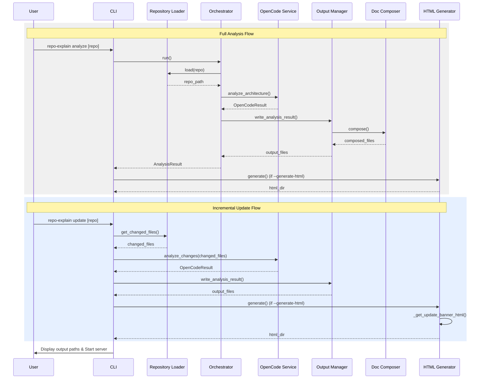

# Data Flow

This page visualizes how data flows through the system.

## Data Flow Diagram

View Mermaid Source

## Description

1. **Input**: User provides a repository path or URL to the `cli`.
2. **Loading**: `RepositoryLoader` resolves the path or clones the repo.
3. **Orchestration**: `Orchestrator` (or `cli` directly for simple commands) manages the pipeline.
4. **Analysis**: `OpenCodeService` or `OpenCodeRunner` executes AI analysis (full or incremental).
5. **Processing**: `OutputManager` captures raw output and artifacts.
6. **Composition**: `DocComposer` builds structured Markdown docs and diagrams.
7. **Conversion**: `HTMLGenerator` optionally converts the results to HTML for viewing.
