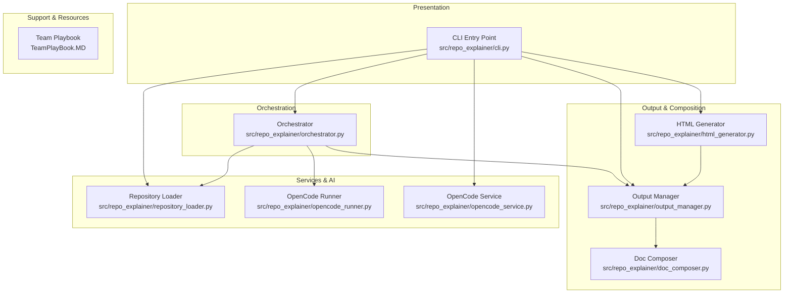

# Architecture Overview: repo-explainer

## Executive Summary
`repo-explainer` is an AI-powered documentation generator designed to analyze software repositories and produce structured, navigable, and visually rich documentation. It leverages the OpenCode CLI as its analysis engine, providing deep insights into project structure, component relationships, and data flows.

The system supports full repository analysis and incremental updates based on recent commits. It generates both Markdown and HTML documentation, providing a local preview server for easy exploration.

## High-Level Architecture
The project follows a **Layered Architecture** pattern, separating concerns between CLI interaction, service orchestration, and output management.

- **Presentation Layer**: Typer-based CLI for user interaction.
- **Service Layer**: Orchestrates repository loading and AI-powered analysis via OpenCode.
- **Composition Layer**: Post-processes analysis data into structured markdown, visual diagrams, and HTML.

## System Components

### Component: CLI Entry Point
- **ID**: `cli`
- **Type**: `module`
- **Location**: `src/repo_explainer/cli.py`
- **Purpose**: Main entry point for the application, handling user commands and CLI formatting.
- **Responsibilities**:
  - Parse CLI arguments and options using Typer.
  - Coordinate high-level analysis and incremental update workflows.
  - Manage HTML documentation generation and serving.
- **Key Functions**:
  - `analyze` - Main command for initial repository analysis.
  - `update` - Command for incremental documentation updates based on Git history.
  - `generate_html` - Command for converting Markdown to HTML and serving it.

### Component: Orchestrator
- **ID**: `orchestrator`
- **Type**: `module`
- **Location**: `src/repo_explainer/orchestrator.py`
- **Purpose**: Coordinates the end-to-end analysis pipeline sequentially.
- **Responsibilities**:
  - Orchestrate the flow from loading to AI analysis to document generation.
  - Handle result aggregation and metadata capture.
  - Manage transitions between different pipeline stages.

### Component: Repository Loader
- **ID**: `repository-loader`
- **Type**: `module`
- **Location**: `src/repo_explainer/repository_loader.py`
- **Purpose**: Handles the resolution of local paths and cloning of remote Git repositories.
- **Responsibilities**:
  - Clone remote repositories to temporary directories.
  - Detect changes in recent commits for incremental updates.
  - Manage Git history analysis (last update markers).

### Component: OpenCode Integration Service
- **ID**: `opencode-service`
- **Type**: `module`
- **Location**: `src/repo_explainer/opencode_service.py`
- **Purpose**: High-level interface for OpenCode CLI execution with streaming support.
- **Responsibilities**:
  - Execute analysis prompts for architecture, patterns, and dependencies.
  - Perform incremental analysis on changed files.
  - Stream and parse JSON events from the analysis engine.

### Component: OpenCode Runner
- **ID**: `opencode-runner`
- **Type**: `module`
- **Location**: `src/repo_explainer/opencode_runner.py`
- **Purpose**: Low-level execution of OpenCode CLI commands with fallback support.
- **Responsibilities**:
  - Execute subprocess commands for OpenCode.
  - Build AI prompts for different analysis depths.
  - Provide fallback to Claude CLI if OpenCode is unavailable.

### Component: Document Composer
- **ID**: `doc-composer`
- **Type**: `module`
- **Location**: `src/repo_explainer/doc_composer.py`
- **Purpose**: Assembles the final, navigable documentation set from raw analysis artifacts.
- **Responsibilities**:
  - Render Mermaid diagrams to SVG with auto-fix capabilities.
  - Generate structured pages for components, APIs, and dependencies.
  - Create the `index.md` landing page and `coherence.json` manifest.

### Component: HTML Generator
- **ID**: `html-generator`
- **Type**: `module`
- **Location**: `src/repo_explainer/html_generator.py`
- **Purpose**: Converts Markdown documentation to a styled HTML website.
- **Responsibilities**:
  - Convert Markdown to HTML using themed templates.
  - Provide a local HTTP server for documentation preview.
  - Display update banners based on recent incremental analysis.
  - Generate an update history page from tracked sessions.

### Component: Output Manager
- **ID**: `output-manager`
- **Type**: `module`
- **Location**: `src/repo_explainer/output_manager.py`
- **Purpose**: Manages file system operations for saving analysis results and logs.
- **Responsibilities**:
  - Organize artifacts into `src/raw`, `src/logs`, and themed doc directories.
  - Capture metadata and raw execution logs.
  - Orchestrate the documentation composition process.

### Component: Team Playbook
- **ID**: `team-playbook`
- **Type**: `documentation`
- **Location**: `TeamPlayBook.MD`
- **Purpose**: Comprehensive engineering playbook covering workflows, quality standards, and communication norms.
- **Responsibilities**:
  - Define work flows, branching strategies, and PR expectations.
  - Establish testing guidelines and deployment protocols.
  - Document decision-making processes and incident handling.
  - Provide communication norms and resource locations.

## Data Flow
1. **Input**: User provides a repository path or URL to the `cli`.
2. **Loading**: `RepositoryLoader` resolves the path or clones the repo.
3. **Orchestration**: `Orchestrator` (or `cli` directly for simple commands) manages the pipeline.
4. **Analysis**: `OpenCodeService` or `OpenCodeRunner` executes AI analysis (full or incremental).
5. **Processing**: `OutputManager` captures raw output and artifacts.
6. **Composition**: `DocComposer` builds structured Markdown docs and diagrams.
7. **Conversion**: `HTMLGenerator` optionally converts the results to HTML for viewing.

## External Integrations
- **OpenCode CLI**: AI-powered analysis engine.
- **Mermaid CLI (mmdc)**: Diagram rendering engine.
- **Git**: Repository version control and history analysis.
