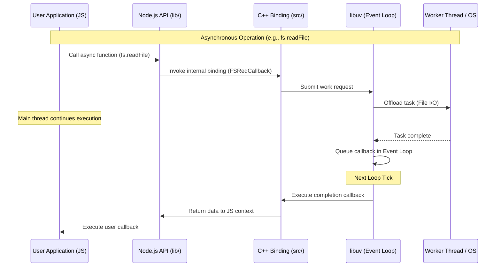

# Architecture Overview

## repo-explainer-xz_uzevw

This repository is a very_large-sized project primarily written in javascript.

## System Architecture

### Components

```mermaid
graph TB
    subgraph User_Space [User Space]
        UserApp[User Application]
    end

    subgraph Node_JS [Node.js Runtime]
        subgraph JS_Land [JavaScript Standard Library (lib/)]
            FS[fs module]
            HTTP[http module]
            NET[net module]
            Events[events module]
            Other[Other modules]
        end

        subgraph Bindings [C++ Bindings (src/)]
            NodeAPI[Node.js API]
            BindingWrappers[Internal Bindings]
        end

        subgraph Dependencies [Core Dependencies (deps/)]
            V8[V8 JavaScript Engine]
            Libuv[libuv (Async I/O)]
            OpenSSL[OpenSSL (Crypto)]
            Zlib[zlib (Compression)]
            CAres[c-ares (DNS)]
            LLHttp[llhttp (Parsing)]
        end
    end

    subgraph System [Operating System]
        Kernel[OS Kernel]
        ThreadPool[Thread Pool]
    end

    UserApp --> FS
    UserApp --> HTTP
    UserApp --> NET
    UserApp --> Events

    FS --> BindingWrappers
    HTTP --> BindingWrappers
    NET --> BindingWrappers

    BindingWrappers --> V8
    BindingWrappers --> Libuv
    BindingWrappers --> OpenSSL
    BindingWrappers --> Zlib
    BindingWrappers --> LLHttp

    Libuv --> Kernel
    Libuv --> ThreadPool
    CAres --> Kernel

```

## Key Components

### benchmark
- **Type**: module
- **Path**: `benchmark`
- **Files**: 20 source files

### tools
- **Type**: module
- **Path**: `tools`
- **Files**: 20 source files

### test
- **Type**: tests
- **Path**: `test`
- **Files**: 20 source files

### typings
- **Type**: module
- **Path**: `typings`
- **Files**: 20 source files

### lib
- **Type**: package
- **Path**: `lib`
- **Files**: 20 source files

### deps
- **Type**: module
- **Path**: `deps`
- **Files**: 20 source files

### doc
- **Type**: module
- **Path**: `doc`
- **Files**: 1 source files

## Data Flow



