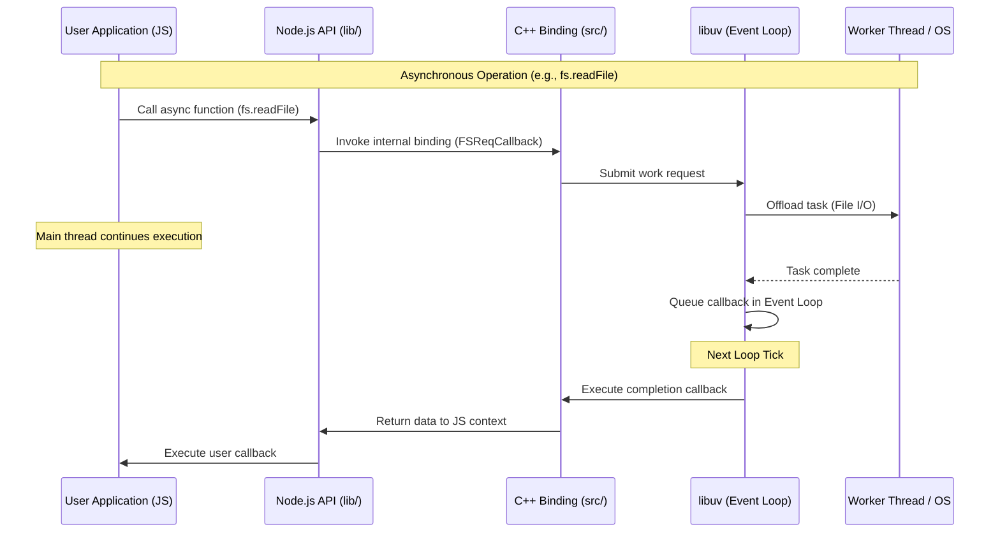

# repo-explainer-xz_uzevw - Repository Documentation

> Auto-generated documentation by repo-explainer

## Overview

| Property | Value |
|----------|-------|
| **Primary Language** | javascript |
| **All Languages** | python, javascript, typescript |
| **Size** | very_large (20,309 files) |
| **Total Lines** | 1,888,664 |
| **Last Analyzed** | 2026-01-17 11:28:18 |
| **Git Remote** | https://github.com/nodejs/node.git |
| **Branch** | main |
| **Commit** | 8365edcb |

## Table of Contents

### Architecture
- [Architecture Overview](architecture/overview.md)
- [System Architecture](architecture/system-architecture.md)

### Components
- [benchmark](components/benchmark/overview.md)
- [tools](components/tools/overview.md)
- [test](components/test/overview.md)
- [typings](components/typings/overview.md)
- [lib](components/lib/overview.md)
- [deps](components/deps/overview.md)
- [doc](components/doc/overview.md)

### Diagrams
- [Dataflow](architecture/diagrams/dataflow.mermaid)
- [Components](architecture/diagrams/components.mermaid)

## Visual Overview

### Dataflow



### Components

```mermaid
graph TB
    subgraph User_Space [User Space]
        UserApp[User Application]
    end

    subgraph Node_JS [Node.js Runtime]
        subgraph JS_Land [JavaScript Standard Library (lib/)]
            FS[fs module]
            HTTP[http module]
            NET[net module]
            Events[events module]
            Other[Other modules]
        end

        subgraph Bindings [C++ Bindings (src/)]
            NodeAPI[Node.js API]
            BindingWrappers[Internal Bindings]
        end

        subgraph Dependencies [Core Dependencies (deps/)]
            V8[V8 JavaScript Engine]
            Libuv[libuv (Async I/O)]
            OpenSSL[OpenSSL (Crypto)]
            Zlib[zlib (Compression)]
            CAres[c-ares (DNS)]
            LLHttp[llhttp (Parsing)]
        end
    end

    subgraph System [Operating System]
        Kernel[OS Kernel]
        ThreadPool[Thread Pool]
    end

    UserApp --> FS
    UserApp --> HTTP
    UserApp --> NET
    UserApp --> Events

    FS --> BindingWrappers
    HTTP --> BindingWrappers
    NET --> BindingWrappers

    BindingWrappers --> V8
    BindingWrappers --> Libuv
    BindingWrappers --> OpenSSL
    BindingWrappers --> Zlib
    BindingWrappers --> LLHttp

    Libuv --> Kernel
    Libuv --> ThreadPool
    CAres --> Kernel

```


### Additional
- [Dependencies](dependencies/internal.md)
- [Patterns](patterns/identified-patterns.md)

---

*Generated by [repo-explainer](https://github.com/your-org/repo-explainer)*
