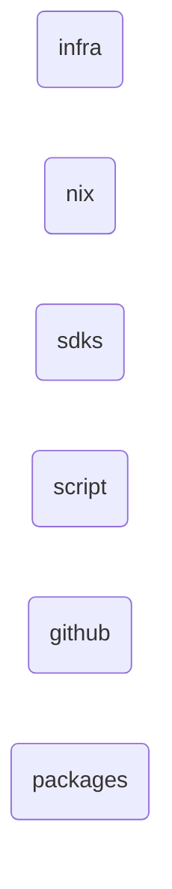
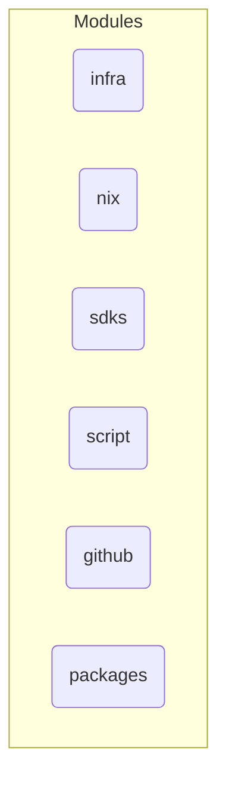
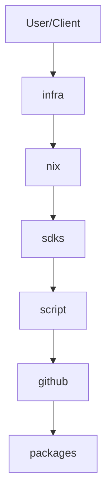

# Architecture Overview

## repo-explainer-qcbt5fu8

This repository is a medium-sized project primarily written in typescript.

## System Architecture

### High-Level Architecture

### Component Relationships

## Key Components

### infra
- **Type**: module
- **Path**: `infra`
- **Files**: 5 source files

### nix
- **Type**: module
- **Path**: `nix`
- **Files**: 5 source files

### sdks
- **Type**: module
- **Path**: `sdks`
- **Files**: 3 source files

### script
- **Type**: module
- **Path**: `script`
- **Files**: 8 source files

### github
- **Type**: module
- **Path**: `github`
- **Files**: 2 source files

### packages
- **Type**: module
- **Path**: `packages`
- **Files**: 20 source files

## Data Flow

