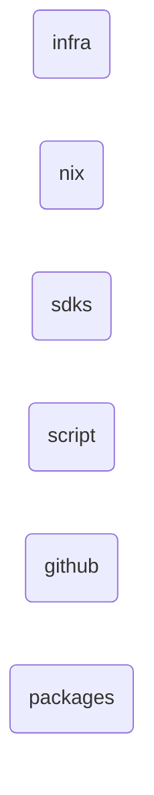
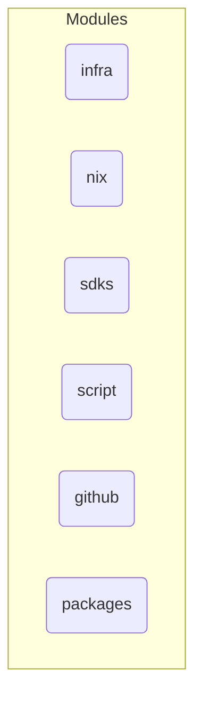
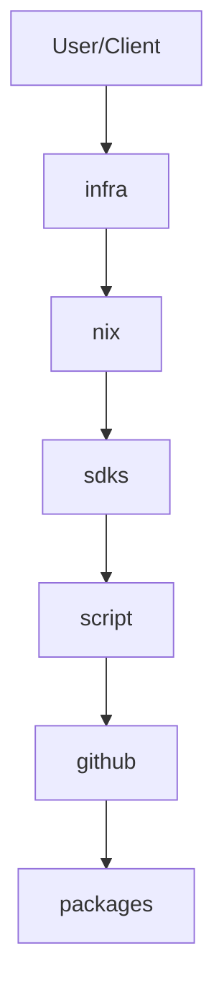
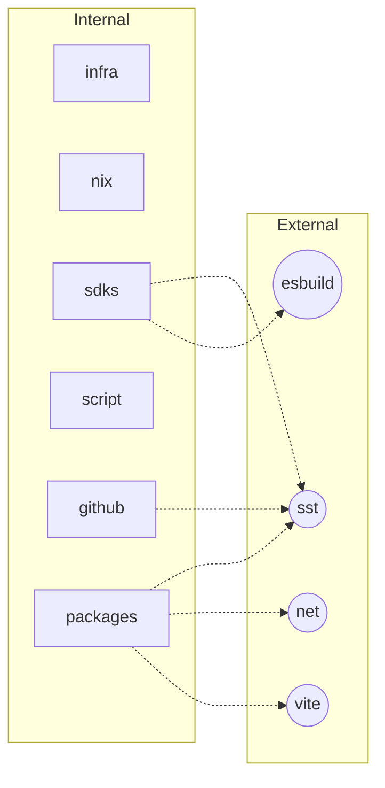
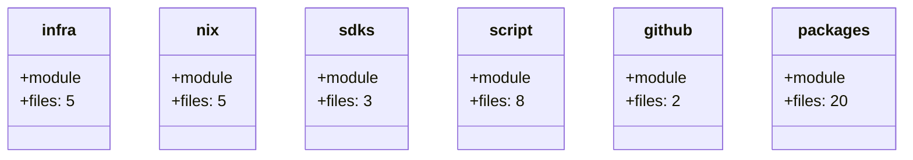

# repo-explainer-qcbt5fu8 - Repository Documentation

> Auto-generated documentation by repo-explainer

## Overview

| Property | Value |
|----------|-------|
| **Primary Language** | typescript |
| **All Languages** | typescript, javascript |
| **Size** | medium (735 files) |
| **Total Lines** | 140,776 |
| **Last Analyzed** | 2026-01-17 12:20:13 |
| **Git Remote** | git@github.com:anomalyco/opencode.git |
| **Branch** | dev |
| **Commit** | a58d1be8 |

## Table of Contents

### Architecture
- [Architecture Overview](architecture/overview.md)
- [System Architecture](architecture/system-architecture.md)

### Components
- [infra](components/infra/overview.md)
- [nix](components/nix/overview.md)
- [sdks](components/sdks/overview.md)
- [script](components/script/overview.md)
- [github](components/github/overview.md)
- [packages](components/packages/overview.md)

### Diagrams
- [High-Level Architecture](architecture/diagrams/high-level.png)
- [Component Relationships](architecture/diagrams/component-diagram.png)
- [Data Flow](architecture/diagrams/dataflow.png)
- [Dependency Graph](dependencies/diagrams/dependency-graph.png)
- [Class Diagram](data-models/diagrams/class-diagram.png)

## Visual Overview

### High-Level Architecture

### Component Relationships

### Data Flow

### Dependency Graph

### Class Diagram

### Additional
- [Dependencies](dependencies/internal.md)
- [Patterns](patterns/identified-patterns.md)

---

*Generated by [repo-explainer](https://github.com/your-org/repo-explainer)*
