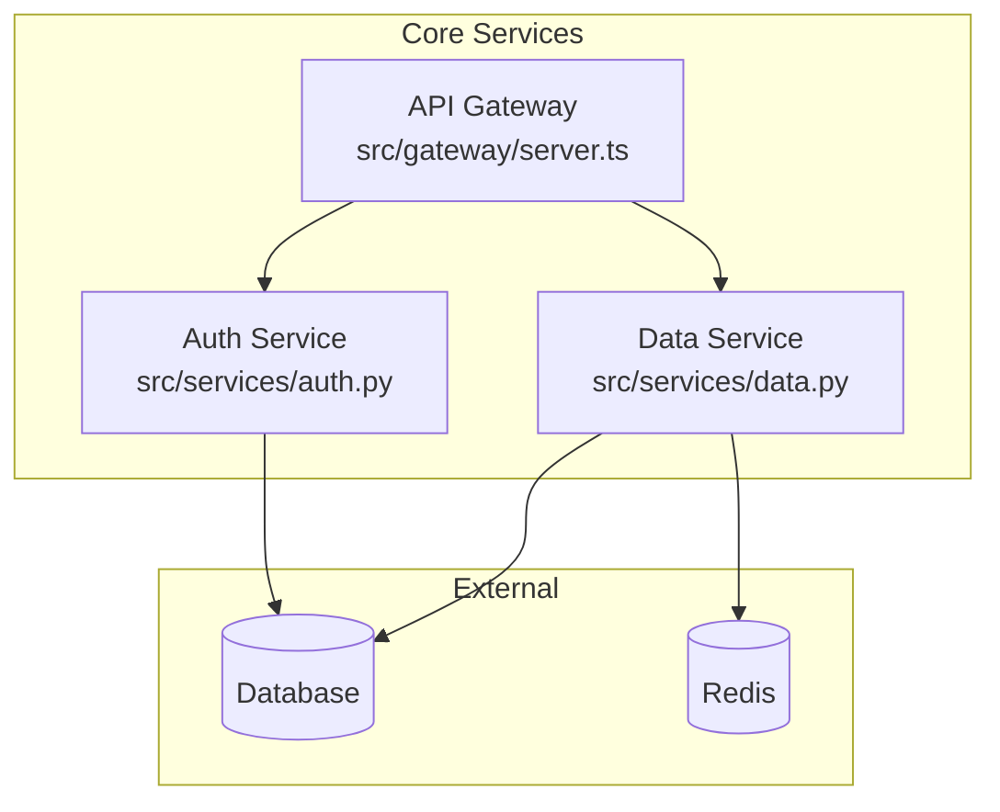
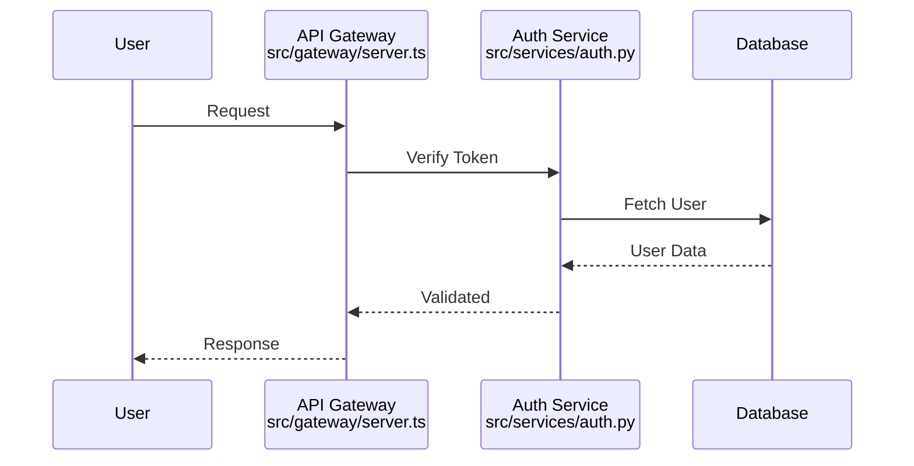

# Architecture Deep Dive - Comprehensive Analysis

## Objective
Perform comprehensive architectural analysis with explicit file-to-component mappings, function-level details, and orchestrator-ready metadata. This analysis supports Stage 2+ orchestrators requiring precise references for pattern detection and dependency mapping.

## Required Outputs

### 1. Architecture Overview (architecture.md)
Create a detailed markdown document with the following sections:

```markdown
# Architecture Overview: <repo-name>

## Executive Summary
[2-3 paragraph overview of system purpose and architecture]

## High-Level Architecture
[Describe architectural style: microservices, monolith, layered, etc.]
[Include diagram reference: See `diagrams/architecture.mermaid`]

## System Components

### Component: <component-name>
- **ID**: `<component-id>`
- **Type**: `<service|module|package>`
- **Location**: `<file-path>`
- **Lines**: `<start>-<end>` (if applicable)
- **Purpose**: [Description]
- **Responsibilities**:
  - [Responsibility 1]
  - [Responsibility 2]
- **Key Functions**:
  - `<function-name>` (`<file>:<line-range>`) - [Purpose]
  - ...
- **Dependencies**:
  - Internal: `<component-id-1>`, `<component-id-2>`
  - External: `<package-1>`, `<package-2>`
- **Interfaces**: [If exposes API/public functions]

[Repeat for each major component]

## Data Flow
[Describe how data moves through the system]
[Reference dataflow diagram]

## Entry Points
- **Primary**: `<file-path>` - [Description]
- **Secondary**: `<file-path>` - [Description]

## External Integrations
[List external services, APIs, databases]
```

### 2. Component Diagram (components.mermaid)
Generate a Mermaid graph showing:
- All major components as nodes
- Dependencies as directed edges
- External systems as separate nodes
- Clear labels and groupings

Example:


### 3. Data Flow Diagram (dataflow.mermaid)
Create a sequence diagram showing typical request flow:


### 4. Component Registry (components.json)
Generate comprehensive JSON with:
```json
{
  "repository": {
    "name": "<repo-name>",
    "path": "<path>",
    "primary_language": "<language>",
    "languages": ["<lang1>", "<lang2>"],
    "entry_points": ["<file1>", "<file2>"]
  },
  "components": [
    {
      "component_id": "auth-service",
      "name": "Authentication Service",
      "type": "service",
      "file_path": "src/services/auth.py",
      "line_range": {"start": 1, "end": 250},
      "description": "Handles user authentication and authorization",
      "key_functions": [
        {
          "name": "verify_token",
          "file_path": "src/services/auth.py",
          "line_range": {"start": 45, "end": 68},
          "signature": "def verify_token(token: str) -> User",
          "purpose": "Validates JWT tokens and returns user object"
        },
        {
          "name": "create_session",
          "file_path": "src/services/auth.py",
          "line_range": {"start": 70, "end": 95},
          "signature": "def create_session(user_id: str) -> Session",
          "purpose": "Creates authenticated session for user"
        }
      ],
      "dependencies": {
        "internal": ["database-client", "cache-client"],
        "external": ["pyjwt", "cryptography"]
      },
      "interfaces": [
        {
          "name": "AuthAPI",
          "type": "REST",
          "endpoints": ["/auth/login", "/auth/logout", "/auth/verify"]
        }
      ]
    }
  ]
}
```

### 5. Technology Stack (tech-stack.txt)
Detailed technology inventory with versions where available:
```
# Programming Languages
- Python 3.11+ (primary)
- JavaScript/TypeScript (frontend)
- SQL (database queries)

# Backend Frameworks
- FastAPI 0.104.1 (web framework)
- SQLAlchemy 2.0 (ORM)
- Celery 5.3 (task queue)

# Frontend Frameworks
- React 18.2 (UI library)
- Redux Toolkit 1.9 (state management)
- TailwindCSS 3.3 (styling)

# Databases & Caching
- PostgreSQL 15 (primary database)
- Redis 7.0 (caching, sessions)

# Infrastructure & DevOps
- Docker (containerization)
- GitHub Actions (CI/CD)
- pytest (testing)
- mypy (type checking)

# External Services
- AWS S3 (file storage)
- SendGrid (email)
- Stripe (payments)

# Development Tools
- npm/yarn (JavaScript package management)
- pip/poetry (Python package management)
- ESLint, Black (code formatting)
```

## Analysis Instructions

### Step 1: Initial Reconnaissance
1. Read package/manifest files to understand dependencies
2. Identify entry points (main.py, index.js, cmd/main.go, etc.)
3. Scan directory structure to find major modules
4. Detect framework from dependencies and file patterns

### Step 2: Component Identification
For each significant module/service/package:
1. **Determine boundaries**: What files belong to this component?
2. **Extract metadata**:
   - Component name and ID
   - Primary file path and line ranges
   - Type classification (service, module, package, library)
3. **Analyze responsibilities**: What does this component do?
4. **Identify key functions/classes**:
   - Read the main files
   - Extract 3-5 most important functions/classes
   - Record exact file paths and line numbers
   - Include function signatures

### Step 3: Dependency Mapping
1. **Internal dependencies**:
   - Track imports/requires between components
   - Build component→component relationships
   - Record relationship type (imports, calls, extends)
2. **External dependencies**:
   - Extract from package managers
   - Note which components use which external packages

### Step 4: Architecture Analysis
1. **Identify architectural pattern**:
   - Look for MVC indicators (models/, views/, controllers/)
   - Look for microservices (separate services, APIs between them)
   - Look for layered architecture (presentation, business, data layers)
2. **Document data flow**:
   - Trace typical request path
   - Identify where data enters/exits system
   - Note transformations and storage points

### Step 5: Interface Documentation
For components exposing public APIs:
1. Identify API type (REST, GraphQL, gRPC, function exports)
2. List main endpoints/functions
3. Document request/response patterns where evident

### Step 6: Diagram Generation
1. **Component diagram**: Show all components and their relationships
2. **Dataflow diagram**: Show typical request flow with file references
3. **Include file paths in diagram labels** where space allows

## Critical Requirements

### File-to-Component Mapping
**EVERY component MUST include**:
- `file_path`: Exact relative path from repo root
- `line_range`: Start and end lines (when analyzing classes/functions)
- Component IDs must be unique and consistent across all outputs

### Function-Level Details
**For key functions, MUST include**:
- Function name
- File path where defined
- Line range (start and end)
- Signature (parameters and return type if available)
- One-sentence purpose

### Relationship Documentation
**For dependencies, MUST specify**:
- Source component ID
- Target component ID or package name
- Relationship type (imports, calls, extends, implements)

## Validation Checklist
Before completing, verify:
- [ ] Every component has a valid file_path
- [ ] At least 3 key functions documented per major component
- [ ] Line ranges provided for all functions
- [ ] Component diagram includes all major components
- [ ] Dataflow diagram shows at least one complete flow
- [ ] External dependencies listed with package names
- [ ] JSON output is valid and matches schema

## Token Efficiency Guidelines
- Read files strategically (manifests first, then entry points, then referenced modules)
- Use glob/grep to find definitions before reading full files
- For large files, use line ranges to read only relevant sections
- Cache component information to avoid re-analyzing same code

## Example Workflow
```
1. Read package.json/pyproject.toml → Identify framework and dependencies
2. Read main entry point → Identify initial components
3. Glob for "service*", "controller*", "model*" → Find component files
4. For each component file:
   a. Read class/function definitions
   b. Extract key functions with line numbers
   c. Note imports/dependencies
   d. Record in components.json
5. Generate architecture.md with collected data
6. Create Mermaid diagrams from component relationships
7. Validate all file paths and line ranges are correct
```

## Success Criteria
- 100% of identified components have file_path mappings
- At least 90% of key functions have line_range data
- Component diagram accurately represents relationships
- Architecture documentation is navigable and cross-referenced
- Output is valid JSON conforming to orchestrator schema
