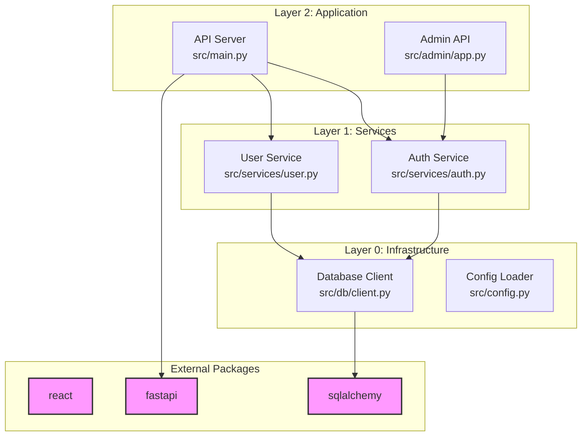

# Dependency Mapping - Internal & External Dependencies

## Objective
Build comprehensive dependency graphs showing both internal (component-to-component) and external (package) dependencies. Generate visualization-ready data for dependency diagrams.

## Context Requirements
This prompt assumes access to:
- `components.json` from architecture analysis
- Package manager files (package.json, requirements.txt, go.mod, Cargo.toml, pom.xml, etc.)
- Source code files for import analysis

## Required Outputs

### 1. Dependency Report (dependencies/overview.md)
```markdown
# Dependency Analysis

## Summary
- **Total Components**: X
- **Internal Dependencies**: Y edges
- **External Packages**: Z packages
- **Dependency Layers**: N (depth of dependency tree)

## External Dependencies

### Production Dependencies
| Package | Version | Used By Components | Purpose |
|---------|---------|-------------------|---------|
| `<package>` | `<version>` | `<component-id-1>`, `<component-id-2>` | <purpose> |

### Development Dependencies
| Package | Version | Purpose |
|---------|---------|---------|
| `<package>` | `<version>` | <purpose> |

## Internal Dependency Graph

### Component: `<component-id>`
**Depends on**:
- `<component-id-2>` (via `<file>:<line>`)
- `<component-id-3>` (via `<file>:<line>`)

**Depended by**:
- `<component-id-4>`
- `<component-id-5>`

**Circular Dependencies** ⚠️:
- None detected
OR
- `<component-a>` ↔ `<component-b>` (via `<files>`)

## Dependency Layers

**Layer 0** (No dependencies):
- `<component-id-1>`

**Layer 1** (Depends only on Layer 0):
- `<component-id-2>`
- `<component-id-3>`

**Layer 2** (Depends on Layer 0-1):
- `<component-id-4>`

## Critical Dependencies
Components with the most dependents:
1. `<component-id>` (X dependents)
2. `<component-id>` (Y dependents)

Components with the most dependencies:
1. `<component-id>` (X dependencies)
2. `<component-id>` (Y dependencies)
```

### 2. Dependency Graph Data (dependencies/dependency-graph.json)
```json
{
  "external_packages": [
    {
      "name": "react",
      "version": "18.2.0",
      "manager": "npm",
      "type": "production",
      "used_by_components": ["ui-components", "app-shell"],
      "used_by_files": [
        {
          "file_path": "src/components/Button.tsx",
          "import_statement": "import React from 'react'",
          "line": 1
        }
      ]
    },
    {
      "name": "fastapi",
      "version": "0.104.1",
      "manager": "pip",
      "type": "production",
      "used_by_components": ["api-server"],
      "used_by_files": [
        {
          "file_path": "src/main.py",
          "import_statement": "from fastapi import FastAPI",
          "line": 3
        }
      ]
    }
  ],
  "internal_dependencies": [
    {
      "from_component": "api-server",
      "to_component": "auth-service",
      "relationship": "imports",
      "evidence": [
        {
          "file_path": "src/main.py",
          "line": 5,
          "import_statement": "from services.auth import verify_token"
        }
      ]
    },
    {
      "from_component": "auth-service",
      "to_component": "database-client",
      "relationship": "calls",
      "evidence": [
        {
          "file_path": "src/services/auth.py",
          "line": 45,
          "code_context": "db.query(User).filter(...)"
        }
      ]
    }
  ],
  "dependency_layers": [
    {
      "layer": 0,
      "components": ["database-client", "config-loader"]
    },
    {
      "layer": 1,
      "components": ["auth-service", "user-service"]
    },
    {
      "layer": 2,
      "components": ["api-server", "admin-api"]
    }
  ],
  "circular_dependencies": [
    {
      "cycle": ["component-a", "component-b", "component-a"],
      "evidence": [
        {
          "from": "component-a",
          "to": "component-b",
          "file": "src/a.py",
          "line": 5
        },
        {
          "from": "component-b",
          "to": "component-a",
          "file": "src/b.py",
          "line": 8
        }
      ]
    }
  ],
  "metrics": {
    "total_components": 15,
    "total_internal_edges": 42,
    "total_external_packages": 28,
    "max_dependency_depth": 3,
    "circular_dependency_count": 1
  }
}
```

### 3. Dependency Diagram (dependencies/dependency-graph.mermaid)


## Analysis Instructions

### Step 1: Extract External Dependencies

#### For each package manager file found:

**npm (package.json)**:
```json
{
  "dependencies": {...},  // Production
  "devDependencies": {...}  // Development
}
```

**pip (requirements.txt, pyproject.toml)**:
```
fastapi==0.104.1
sqlalchemy>=2.0.0
```

**Go (go.mod)**:
```
require (
    github.com/gin-gonic/gin v1.9.1
)
```

**Rust (Cargo.toml)**:
```toml
[dependencies]
tokio = "1.35"
```

**Maven (pom.xml)**:
```xml
<dependencies>
  <dependency>...</dependency>
</dependencies>
```

#### Record:
- Package name
- Version/version constraint
- Package manager type
- Dependency type (production vs development)

### Step 2: Map External Package Usage

For each external package:
1. **Search for import/require statements**:
   - Python: `import <pkg>`, `from <pkg> import`
   - JavaScript: `import ... from '<pkg>'`, `require('<pkg>')`
   - Go: `import "<pkg>"`
   - Rust: `use <pkg>`

2. **Record usage locations**:
   - File path
   - Line number
   - Import statement text
   - Map to component ID from components.json

3. **Determine purpose** (if evident):
   - Web framework
   - Database ORM
   - HTTP client
   - Testing
   - Utilities

### Step 3: Build Internal Dependency Graph

#### For each component in components.json:

1. **Find all imports within codebase**:
   - Read the component's primary file
   - Extract all import statements
   - Filter for internal imports (same repository)

2. **Map import to target component**:
   - Match imported file path to component in components.json
   - Record relationship type:
     - `imports`: Direct import statement
     - `calls`: Function/method calls
     - `extends`: Class inheritance
     - `implements`: Interface implementation

3. **Record evidence**:
   - Source file path and line number
   - Import statement or code snippet

#### Example:
```python
# src/api/server.py (component: api-server)
from services.auth import verify_token  # Line 5
```
**Creates edge**: `api-server` → `auth-service` (imports, src/api/server.py:5)

### Step 4: Calculate Dependency Layers

1. **Identify Layer 0** (foundation):
   - Components with no internal dependencies
   - Only depend on external packages

2. **Build upward**:
   - Layer N contains components that depend only on layers 0 to N-1
   - Continue until all components are layered

3. **Detect circular dependencies**:
   - If a component can't be layered, it's in a cycle
   - Trace the cycle and report all involved components

### Step 5: Generate Dependency Diagram

**Layout strategy**:
- External packages at top or left
- Layer 0 at bottom
- Higher layers above
- Use subgraphs for logical grouping
- Color-code external vs internal nodes
- Include file paths in node labels

**Simplification for large graphs**:
- If > 30 components, show only major components
- Provide filter options in comments
- Create separate diagrams per subsystem if needed

## Analysis Workflow

```
1. Scan for package manager files
2. Extract all external dependencies with versions
3. Load components.json for component definitions
4. For each component:
   a. Read primary file
   b. Extract import statements
   c. Resolve imports to component IDs or external packages
   d. Record all dependency edges with evidence
5. Calculate dependency layers (topological sort)
6. Detect circular dependencies
7. Generate dependency-graph.json
8. Generate dependency-graph.mermaid
9. Write overview.md
10. Validate all file paths and line numbers
```

## Critical Requirements

### Evidence for Every Edge
**MUST include**:
- Source file path
- Line number where dependency is declared
- Import statement or code snippet
- Target component ID or package name

### Dependency Classification
For each internal dependency, specify:
- **Type**: imports | calls | extends | implements | uses
- **Evidence**: Concrete file path and line number

### Circular Dependency Detection
- Run cycle detection algorithm
- Report ALL circular dependencies found
- Provide complete cycle path (A → B → C → A)
- Include file references for each edge in cycle

## Validation Checklist

- [ ] All external packages have versions
- [ ] All package-to-component mappings verified
- [ ] All internal edges have file/line evidence
- [ ] Dependency layers correctly calculated
- [ ] No components unassigned to layers (except those in cycles)
- [ ] Circular dependencies reported with complete cycles
- [ ] Mermaid diagram is valid syntax
- [ ] JSON output is valid and matches schema

## Token Efficiency

**Optimize by**:
- Reading package files first (smallest files)
- Using grep to find imports before reading full files
- Reading only imports section of large files
- Reusing components.json instead of re-analyzing structure
- Caching import resolution (same package appears in multiple files)

## Success Criteria
- 100% of external dependencies cataloged
- >= 90% of internal dependencies mapped
- All dependency edges have file/line evidence
- Dependency diagram accurately represents relationships
- Circular dependencies detected and reported
- Layer assignment is logically correct
