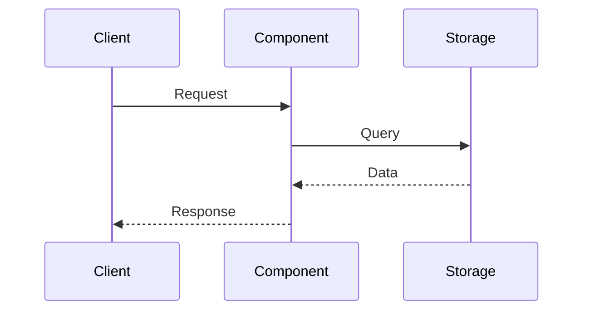
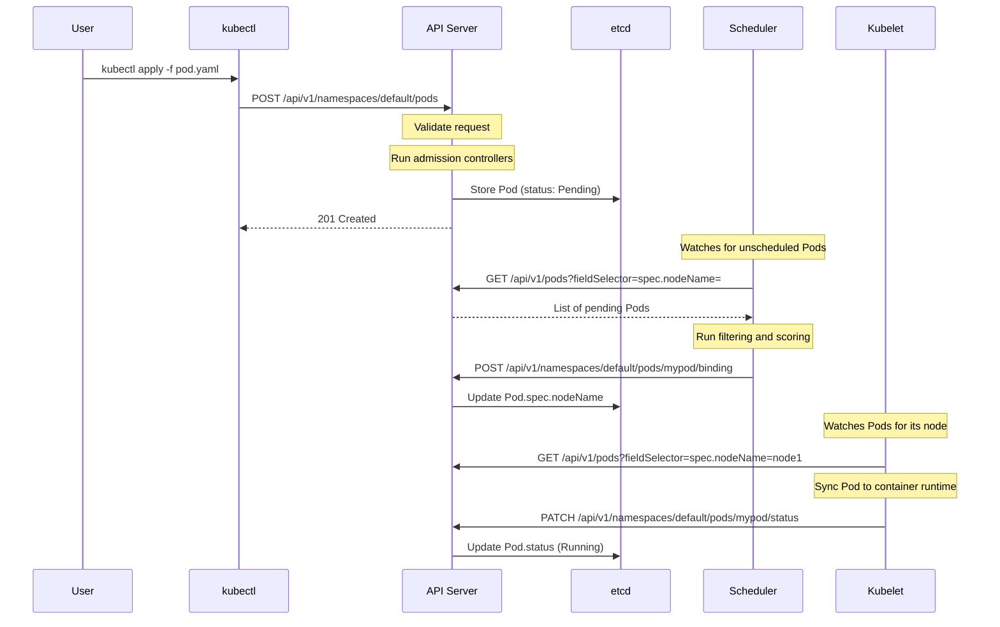

# Extra Deep Analysis - Exhaustive Repository Documentation

## Objective
Generate exhaustive, encyclopedia-style documentation that covers virtually every significant aspect of a large codebase. This mode produces dozens of individual markdown files covering each component, interaction pattern, subsystem, API, and data flow in detail.

## Context
This prompt is for users who want **complete coverage** of a repository. Unlike standard analysis which focuses on key components, extra-deep analysis aims to document:
- Every major component with its own dedicated page
- Every interaction pattern between components
- Every significant subsystem and module
- Every public API and interface
- Controller/handler details
- Extension points and plugins
- Testing strategies per component
- Configuration options

## Output Structure

You will generate multiple files in a structured hierarchy:

```
<output>/
├── index.md                          # Main entry point with navigation
├── architecture.md                   # High-level architecture overview
├── components/
│   ├── index.md                      # Component directory
│   ├── api-server.md                 # Per-component deep dive
│   ├── scheduler.md
│   ├── controller-manager.md
│   ├── kubelet.md
│   ├── kube-proxy.md
│   └── [other-components].md
├── subsystems/
│   ├── index.md                      # Subsystem directory
│   ├── authentication.md             # Deep dive into auth subsystem
│   ├── authorization.md
│   ├── admission-control.md
│   ├── storage.md
│   ├── networking.md
│   └── [other-subsystems].md
├── interactions/
│   ├── index.md                      # Interaction patterns directory
│   ├── pod-scheduling-flow.md        # Detailed interaction walkthroughs
│   ├── deployment-rollout.md
│   ├── service-discovery.md
│   ├── volume-provisioning.md
│   └── [other-flows].md
├── apis/
│   ├── index.md                      # API documentation directory
│   ├── core-v1.md                    # API group documentation
│   ├── apps-v1.md
│   ├── batch-v1.md
│   └── [other-api-groups].md
├── controllers/
│   ├── index.md                      # Controllers directory
│   ├── deployment-controller.md      # Per-controller documentation
│   ├── replicaset-controller.md
│   ├── job-controller.md
│   └── [other-controllers].md
├── interfaces/
│   ├── index.md                      # Key interfaces
│   ├── cri.md                        # Container Runtime Interface
│   ├── cni.md                        # Container Network Interface
│   ├── csi.md                        # Container Storage Interface
│   └── [other-interfaces].md
├── extension-points/
│   ├── index.md                      # Extension mechanisms
│   ├── custom-resources.md
│   ├── admission-webhooks.md
│   ├── scheduler-plugins.md
│   └── [other-extensions].md
├── diagrams/
│   ├── architecture.mermaid
│   ├── component-relationships.mermaid
│   ├── data-flows/
│   │   ├── pod-creation.mermaid
│   │   ├── service-routing.mermaid
│   │   └── [other-flows].mermaid
│   └── sequence-diagrams/
│       ├── api-request.mermaid
│       ├── scheduling.mermaid
│       └── [other-sequences].mermaid
├── tech-stack.txt                    # Technology summary
└── glossary.md                       # Comprehensive glossary
```

## Required Output Files

### 1. Main Index (index.md)

```markdown
# [Project Name] - Complete Documentation

> Exhaustive documentation generated by repo-explainer (extra-deep mode)

## Quick Start
[2-3 paragraphs for someone who just wants to get oriented]

## Documentation Map

### Core Components
| Component | Purpose | Documentation |
|-----------|---------|---------------|
| API Server | Central control plane API | [View →](components/api-server.md) |
| Scheduler | Workload placement | [View →](components/scheduler.md) |
| ... | ... | ... |

### Subsystems
| Subsystem | Purpose | Documentation |
|-----------|---------|---------------|
| Authentication | Identity verification | [View →](subsystems/authentication.md) |
| ... | ... | ... |

### Interaction Patterns
| Flow | Description | Documentation |
|------|-------------|---------------|
| Pod Scheduling | How pods get assigned to nodes | [View →](interactions/pod-scheduling-flow.md) |
| ... | ... | ... |

### APIs
| API Group | Resources | Documentation |
|-----------|-----------|---------------|
| core/v1 | Pod, Service, Node, etc. | [View →](apis/core-v1.md) |
| ... | ... | ... |

## Architecture Overview
[Brief architecture description with link to detailed page]


[Full Architecture Details →](architecture.md)

## Getting Started Guides
- [Understanding the Codebase](guides/understanding-codebase.md)
- [Making Your First Change](guides/first-contribution.md)
- [Running Tests](guides/testing.md)

## Glossary
[Link to comprehensive glossary](glossary.md)
```

### 2. Per-Component Documentation (components/*.md)

Each component file should follow this template:

```markdown
# [Component Name]

> [One-line description]

## Overview
[2-3 paragraph description of what this component does and why it exists]

## Location in Codebase
- **Entry Point:** `cmd/[component]/main.go`
- **Core Logic:** `pkg/[component]/`
- **Configuration:** `cmd/[component]/app/options/`

## Architecture

### Internal Structure
[Description of how the component is internally organized]

```
pkg/component/
├── server.go           # Main server setup
├── handlers/           # Request handlers
├── storage/            # Storage adapters
└── options/            # Configuration
```

### Key Types and Interfaces
| Type | File | Purpose |
|------|------|---------|
| `Server` | `pkg/component/server.go:45` | Main server struct |
| `Handler` | `pkg/component/handlers/handler.go:23` | Request handling interface |
| ... | ... | ... |

## Responsibilities
1. **[Responsibility 1]** - [Detailed explanation]
2. **[Responsibility 2]** - [Detailed explanation]
3. **[Responsibility 3]** - [Detailed explanation]

## Configuration Options
| Flag | Default | Description |
|------|---------|-------------|
| `--option1` | `value` | Description of option |
| ... | ... | ... |

## Interactions

### Dependencies (What This Component Uses)
| Component | How It's Used |
|-----------|---------------|
| etcd | Persists state |
| ... | ... |

### Dependents (What Uses This Component)
| Component | How It Uses This |
|-----------|------------------|
| kubectl | Sends API requests |
| ... | ... |

### Communication Patterns
- **Inbound:** [How requests come in]
- **Outbound:** [How this component talks to others]

## Data Flow
[Description of how data moves through this component]



## Key Functions

### `FunctionName`
**File:** `pkg/component/file.go:123-145`
**Signature:** `func FunctionName(ctx context.Context, obj *Object) error`

[Description of what this function does]

```go
// Key implementation snippet (if helpful)
```

### `AnotherFunction`
...

## Extension Points
[How can this component be extended?]

- **Plugin Interface:** `pkg/component/plugins/interface.go`
- **Webhooks:** [If applicable]
- **Configuration:** [Custom configuration options]

## Testing
- **Unit Tests:** `pkg/component/*_test.go`
- **Integration Tests:** `test/integration/component/`
- **E2E Tests:** `test/e2e/component/`

### Running Tests
```bash
# Unit tests
go test ./pkg/component/...

# Integration tests
make test-integration WHAT=./test/integration/component/
```

## Debugging Tips
- [Tip 1]
- [Tip 2]
- [How to enable verbose logging]

## Related Documentation
- [Link to related component](other-component.md)
- [Link to relevant interaction](../interactions/relevant-flow.md)
- [Official Kubernetes docs](https://kubernetes.io/docs/...)

## Revision History
- **Last Updated:** [Date]
- **Kubernetes Version:** [Version analyzed]
```

### 3. Per-Interaction Documentation (interactions/*.md)

```markdown
# [Interaction Name] Flow

> [One-line description of what this interaction accomplishes]

## Overview
[2-3 paragraphs explaining this interaction pattern]

## Participants
| Component | Role in This Flow |
|-----------|-------------------|
| kubectl | Initiates the request |
| API Server | Validates and persists |
| ... | ... |

## Prerequisites
- [What state must exist before this flow can happen]
- [Required configurations]

## Flow Diagram



## Step-by-Step Walkthrough

### Step 1: [Step Name]
**Component:** [Which component]
**File:** `path/to/file.go:line`

[Detailed description of what happens]

```go
// Relevant code snippet
```

### Step 2: [Step Name]
...

## Error Handling
| Error Scenario | How It's Handled |
|----------------|------------------|
| Validation failure | 400 Bad Request returned |
| No nodes available | Pod stays Pending |
| ... | ... |

## Retry Behavior
[How are failures retried?]

## Timeouts
| Operation | Timeout | Configurable? |
|-----------|---------|---------------|
| API request | 30s | Yes, via --request-timeout |
| ... | ... | ... |

## Observability
- **Metrics:** [Relevant metrics]
- **Logs:** [Where to find logs]
- **Events:** [Kubernetes events generated]

## Related Flows
- [Link to related interaction](other-flow.md)

## Troubleshooting
| Symptom | Possible Cause | Solution |
|---------|----------------|----------|
| Pod stuck in Pending | No schedulable nodes | Check node resources |
| ... | ... | ... |
```

### 4. Per-Controller Documentation (controllers/*.md)

```markdown
# [Controller Name]

> [One-line description]

## Overview
[What this controller does]

## Location
- **Main:** `pkg/controller/[name]/controller.go`
- **Types:** `pkg/apis/[group]/types.go`

## Watched Resources
| Resource | Event Types | Purpose |
|----------|-------------|---------|
| Deployment | Add, Update, Delete | Primary watched resource |
| ReplicaSet | Add, Update, Delete | Owned resources |
| ... | ... | ... |

## Reconciliation Logic

### Trigger
[What triggers reconciliation?]

### Algorithm
1. [Step 1]
2. [Step 2]
3. [Step 3]

### Code Reference
```go
// pkg/controller/deployment/deployment_controller.go:234
func (dc *DeploymentController) syncDeployment(key string) error {
    // ...
}
```

## Status Conditions
| Condition | Meaning |
|-----------|---------|
| Available | At least minReadySeconds have passed |
| Progressing | Rolling update in progress |
| ... | ... |

## Events Generated
| Event | When Generated |
|-------|----------------|
| ScalingReplicaSet | When scaling up/down |
| ... | ... |

## Configuration
| Flag | Default | Description |
|------|---------|-------------|
| `--concurrent-deployment-syncs` | 5 | Number of concurrent syncs |
| ... | ... | ... |
```

### 5. Per-API Group Documentation (apis/*.md)

```markdown
# [API Group] API Reference

> API Group: `[group]/[version]`

## Overview
[What resources are in this API group]

## Resources

### [ResourceName]
| Field | Type | Description |
|-------|------|-------------|
| `metadata` | `ObjectMeta` | Standard object metadata |
| `spec` | `[Resource]Spec` | Desired state |
| `status` | `[Resource]Status` | Current state |

#### Spec Fields
| Field | Type | Required | Description |
|-------|------|----------|-------------|
| `replicas` | `int32` | No | Desired number of replicas |
| ... | ... | ... | ... |

#### Status Fields
| Field | Type | Description |
|-------|------|-------------|
| `readyReplicas` | `int32` | Number of ready replicas |
| ... | ... | ... |

### Example
```yaml
apiVersion: apps/v1
kind: Deployment
metadata:
  name: example
spec:
  replicas: 3
  selector:
    matchLabels:
      app: example
  template:
    spec:
      containers:
      - name: app
        image: nginx
```

### Endpoints
| Method | Path | Description |
|--------|------|-------------|
| GET | /apis/apps/v1/deployments | List all |
| GET | /apis/apps/v1/namespaces/{ns}/deployments/{name} | Get one |
| POST | /apis/apps/v1/namespaces/{ns}/deployments | Create |
| PUT | /apis/apps/v1/namespaces/{ns}/deployments/{name} | Update |
| DELETE | /apis/apps/v1/namespaces/{ns}/deployments/{name} | Delete |
```

### 6. Comprehensive Glossary (glossary.md)

```markdown
# Glossary

## A
### Admission Controller
[Definition with links to relevant documentation]

### Annotation
[Definition]

## B
...

## C
### Container Runtime Interface (CRI)
[Definition with link to interfaces/cri.md]

### Controller
[Definition with link to controllers/index.md]

### Custom Resource Definition (CRD)
[Definition with link to extension-points/custom-resources.md]

...
```

## Analysis Process

### Phase 1: Complete Inventory (10-15 min)
1. List ALL directories under `cmd/` - these are major components
2. List ALL directories under `pkg/` - these are subsystems
3. List ALL directories under `pkg/controller/` - these are controllers
4. List ALL API groups under `staging/src/k8s.io/api/`
5. Identify ALL interface definitions (CRI, CNI, CSI, etc.)

### Phase 2: Component Deep Dives (30-40 min)
For EACH component identified:
1. Read the main entry point
2. Read the core server/controller setup
3. Identify key types and interfaces
4. Map dependencies to other components
5. Document configuration options
6. Find relevant tests

### Phase 3: Interaction Mapping (15-20 min)
Identify and document major interaction patterns:
1. Trace request flows through the system
2. Document event-driven patterns
3. Map reconciliation loops
4. Document external integrations

### Phase 4: API Documentation (10-15 min)
For each API group:
1. List all resources
2. Document key fields
3. Show example YAML
4. List endpoints

### Phase 5: File Generation (ongoing)
As you analyze each component/subsystem/interaction:
1. Generate its dedicated markdown file immediately
2. Update index files with links
3. Generate relevant diagrams

## File Generation Guidelines

### When to Create a New File
- Every component in `cmd/` gets its own file in `components/`
- Every controller in `pkg/controller/` gets its own file in `controllers/`
- Every major subsystem (auth, storage, networking) gets its own file in `subsystems/`
- Every significant multi-component interaction gets its own file in `interactions/`
- Every API group gets its own file in `apis/`
- Every major interface (CRI, CNI, CSI) gets its own file in `interfaces/`

### Naming Convention
- Use kebab-case for filenames: `api-server.md`, `pod-scheduling-flow.md`
- Use descriptive names that match the component: `kube-scheduler.md` not `scheduler.md`

### Cross-Linking
- Every page should link to related pages
- Use relative links: `[API Server](../components/api-server.md)`
- Include "Related Documentation" section at the bottom

## Quality Requirements

### Every Component Page Must Include:
- [ ] Overview paragraph
- [ ] Codebase location with exact paths
- [ ] Key types table with file:line references
- [ ] Dependencies (what it uses)
- [ ] Dependents (what uses it)
- [ ] At least one diagram
- [ ] Key functions with file:line references
- [ ] Testing information

### Every Interaction Page Must Include:
- [ ] Participants table
- [ ] Sequence diagram
- [ ] Step-by-step walkthrough with code references
- [ ] Error handling section
- [ ] Troubleshooting table

### Every API Page Must Include:
- [ ] Resource table with all fields
- [ ] Example YAML
- [ ] Endpoint table

## Token Efficiency for Large Analysis

Since this is an exhaustive analysis, you'll need many tool calls. Optimize by:

1. **Batch reads:** Read multiple related files in one go
2. **Use glob strategically:** Find all controllers with `pkg/controller/*/controller.go`
3. **Read headers first:** Read first 50 lines to understand structure before reading more
4. **Cache patterns:** Once you understand one controller, apply the pattern to others
5. **Generate as you go:** Don't wait until the end to write files

## Success Criteria

Your output is successful if:
1. **Coverage:** At least 80% of major components have dedicated pages
2. **Depth:** Each page has meaningful content, not just stubs
3. **Accuracy:** File paths and line numbers are correct
4. **Navigation:** Everything is linked and discoverable from index.md
5. **Diagrams:** At least one diagram per component/interaction
6. **Completeness:** A developer could understand any part of the system from your docs

## Anti-Patterns to Avoid

- **Shallow pages:** Don't create pages with just a title and one paragraph
- **Missing links:** Every page should link to related content
- **Generic content:** Be specific to THIS codebase, not generic descriptions
- **Wrong paths:** Verify file paths exist before including them
- **Monolithic files:** Split content into focused pages
- **Missing diagrams:** Visual aids are essential for complex systems
