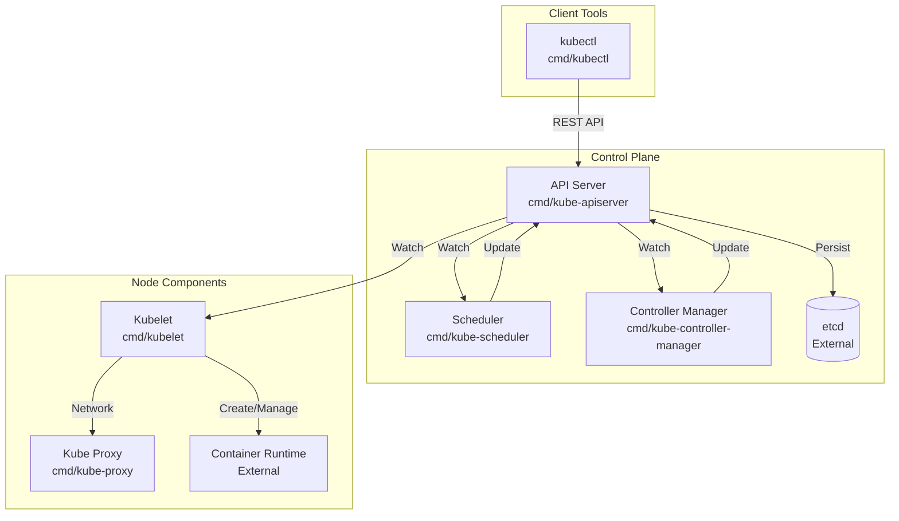
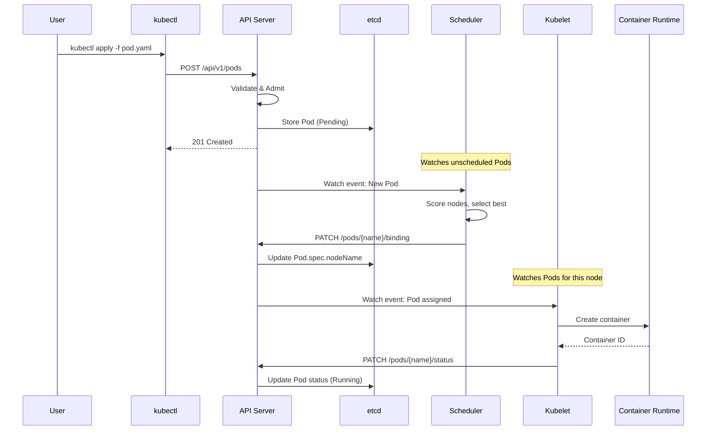

# Large System Analysis - Comprehensive Monorepo Documentation

## Objective
Analyze a large-scale project (like Kubernetes, Linux kernel, or enterprise systems) and produce comprehensive, human-readable documentation. Focus on understanding the system holistically rather than exhaustively cataloging every file.

## Context Awareness
This prompt is designed for LARGE codebases with 100s-1000s of files. Prioritize:
- **High-level understanding** over exhaustive enumeration
- **Key architectural components** over every single module
- **Data and control flow** over implementation details
- **Practical navigation guidance** for developers new to the codebase

## Required Outputs

### 1. Architecture Overview (architecture.md)

Create a comprehensive markdown document structured as follows:

```markdown
# <Project Name> Architecture

## Executive Summary
[3-5 paragraphs providing a high-level overview that a new developer could read in 5 minutes to understand what this system does, why it exists, and how it's organized]

## System Purpose & Design Philosophy
[What problem does this system solve? What are its design goals?]
[What principles guide its architecture? (e.g., extensibility, performance, security)]

## Architecture at a Glance

### Architectural Style
[Is this a monolith? Microservices? Modular monolith? Plugin-based? Describe the overall pattern]

### Core Subsystems
[List the 5-10 major subsystems with 1-2 sentence descriptions each]

Example:
- **API Server** - The central control plane that exposes the REST API and manages cluster state
- **Scheduler** - Assigns workloads to nodes based on resource availability and constraints
- **Controller Manager** - Runs controllers that regulate cluster state (deployments, services, etc.)

## Detailed Component Analysis

### Component: <Name>

**Purpose:** [What does this component do?]

**Location:** `<directory or file path>`

**Key Responsibilities:**
- [Responsibility 1]
- [Responsibility 2]
- [Responsibility 3]

**Core Abstractions:**
- `<type/interface/class>` - [Brief description]

**Entry Points:**
- `<file:function>` - [What it does]

**Interactions:**
- Consumes: [What other components does it depend on?]
- Provides: [What does it expose to other components?]

**Extension Points:**
- [How can this be extended? Plugins, interfaces, etc.]

[Repeat for each major component - aim for 5-15 components depending on system size]

## Data Flow & Communication

### Primary Data Flows
[Describe how data moves through the system. What are the main pipelines?]

### Communication Patterns
- **Synchronous:** [HTTP, gRPC, function calls, etc.]
- **Asynchronous:** [Message queues, events, watches, etc.]
- **Persistence:** [How is state stored? Databases, files, etc.]

### Request Lifecycle
[Trace a typical request from entry to completion]

Example for Kubernetes:
1. User submits a Pod spec via kubectl
2. API Server validates and persists to etcd
3. Scheduler watches for unscheduled Pods
4. Scheduler selects a node and updates the Pod
5. Kubelet on the node sees the assignment
6. Kubelet creates the container via container runtime

## Directory Structure Guide

```
<repo>/
├── cmd/                    # [Purpose of this directory]
│   ├── component1/         # [Purpose]
│   └── component2/         # [Purpose]
├── pkg/                    # [Purpose]
│   ├── subsystem1/         # [Purpose]
│   └── subsystem2/         # [Purpose]
├── api/                    # [Purpose]
├── internal/               # [Purpose]
└── ...
```

## Key Interfaces & Abstractions

### Interface: <Name>
**Location:** `<file path>`
**Purpose:** [Why does this interface exist?]
**Implementations:** [List known implementations]

[List 5-10 most important interfaces/abstractions]

## External Dependencies & Integrations

### Runtime Dependencies
- **<Dependency>** - [Purpose, why it's needed]

### Build/Development Dependencies
- **<Tool>** - [Purpose]

### External Systems
- **<System>** - [How the project integrates with it]

## Development Guide

### Building
[Brief build instructions or pointer to build docs]

### Testing
[Overview of test structure and how to run tests]

### Contributing
[High-level guide to where to make changes for common tasks]

## Glossary
[Define project-specific terms that a newcomer might not understand]

- **<Term>**: [Definition]
```

### 2. Component Diagram (components.mermaid)

Create a high-level Mermaid diagram showing major components and their relationships:



Guidelines:
- Group related components into subgraphs
- Include file/directory paths in node labels
- Show primary communication flows
- Distinguish internal vs external components
- Keep it readable (max 15-20 nodes)

### 3. Data Flow Diagram (dataflow.mermaid)

Create a sequence or flowchart showing a key data flow:



### 4. Technology Stack (tech-stack.txt)

```
# Project: <Name>
# Last Updated: <Date>

== Languages ==
- <Language> <version> - <purpose/where used>

== Core Frameworks & Libraries ==
- <Library> - <purpose>

== Build System ==
- <Tool> - <purpose>

== Testing ==
- <Framework> - <type of tests>

== Infrastructure & Deployment ==
- <Tool> - <purpose>

== Documentation ==
- <Format/Tool> - <purpose>

== External Dependencies (Runtime) ==
- <Dependency> - <purpose>

== Development Tools ==
- <Tool> - <purpose>
```

## Analysis Process for Large Codebases

### Phase 1: Orientation (5 min)
1. Read README.md and any ARCHITECTURE.md files
2. Examine top-level directory structure
3. Read main build/manifest files (go.mod, package.json, etc.)
4. Identify the project's primary purpose from documentation

### Phase 2: Structural Mapping (10 min)
1. Map the `cmd/` or entry point directories - these are your components
2. Map the `pkg/` or library directories - these are shared code
3. Identify the `api/` or interface definitions
4. Note any `internal/` or unexported packages
5. Look for `docs/`, `examples/`, or `test/` directories

### Phase 3: Component Deep Dives (15-20 min)
For each major component (aim for 5-15):
1. Read the main entry point file (e.g., `cmd/component/main.go`)
2. Trace 1-2 levels of imports to understand dependencies
3. Read any README in the component directory
4. Identify the core interface or main type
5. Understand what other components this one talks to

### Phase 4: Data Flow Analysis (10 min)
1. Identify where data enters the system (APIs, files, etc.)
2. Trace how a typical request flows through components
3. Identify where state is persisted
4. Note any message queues, event systems, or async patterns

### Phase 5: Documentation Generation (10 min)
1. Write the architecture.md with collected knowledge
2. Generate diagrams from component relationships
3. Create the tech stack inventory
4. Add practical navigation guidance

## Quality Guidelines

### For architecture.md:
- **Readable by newcomers** - Avoid jargon without explanation
- **Navigable** - Use clear headings and include file paths
- **Accurate** - Every file path mentioned should exist
- **Complete enough** - Cover all major subsystems
- **Not exhaustive** - Don't list every file, focus on important ones

### For diagrams:
- **Readable at a glance** - No more than 20 nodes
- **Include paths** - So readers know where to look
- **Show relationships** - Arrows should indicate real dependencies
- **Group logically** - Use subgraphs for related components

### For tech-stack.txt:
- **Version numbers** where applicable
- **Purpose** for each technology
- **Categorized** clearly

## Common Patterns to Look For

### Monorepo Patterns:
- `cmd/` - Multiple binaries/entry points
- `pkg/` - Shared libraries
- `internal/` - Private packages
- `api/` - API definitions (OpenAPI, protobuf, etc.)
- `build/` - Build scripts and configuration
- `deploy/` - Deployment manifests
- `hack/` - Development scripts
- `vendor/` - Vendored dependencies
- `staging/` - Staged/experimental code

### Architecture Patterns:
- **Plugin architecture** - Look for plugin/, providers/, or interfaces
- **Layered** - Look for layers like transport, business, data
- **Event-driven** - Look for events/, handlers/, subscribers/
- **Microservices** - Look for services/, api gateways
- **Modular monolith** - Look for modules/ with clear boundaries

## Success Criteria

Your output is successful if:
1. A developer new to the project can understand its purpose in 5 minutes
2. They know which directories contain which functionality
3. They understand how the major components interact
4. They can trace a typical request through the system
5. The diagrams accurately represent the architecture
6. File paths in the documentation actually exist in the repo

## Anti-Patterns to Avoid

- **Listing every file** - Focus on important ones
- **Copying code** - Explain, don't paste
- **Implementation details** - Focus on architecture
- **Outdated information** - Verify paths exist
- **Jargon without explanation** - Define terms
- **Diagrams with 50+ nodes** - Keep them readable
- **Shallow analysis** - Go deep on key components
