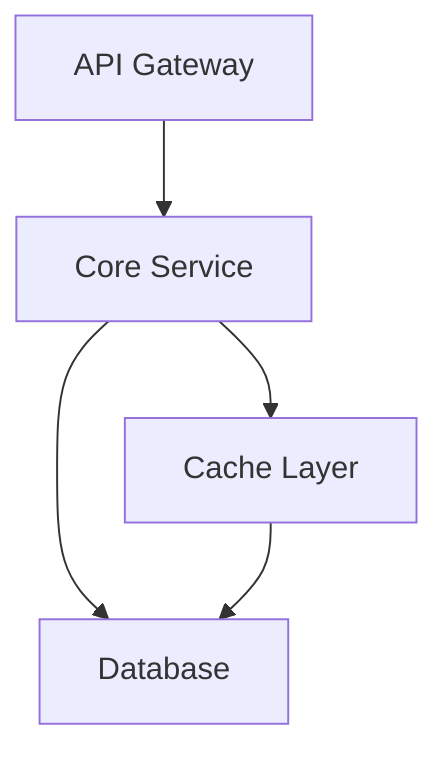
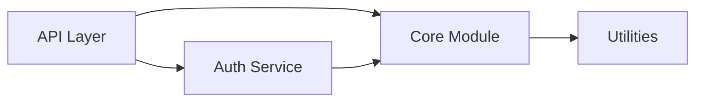
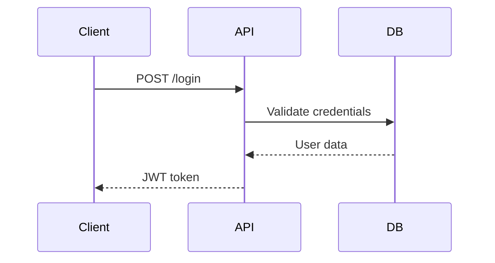
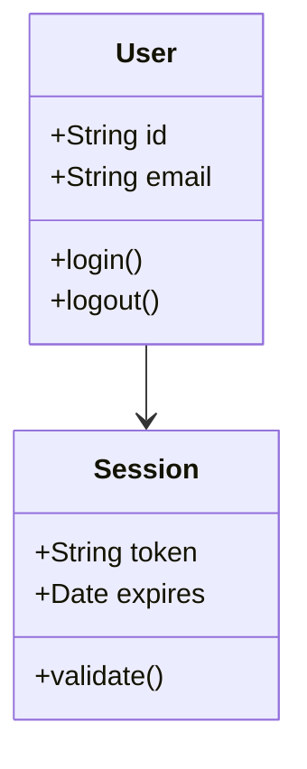

Create and compile mermaid diagrams for documentation

You are responsible for generating mermaid diagram source and compiling to PNG for embedding in documentation.

## Purpose

Generate visual diagrams that illustrate architecture, dependencies, and workflows using mermaid syntax.

## Diagram Types

### Architecture Diagrams (Flowchart)


### Dependency Graphs


### Sequence Diagrams


### Class Diagrams


## Processing

1. **Create assets directory**:
   - Ensure `docs/assets/` exists
   - **CRITICAL**: All diagrams MUST be saved to this shared directory

2. **Analyze component relationships**:
   - Read component documentation
   - Identify key relationships, flows, dependencies
   - Determine which diagram types are most useful

3. **Generate mermaid syntax**:
   - Write clear, readable diagram code
   - Use consistent naming and styling
   - Add comments for complex diagrams

4. **Write .mmd files to assets directory**:
   - Save to `docs/assets/{diagram_name}.mmd`
   - Use descriptive filenames (e.g., `architecture.mmd`, `auth_flow.mmd`)
   - Include diagram title in first line comment

5. **Compile using mmdc CLI**:
   ```bash
   mkdir -p docs/assets
   mmdc -i docs/assets/diagram.mmd -o docs/assets/diagram.png -t dark -b transparent
   ```

6. **Validate PNG output**:
   - Check file was created in `docs/assets/`
   - Verify file size > 0
   - Log success or failure

## Error Handling

- **mmdc not installed**:
  - Keep `.mmd` source files
  - Log warning with installation instructions
  - Continue without failing pipeline

- **Compilation fails**:
  - Log error message
  - Keep `.mmd` source
  - Recommend manual compilation

- **Syntax errors**:
  - Validate mermaid syntax before compilation
  - Fix common errors automatically
  - Log validation warnings

## Output

**IMPORTANT**: All diagrams are saved to the shared `docs/assets/` directory.

For each diagram:
- `docs/assets/{name}.mmd`: Mermaid source file
- `docs/assets/{name}.png`: Compiled PNG (if mmdc available)

When referencing diagrams in markdown files within section directories:
- Use relative path: ``

## Example Workflow

1. Create `docs/assets/architecture.mmd`:
   ```mermaid
   flowchart TD
       Client[Client Application]
       API[API Gateway]
       Service[Core Service]
       DB[(Database)]

       Client --> API
       API --> Service
       Service --> DB
   ```

2. Compile to PNG in assets directory:
   ```bash
   mkdir -p docs/assets
   mmdc -i docs/assets/architecture.mmd -o docs/assets/architecture.png -t dark -b transparent
   ```

3. Embed in section markdown file (e.g., `docs/architecture/index.md`):
   ```markdown
   
   ```

   **Note**: The `../assets/` path is relative from the section directory to the assets directory.

## Guidelines

- **Clarity**: Keep diagrams simple and focused
- **Consistency**: Use consistent shapes, colors, naming
- **Labels**: All nodes should have clear labels
- **Flow**: Arrange nodes logically (top-to-bottom or left-to-right)
- **Size**: Keep diagrams to 10-15 nodes maximum
- **Legend**: Add legend for complex diagrams
