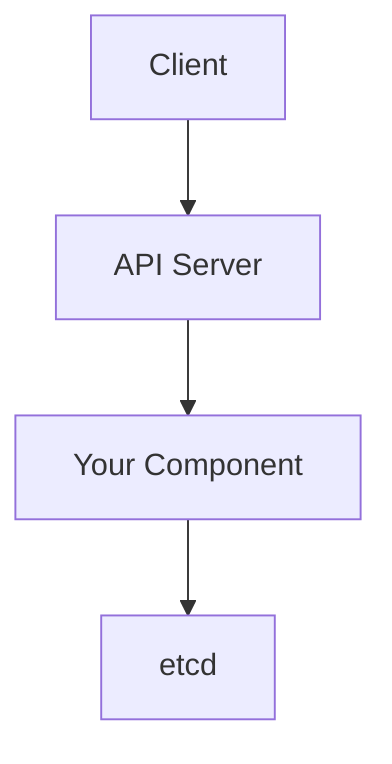
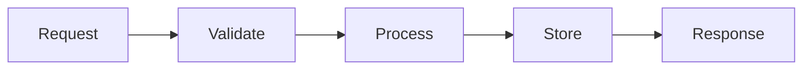
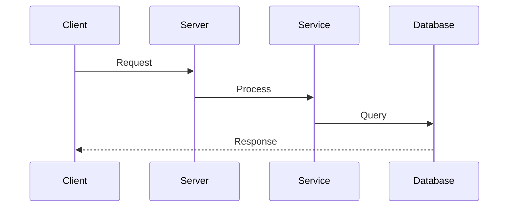
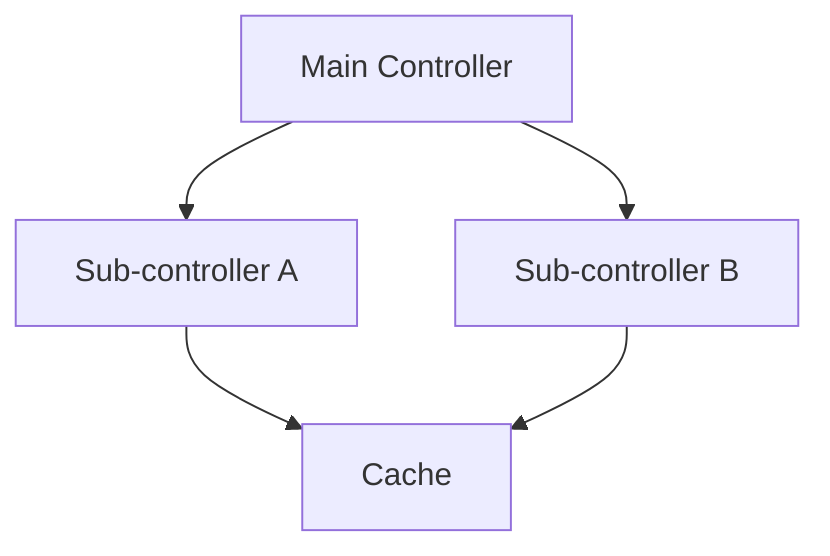

Comprehensive diagram generation for all documentation types

## Diagram Types Required

### 1. Architecture Diagrams (Mermaid flowchart)

Show component in system context:


### 2. Flow Diagrams (Mermaid flowchart)

Show request/response flow:


### 3. Sequence Diagrams (Mermaid sequenceDiagram)

Show interactions over time:


### 4. Component Diagrams (Mermaid graph)

Show internal structure:


## Placement

- Save to: `docs/assets/{component}_{type}.mmd`
- Reference in markdown: ``
- Generate both .mmd source and .png compiled version

## ASCII Fallbacks

For simple relationships, use ASCII art:
```
    ┌─────────┐
    │ Client  │
    └────┬────┘
         │
    ┌────▼────┐
    │   API   │
    └────┬────┘
         │
    ┌────▼────┐
    │Component│
    └─────────┘
```

## Error Handling

- If mmdc compilation fails, keep .mmd source files
- Log warning but continue documentation
- Don't fail the entire pipeline over diagram compilation
- Document in section that diagrams may require manual compilation
