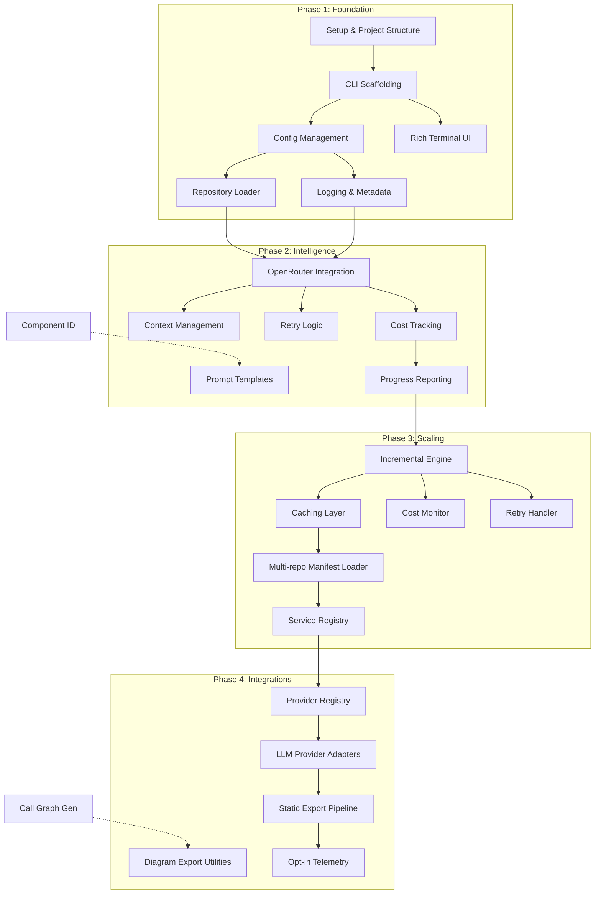
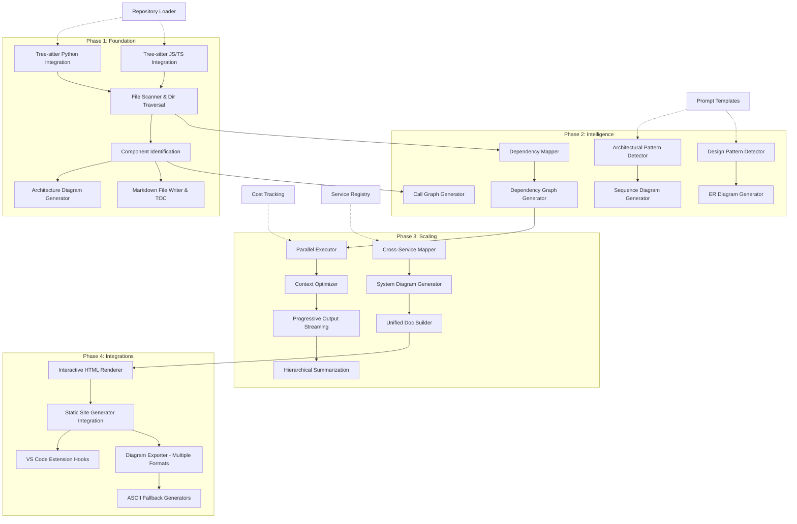
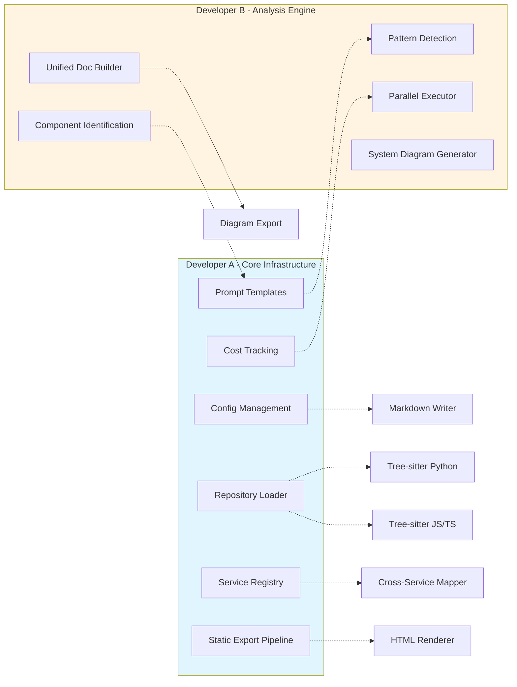

# Dependency Graph - Repository Explainer

## Overview

This document provides comprehensive Mermaid dependency graphs showing task dependencies across all development phases for parallel execution by 2 developers.

## Master Dependency Graph

```mermaid
gantt
    title Repository Explainer Development Timeline (2 Developers - 8 Weeks)
    dateFormat  YYYY-MM-DD
    section Phase 1: Foundation
    Setup & Structure          :done, p1a, 2026-01-17, 3d
    CLI Scaffolding           :p1b, p1a, 4d
    Config Management         :p1c, p1b, 3d
    Repository Loader         :p1d, p1c, 4d

    Tree-sitter Integration   :p1e, p1a, 5d
    File Scanner              :p1f, p1e, 3d
    Component ID              :p1g, p1f, 4d
    Basic Markdown Writer     :p1h, p1g, 3d

    section Phase 2: Intelligence
    OpenRouter Integration    :p2a, p1d, 5d
    Prompt Templates          :p2b, p1h, 4d
    Context Management        :p2c, p2a, 3d
    Cost Tracking             :p2d, p2a, 3d

    Pattern Detector          :p2e, p2b, 5d
    Dependency Mapper         :p2f, p2b, 4d
    Diagram Generators        :p2g, p2e, 5d
    Progress Reporting        :p2h, p2d, 3d

    section Phase 3: Scaling
    Incremental Engine        :p3a, p2h, 5d
    Caching Layer             :p3b, p3a, 4d
    Cost Monitor              :p3c, p3a, 3d
    Retry Handler             :p3d, p3a, 3d

    Parallel Executor         :p3e, p2g, 5d
    Context Optimizer         :p3f, p3e, 4d
    Progressive Streaming     :p3g, p3f, 3d
    Hierarchical Summarization :p3h, p3g, 4d

    section Phase 4: Integrations
    Multi-repo Config         :p4a, p3b, 5d
    Provider Registry         :p4b, p4a, 4d
    LLM Adapters              :p4c, p4b, 4d

    Cross-Service Mapper      :p4d, p3h, 5d
    System Diagram Gen        :p4e, p4d, 4d
    Unified Doc Builder       :p4f, p4e, 4d

    section Phase 5: Polish
    Static Export Pipeline    :p5a, p4f, 5d
    Diagram Exporter          :p5b, p4f, 4d
    HTML Renderer             :p5c, p5a, 5d
    Integration Points        :p5d, p5c, 3d
```

## Developer A Task Dependency Flow



## Developer B Task Dependency Flow



## Cross-Developer Dependency Graph



## Phase-by-Phase Critical Path

```mermaid
graph TD
    start[Start] --> p1

    subgraph P1["Phase 1 Foundation"]
        p1[Setup & Structure<br/>Shared]
        p2a[CLI Scaffolding<br/>Dev A]
        p2b[Tree-sitter Integration<br/>Dev B]
        sync1[Sync: File System Ready]
    end

    subgraph P2["Phase 2 Intelligence"]
        p3a[OpenRouter Integration<br/>Dev A]
        p3b[Pattern Detection<br/>Dev B]
        p3c[Diagram Generators<br/>Dev B]
        sync2[Sync: End-to-End Analysis]
    end

    subgraph P3["Phase 3 Scaling"]
        p4a[Incremental Engine<br/>Dev A]
        p4b[Parallel Executor<br/>Dev B]
        p4c[Progressive Streaming<br/>Dev B]
        sync3[Sync: Incremental Updates]
    end

    subgraph P4["Phase 4 Integrations"]
        p5a[Multi-repo Config<br/>Dev A]
        p5b[Cross-Service Mapper<br/>Dev B]
        p5c[System Diagrams<br/>Dev B]
        sync4[Sync: Multi-repo Working]
    end

    subgraph P5["Phase 5 Polish"]
        p6a[Provider Registry<br/>Dev A]
        p6b[HTML Export<br/>Dev B]
        sync5[Sync: Feature Complete]
    end

    p1 --> p2a
    p1 --> p2b
    p2a & p2b --> sync1 --> p3a & p3b --> sync2 --> p4a & p4b --> sync3 --> p5a & p5b --> sync4 --> p6a & p6b --> sync5 --> end[Complete]

    style p1 fill:#c8e6c9
    style sync1 fill:#fff59d
    style sync2 fill:#fff59d
    style sync3 fill:#fff59d
    style sync4 fill:#fff59d
    style sync5 fill:#c8e6c9
```

## Task Parallelization Matrix

| Week | Dev A Tasks | Dev B Tasks | Dependencies | Sync Points |
|------|-------------|-------------|--------------|-------------|
| 1-2 | CLI, Config, Repo Loader | Tree-sitter, Scanner, Markdown | A4→B1,B2 | Week 2: File system |
| 3-4 | OpenRouter, Prompts, Cost | Pattern detection, Diagrams | A8→B7,B8 | Week 4: Analysis works |
| 5-6 | Incremental, Caching | Parallel executor, Streaming | A11→B14 | Week 6: Incremental works |
| 7-8 | Multi-repo, Providers | Cross-service, HTML export | A18→B18 | Week 8: Feature complete |

## Integration Points Schedule

### Week 2 Integration
- **Goal**: CLI can load repos and write markdown
- **Dev A Delivers**: Config management, repo loader
- **Dev B Delivers**: Tree-sitter parsers, markdown writer
- **Test**: `repo-explainer analyze <local-repo>` produces basic docs

### Week 4 Integration
- **Goal**: End-to-end analysis with LLM
- **Dev A Delivers**: OpenRouter integration, prompt templates
- **Dev B Delivers**: Pattern detection, diagram generators
- **Test**: Full analysis produces docs + diagrams

### Week 6 Integration
- **Goal**: Incremental updates work
- **Dev A Delivers**: Git diff detection, caching
- **Dev B Delivers**: Parallel executor, progressive output
- **Test**: Update command refreshes only changed files

### Week 8 Integration
- **Goal**: All features integrated
- **Dev A Delivers**: Multi-repo support, multiple providers
- **Dev B Delivers**: HTML export, advanced diagrams
- **Test**: Full feature test suite passes

## Risk Dependencies

### High-Risk Dependencies (Must Prioritize)
1. **A4 (Repo Loader) → B1,B2 (Tree-sitter)**
   - Impact: Dev B blocked on file access
   - Mitigation: Dev A delivers early, mock with test files

2. **A8 (Prompts) → B7,B8 (Pattern Detection)**
   - Impact: Dev B can't test LLM-dependent features
   - Mitigation: Agree on prompt interface early, use mock responses

3. **B4 (Component ID) → A8 (Prompt Design)**
   - Impact: Dev A needs component structure for prompts
   - Mitigation: Define Pydantic model contract Week 2

### Medium-Risk Dependencies
1. **A11 (Cost Tracking) → B14 (Parallel Executor)**
   - Impact: Performance optimization lacks cost awareness
   - Mitigation: Simple cost tracking placeholder sufficient

2. **A18 (Service Registry) → B18 (Cross-Service Mapper)**
   - Impact: Multi-repo coordination unclear
   - Mitigation: Define manifest format Week 6

## Rollback Plan

If integration fails at sync point:
- **Week 2**: Use mock repo loader, focus on parsing logic
- **Week 4**: Use mock LLM responses, focus on diagram logic
- **Week 6**: Disable parallel execution, focus on incremental detection
- **Week 8**: Defer multi-repo, polish single-repo features