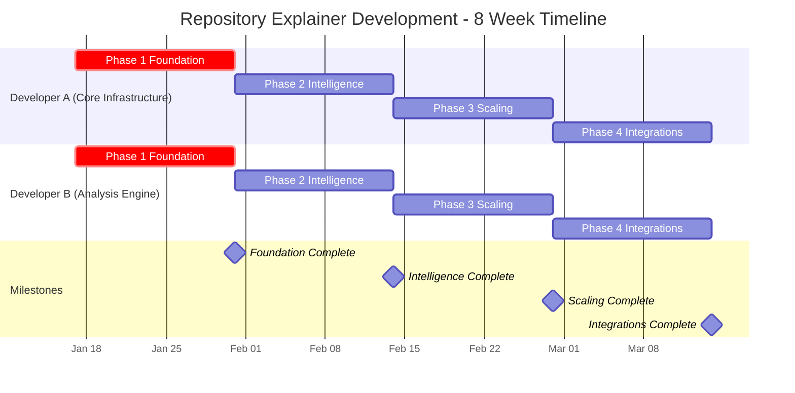
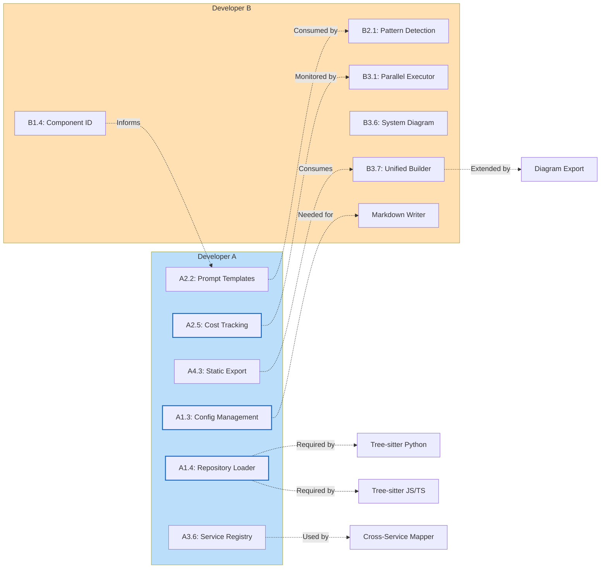
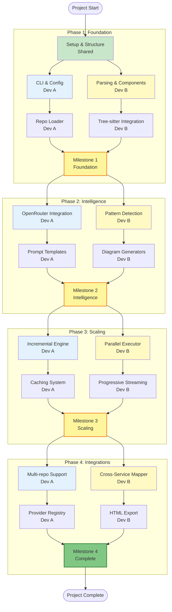
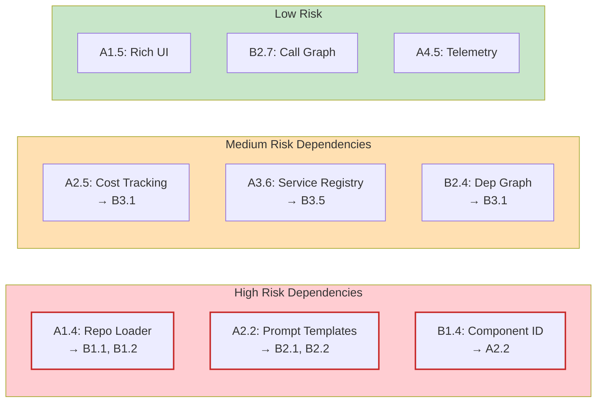
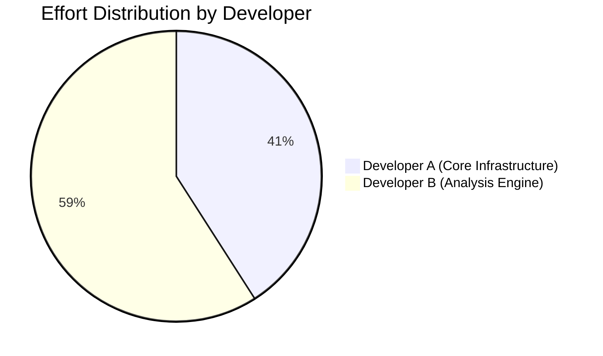
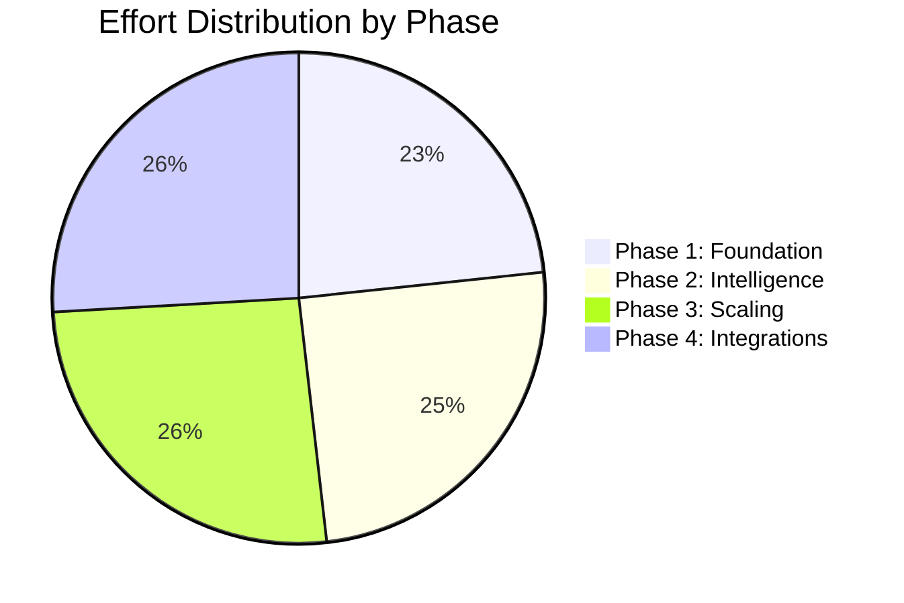
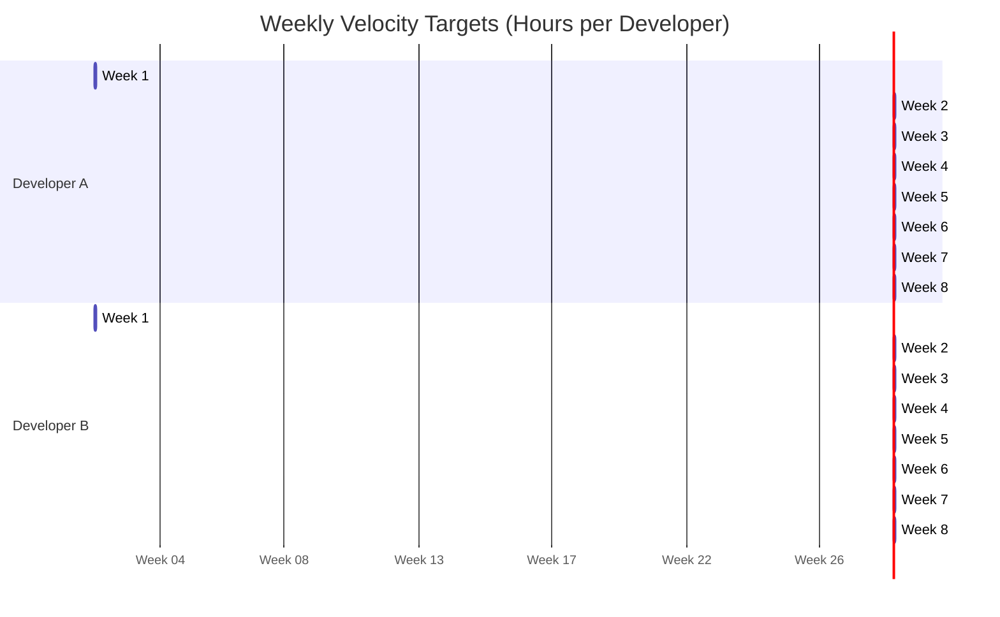

# Work Visualizations

## Master Project Timeline



## Developer A Task Flow

```mermaid
flowchart LR
    subgraph Phase1["Phase 1: Foundation (Week 1-2)"]
        A1[A1.1: Setup & Structure<br/>4h]
        A2[A1.2: CLI Scaffolding<br/>6h]
        A3[A1.3: Config Mgmt<br/>8h]
        A4[A1.4: Repo Loader<br/>12h]
        A5[A1.5: Rich UI<br/>4h]
        A6[A1.6: Logging<br/>4h]
    end

    subgraph Sync1["Week 2 Sync Point"]
        S1[Foundation Complete<br/>File System Ready]
    end

    subgraph Phase2["Phase 2: Intelligence (Week 3-4)"]
        B1[A2.1: OpenRouter<br/>8h]
        B2[A2.2: Prompt Templates<br/>8h]
        B3[A2.3: Context Mgmt<br/>6h]
        B4[A2.4: Retry Logic<br/>4h]
        B5[A2.5: Cost Tracking<br/>6h]
        B6[A2.6: Progress Reporting<br/>6h]
    end

    subgraph Sync2["Week 4 Sync Point"]
        S2[Intelligence Complete<br/>End-to-End Analysis]
    end

    subgraph Phase3["Phase 3: Scaling (Week 5-6)"]
        C1[A3.1: Incremental Engine<br/>10h]
        C2[A3.2: Caching Layer<br/>8h]
        C3[A3.3: Cost Monitor<br/>4h]
        C4[A3.4: Retry Handler<br/>4h]
        C5[A3.5: Multi-repo Loader<br/>8h]
        C6[A3.6: Service Registry<br/>6h]
    end

    subgraph Sync3["Week 6 Sync Point"]
        S3[Scaling Complete<br/>Incremental Updates]
    end

    subgraph Phase4["Phase 4: Integrations (Week 7-8)"]
        D1[A4.1: Provider Registry<br/>8h]
        D2[A4.2: LLM Adapters<br/>6h]
        D3[A4.3: Static Export<br/>8h]
        D4[A4.4: Diagram Export<br/>4h]
        D5[A4.5: Telemetry<br/>6h]
        D6[A4.6: Integration Testing<br/>10h]
    end

    A1 --> A2 --> A3 --> A4
    A2 --> A5
    A3 --> A6
    A6 --> S1 --> B1 --> B3 --> B4
    B1 --> B2 --> B5 --> B6
    B6 --> S2 --> C1 --> C2 --> C3 --> C4
    C1 --> C5 --> C6
    C6 --> S3 --> D1 --> D2 --> D3 --> D4
    D3 --> D5 --> D6

    style Phase1 fill:#e3f2fd
    style Phase2 fill:#fff3e0
    style Phase3 fill:#e8f5e9
    style Phase4 fill:#f3e5f5
    style S1 fill:#fff59d
    style S2 fill:#fff59d
    style S3 fill:#fff59d
```



## Developer B Task Flow

```mermaid
flowchart LR
    subgraph Phase1["Phase 1: Foundation (Week 1-2)"]
        A1[B1.1: Tree-sitter Python<br/>10h]
        A2[B1.2: Tree-sitter JS/TS<br/>10h]
        A3[B1.3: File Scanner<br/>6h]
        A4[B1.4: Component ID<br/>10h]
        A5[B1.5: Arch Diagram<br/>10h]
        A6[B1.6: Markdown Writer<br/>8h]
    end

    subgraph Sync1["Week 2 Sync Point"]
        S1[Foundation Complete<br/>Parsing Ready]
    end

    subgraph Phase2["Phase 2: Intelligence (Week 3-4)"]
        B1[B2.1: Arch Patterns<br/>10h]
        B2[B2.2: Design Patterns<br/>10h]
        B3[B2.3: Dep Mapper<br/>8h]
        B4[B2.4: Dep Graph<br/>8h]
        B5[B2.5: Seq Diagram<br/>8h]
        B6[B2.6: ER Diagram<br/>6h]
        B7[B2.7: Call Graph<br/>8h]
    end

    subgraph Sync2["Week 4 Sync Point"]
        S2[Intelligence Complete<br/>All Diagrams Ready]
    end

    subgraph Phase3["Phase 3: Scaling (Week 5-6)"]
        C1[B3.1: Parallel Executor<br/>10h]
        C2[B3.2: Context Opt<br/>8h]
        C3[B3.3: Progressive Stream<br/>6h]
        C4[B3.4: Hierarchical<br/>8h]
        C5[B3.5: Cross-Service<br/>10h]
        C6[B3.6: System Diagram<br/>8h]
        C7[B3.7: Unified Builder<br/>10h]
    end

    subgraph Sync3["Week 6 Sync Point"]
        S3[Scaling Complete<br/>Performance Optimized]
    end

    subgraph Phase4["Phase 4: Integrations (Week 7-8)"]
        D1[B4.1: HTML Renderer<br/>10h]
        D2[B4.2: SSG Integration<br/>10h]
        D3[B4.3: VS Code Hooks<br/>8h]
        D4[B4.4: Diagram Export<br/>8h]
        D5[B4.5: ASCII Fallback<br/>6h]
        D6[B4.6: Cross-repo Links<br/>6h]
        D7[B4.7: Performance Opt<br/>10h]
    end

    A1 --> A2 --> A3 --> A4 --> A5 --> A6
    A6 --> S1 --> B1 --> B5
    B1 --> B2 --> B6
    B1 --> B3 --> B4
    B1 --> B7
    B7 --> S2 --> C1 --> C2 --> C3 --> C4
    B4 --> C5 --> C6 --> C7
    C7 --> S3 --> D1 --> D2 --> D3 --> D4 --> D5 --> D6 --> D7

    style Phase1 fill:#e3f2fd
    style Phase2 fill:#fff3e0
    style Phase3 fill:#e8f5e9
    style Phase4 fill:#f3e5f5
    style S1 fill:#fff59d
    style S2 fill:#fff59d
    style S3 fill:#fff59d
```



## Cross-Developer Dependency Graph



## Critical Path Analysis



## Risk Matrix



## Work Distribution Summary





## Weekly Velocity Targets



## Integration Test Schedule

```mermaid
sequenceDiagram
    participant A as Developer A
    participant B as Developer B
    participant Test as Integration Tests

    Note over A,B: Week 1-2: Foundation Phase
    A->>B: Deliver Config Manager & Repo Loader
    B->>A: Delivers Component ID & Markdown Writer
    A->>Test: Integration Test 1 (Week 2)
    Test-->>A,B: Feedback & Fixes

    Note over A,B: Week 3-4: Intelligence Phase
    A->>B: Delivers OpenRouter & Prompt Templates
    B->>A: Delivers Pattern Detection & Diagrams
    B->>Test: Integration Test 2 (Week 4)
    Test-->>A,B: Feedback & Fixes

    Note over A,B: Week 5-6: Scaling Phase
    A->>B: Delivers Incremental Engine & Service Registry
    B->>A: Delivers Parallel Executor & System Diagrams
    A->>Test: Integration Test 3 (Week 6)
    Test-->>A,B: Feedback & Fixes

    Note over A,B: Week 7-8: Polish Phase
    A->>B: Delivers Provider Registry & Static Export
    B->>A: Delivers HTML Renderer & Diagram Export
    A->>B: Integration Test 4 (Week 8)
    B->>A: Full Feature Test Suite
    Test-->>A,B: Final Approval